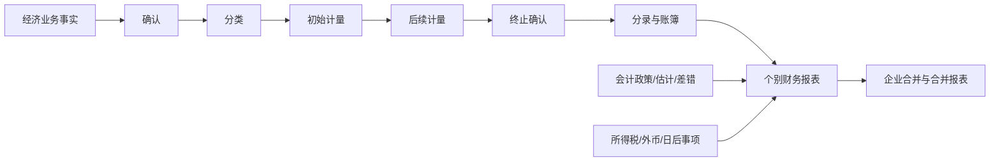

# 会计知识地图

> [!warning] 版本
> 本地图依据 [2026 专业阶段大纲](https://www.cicpa.org.cn/xxfb/tzgg/202603/W020260304555799366109.pdf) 建立，只作为 2027 大纲发布前的学习地形。能力等级、增删内容和法规截止日必须按 2027 官方版本更新。

## 主干关系



所有章节都反复回答六个问题：是什么资产/负债/权益或损益？何时确认？初始按什么量？以后怎么量？何时终止？进入哪张表、哪一行？

## 分层地图

| 层 | 模块 | 关键产出 | 前置 | 初始状态 |
|---|---|---|---|---|
| L0 语言 | 会计要素、恒等式、复式记账、会计循环、报表 | 业务事实能翻成要素变化和分录 | 无 | M0 |
| L1 基础资产 | 存货、固定资产、无形资产、投资性房地产 | 确认—初始—后续—处置完整链 | L0 | M0 |
| L1 基础负债权益 | 负债、职工薪酬、所有者权益 | 分类、计量与报表影响 | L0 | M0 |
| L1 经营成果 | 收入、费用、利润、政府补助 | 收入五步法和时点判断 | L0 | M0 |
| L2 估计与折现 | 资产减值、或有事项、借款费用 | 概率、现值、资本化和估计变化 | L0–L1 | M0 |
| L2 金融计量 | 金融工具、股份支付 | 分类决定计量，计量决定损益/权益 | L0–L2 | M0 |
| L2 特殊交易 | 租赁、非货币交换、债务重组 | 判断交易实质和双方处理 | L1–L2 | M0 |
| L2 税与币 | 所得税、外币折算 | 账面/计税差异和汇率影响 | L1–L2 | M0 |
| L3 投资关系 | 长期股权投资、合营安排 | 控制/共同控制/重大影响与计量转换 | 金融工具、L1 | M0 |
| L3 报告边界 | 持有待售、终止经营、列报披露 | 分类、计量和列报边界 | L1–L2 | M0 |
| L3 时间修正 | 政策/估计变更、差错、日后事项 | 追溯/未来适用、调整/非调整 | 报表、L1 | M0 |
| L4 集成 | 企业合并、合并财务报表 | 控制判断、购买日计量、抵销、少数权益 | 长投、所得税、全 L1–L3 | M0 |

## 章节学习卡只保留这些字段

不另写长篇章笔记。每个模块只在本文件追加一张短卡：

```markdown
### ACC-模块名｜M0/M1/M2/M3/M4
- 考试问题：
- 关键判断树（≤7 节点）：
- 一个边界/反例：
- 与旧知识连接：
- 官方范围/版本：
- 未见真题首次得分：
- D7 / D30：
- 未解决问题：
```

## 第一阶段依赖顺序

1. L0 会计语言。
2. 存货 → 固定资产 → 无形资产。
3. 负债权益 → 收入 → 报表勾稽。
4. 借款费用、或有事项、减值。
5. 所得税只建概念模型。
6. 第 30 天只预览金融工具 → 长投 → 合并的依赖，不急于做高级综合题。

## 状态更新规则

- 当日听懂只能从 M0 到 M1。
- 当日独立变式通过可到 M2。
- 真实题 + D7 + 时间门槛通过才到 M3。
- 跨章节/阶段卷仍可调用才到 M4。
- 状态倒退是数据，不是失败；D30 <75% 时从 M3 回 M2 并重新安排提取。

