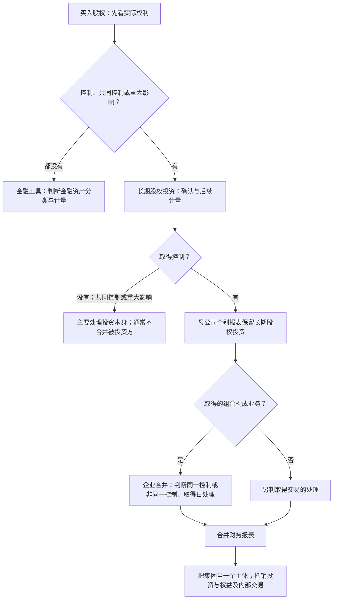

# NOESIS｜2027 CPA 备考执行计划

## 9月25日高级地形预览｜实际学习材料

**总问题：买入另一家企业的股权后，先判断取得了什么权利，再决定投资如何记账，以及报表要呈现哪一个主体。**持股比例只是线索，题目给出的表决权、决策安排等事实决定控制、共同控制或重大影响。下图是普通企业的基本路径；投资性主体等特殊情况留到正式单元处理。范围按[中注协2026会计大纲](https://www.cicpa.org.cn/xxfb/tzgg/202603/W020260304555799366109.pdf)作`[2026 临时基线｜待 2027 大纲复核]`。投资准则的分界依据[财政部实施问答](https://kjs.mof.gov.cn/zt/kjzzss/sswd/jrgjzzss/202103/t20210302_3664211.htm)。

| 模块 | 此章回答的问题 | 向下一章提供什么 |
|---|---|---|
| 金融工具 | 这项权利是何种金融资产，初始和以后如何计量？无控制、共同控制、重大影响的普通股权投资通常进入这一路。 | 理解金融资产、公允价值与计量变化，也为以后追加或处置股权时的方法转换打底。 |
| 长期股权投资 | 我与被投资方的关系是共同控制、重大影响还是控制？投资在**本企业个别报表**如何确认和继续计量？ | 识别联营、合营、子公司；确定何时进入控制与集团报告的问题。 |
| 企业合并 | 取得控制时，取得的组合是否构成业务？若构成，原本是否受同一最终控制方控制、取得日如何处理？ | 给合并报表提供取得日的起点和计量基础；不是每次买股权都构成企业合并。 |
| 合并财务报表 | 哪些主体纳入集团？把母子公司报表放在一起后，哪些内部关系、内部交易需要抵销？ | 产出集团口径的资产、负债、利润与现金流；子公司不是只按持股比例并入各项资产负债。 |

**贯穿例子。**甲购买乙的少量股份，题设明确甲无决策影响力：先研究金融工具。后来甲取得参与乙重要经营决策的权利但仍不能控制：转入长期股权投资的问题。再后来甲取得控制且乙构成业务：先判断企业合并类型和取得日处理，随后编制合并报表；甲的个别报表仍有对乙的长期股权投资。最后，若甲向乙赊销商品，甲、乙各自仍记自己的销售或购货；集团报表要消除集团内部的收入、应收应付和未对外售出商品中的内部利润。这里的“抵销”是在编制合并报表时从集团视角调整，不是把两家公司的日常账簿抹掉。[财政部合并报表准则](https://www.mof.gov.cn/gkml/caizhengwengao/wg2014/wg201405/201412/t20141217_1168564.htm)规定了合并范围、投资与权益抵销以及内部交易抵销。

**75分钟的实际产出：**用15分钟重画“权利→准则→报表”分叉；20分钟说清四章各解决哪个问题；20分钟沿上述例子口头走完三次关系变化；最后20分钟列出待正式学习的前置项：控制/共同控制/重大影响的判断，成本法与权益法，业务及同一控制判断，取得日计量，合并范围与内部交易抵销。这是地形预览，暂不要求精确分录、商誉计算，也不记M2/M3。

## 9月27日正式启动

9月25—26日按[[05-30天启动计划#三天假期重排｜2026-09-25—09-27（计划，未执行）]]完成第一阶段综合案例、阶段测、错因修复与复盘。9月27日起进入以2027考试为目标的持续备考。原计划2027会计、税法、经济法；实际报考科目由实测容量和成绩闸门决定，不把9月的即时正确率当成掌握。

9月27日执行150分钟净学习：

1. **20分钟闭卷复提**：处理当天到期的E-022—E-023、E-033；答错重置D1，不因提前抽查改写间隔。
2. **55分钟锁定备考安排**：把9月26日阶段测首次成绩、近3周可核实的有效小时、D7和真实题记录写入周计划；核对未来4周可执行时段，并确定10月第一轮模块顺序。缺失数据标“未取得”，不补估。
3. **75分钟正式学习**：按[[02-AI原生学习协议]]完成会计首个新单元的来源锁定、前置诊断、小块教学、独立应用和出口题。默认从金融工具的业务事实与分类逻辑开始；若阶段测显示会计循环或报表勾稽存在关键缺口，改为该缺口的完整修复单元。只在实际提交后记首次分，不预填M2/M3。

## 每周可执行容量

先以**约8小时/周**运行四周，再按实际有效小时调整。周二、周四保留量化研究时段。

| 时段 | CPA净学习计划 | 用途 |
|---|---:|---|
| 周一 | 75m | 会计新单元 |
| 周二 | 20m | D1/D3/D7闭卷提取 |
| 周三 | 75m | 会计新单元或延续应用 |
| 周四 | 20m | 间隔提取；保护量化时段 |
| 周五 | 60m | 来源明确的未见真题或错因修复 |
| 周六 | 150m | 完整案例、计算与分录 |
| 周日 | 75m | 混合测试与周复盘 |

合计475分钟（7小时55分）。这只是容量预算；每周记录实际有效小时、完成率和复习债务，不把计划分钟冒充已学时间。若周内掉课，先保留到期提取与周测，再压缩新单元数量。

## 阶段与科目进入条件

| 阶段 | 主线与交付物 | 进入下一阶段前看什么 |
|---|---|---|
| 2026-09-27—10-31 | 以会计为主，沿[[06-会计知识地图]]从已学基础进入L2金融计量与特殊交易；每周至少一次来源明确的未见会计真实题，每周保留D1/D3/D7和混合测试。 | 10月底核对近4周有效小时、阶段卷、D7、真题首次得分和重复错误；按证据调整11月容量。 |
| 2026-11—2027官方大纲发布前 | 会计推进长投、所得税后续与合并前置。若连续4周可稳定达到约9小时、D7≥80%且阶段测≥65%，增配税法稳定框架约90m/周，再用短时段接触经济法基本框架；未达条件先补会计与复习债务。 | 每4周重估三科/两科可行性；税率、期限、能力等级等按`[2026 临时基线｜待 2027 大纲复核]`处理。 |
| 2027官方大纲与教材发布后—5月 | 依据中注协新版本逐项核对范围和易变规则，完成确定报考科目的章节闭环；会计主观题、税法计算与经济法案例均做闭卷应用。 | 每科有来源明确的真实题首次分、D7和限时作答记录；不能用AI训练题代替。 |
| 6—7月 | 按确定科目做跨章混合题、近年真实题、机考输入与时间分配。 | 看最近三次限时完成率、得分和关键错因是否收敛。 |
| 官方考试日前6周 | 以正式公告确定的考试日倒排整卷模拟和Top 3错误修复，暂停低收益扩章。 | 按模考首次成绩与时间决定最后复习顺序。 |

2027官方日期与大纲以[中注协考试大纲入口](https://www.cicpa.org.cn/ztzl1/exam/exam_outline/)及后续公告为准。当前可使用[2026专业阶段官方大纲](https://www.cicpa.org.cn/xxfb/tzgg/202603/W020260304555799366109.pdf)作临时范围地图。真实题从本地`考试真题/中注协官网真题/来源清单.json`所列原件中选取，并核对年份、科目、题号与是否首次作答；不先浏览答案。

## 三科/两科闸门与最近四周

- 暂以2027会计、税法、经济法为目标，不在9月27日仅凭主观感觉锁死报考数。10月底开始按最近4—8周证据复核：稳定周均约10小时、会计阶段卷≥65、D7≥80%时，三科并行才有较稳的容量基础；若连续4周周均<8小时或主科阶段卷<55且无改善，转为两科方案。处于中间区间则保留目标、降低推进速度，先集中会计。具体科目在报名时结合2027官方规则与成绩再定。
- 9月28—30继续在新日历内做原到期短复提：E-011、E-024—E-025（28日）；E-008、E-026—E-027（29日）；E-009、E-014—E-016、E-028—E-029（30日）。9月26日阶段测若已抽到相关触发器，也不能替代原日期的延迟复习。
- 10月第1周：先完成9月27日启动单元的D1/D3/D7；周五做该单元的来源明确未见真实题；周末用一组会计循环/报表混合题验证是否带着基础缺口进入新章。若9月26日阶段测未完成，整卷优先排入本周，压后一个新单元。
- 每周日只记录五项：有效小时、D7、真实题首次分、重复错误、下周一个调整。单元当日最高M2；M3仍须满足[[02-AI原生学习协议#掌握标准]]的真实题、D7/D30、时间和迁移要求。
