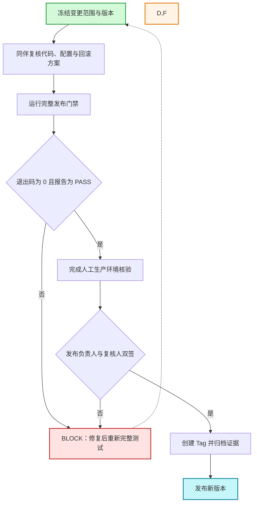

# Sartre 新版本发布流程

> [!danger] 唯一放行规则
> 只有 **完整门禁 PASS + 退出码为 0 + 人工核验完成 + 双人签字** 才能发布。任何一项缺失，结论都是 `BLOCK`。自动报告只提供证据，不直接授权发布。

相关流程：[[02-Sartre实盘新版本更新流程]]

## 开始前必须回答

以下问题必须全部回答“是”：

- [ ] 变更范围已冻结，目标 Commit/Tag 唯一且可追溯？
- [ ] 影响的策略、配置、风险参数和用户操作已列清？
- [ ] 回滚版本、回滚命令、负责人和发布时间窗已准备？
- [ ] 工作区没有未纳入范围的修改、密钥或冲突标记？
- [ ] 发布负责人、独立复核人和实盘负责人均已到位？

## 流程图



## 执行卡

| 步骤 | 责任人 | 必做动作 | 完成标准 |
|---|---|---|---|
| 1. 立项冻结 | 发布负责人 | 记录原因、范围、目标版本、窗口和回滚方案 | 变更单信息完整 |
| 2. 独立复核 | 复核人 | 核对代码差异、配置、风控、密钥和回滚可行性 | 无范围外改动；问题已关闭 |
| 3. 完整门禁 | 发布负责人 | 在工程根目录执行下方命令 | 退出码 0；报告 `PASS`；无零用例 |
| 4. 人工核验 | 实盘负责人 | 核对版本、环境、账户、路径、风控参数及最新日志 | 与本次变更单完全一致 |
| 5. 双人放行 | 发布负责人 + 复核人 | 逐项确认并签字；任一异议即停止 | 两人均明确同意 |
| 6. 归档发布 | 发布负责人 | 创建 Tag，归档门禁报告、变更单和发布说明 | 版本与证据可一一对应 |

```powershell
python .\pre_release_validation\release_gate.py
```

门禁证据位于：`pre_release_validation/artifacts/<运行编号>/`。

## 最小发布记录

- 目标 Commit/Tag：
- 门禁报告目录：
- 影响策略与配置：
- 回滚版本/命令：
- 发布负责人/时间：
- 复核人/时间：
- 最终结论：`PASS` / `BLOCK`
