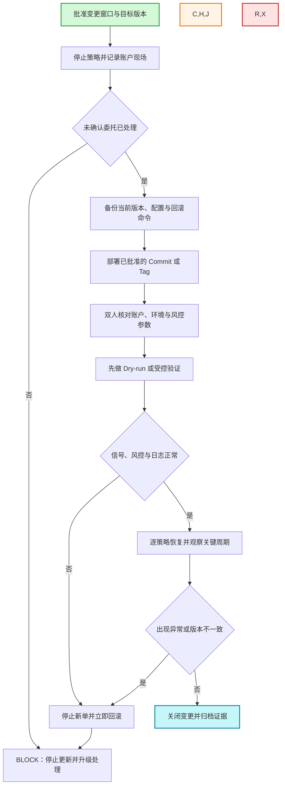

# Sartre 实盘新版本更新流程

> [!warning] 实盘红线
> 默认只在盘前或盘后更新。存在未确认委托、版本不一致、回滚不可用或风控异常时，立即 `BLOCK`。紧急盘中更新必须有单独审批，并先停止新单。

前置流程：[[01-Sartre新版本发布流程]]

## 更新前必须回答

以下问题必须全部回答“是”：

- [ ] 目标 Commit/Tag 已批准，且与门禁报告完全一致？
- [ ] 当前持仓、资金、委托、成交和策略状态已留存？
- [ ] 未确认委托已处理，更新窗口和停止范围已明确？
- [ ] 当前版本与配置已备份，回滚命令已经复核？
- [ ] 账户、MiniQMT、Python/xtquant、路径和风控参数已双人核对？
- [ ] 可先 Dry-run、非生产账户或小范围受控验证？

## 流程图

## 执行卡

| 步骤 | 责任人 | 必做动作 | 完成标准 |
|---|---|---|---|
| 1. 排定窗口 | 发布负责人 | 明确目标版本、影响策略、执行人、复核人和回滚人 | 变更获批；人员在线 |
| 2. 保存现场 | 实盘负责人 | 停止策略，记录持仓、现金、委托、成交和异常 | 无未处理委托；现场可追溯 |
| 3. 备份回滚 | 执行人 + 复核人 | 备份当前版本和配置，复核回滚命令 | 可恢复到上一稳定版本 |
| 4. 部署核对 | 执行人 + 复核人 | 仅部署已批准版本；核对账户、路径、依赖和风控参数 | 版本、配置、环境三者一致 |
| 5. 受控验证 | 实盘负责人 | 先 Dry-run/非生产验证，再逐个恢复策略 | 信号、风控、订阅、日志正常 |
| 6. 监控收口 | 实盘负责人 | 观察至少一个关键运行周期，核对委托与成交 | 无重复下单、未确认委托或陈旧数据 |
| 7. 关闭变更 | 发布负责人 | 记录结果并归档日志、版本、配置和签字 | 证据完整；责任人确认 |

> [!danger] 立即回滚条件
> 版本或配置不一致、连接/订阅异常、数据陈旧、风控失败、重复下单、未确认委托、成交明显偏离预期。触发任一项：**停止新单 → 保存证据 → 回滚稳定版本 → 通知负责人**。

## 最小更新记录

- 目标版本 / 原版本：
- 更新窗口：
- 更新前持仓与委托快照：
- 实际配置与风控上限：
- 验证结果：
- 是否回滚及原因：
- 执行人 / 复核人 / 实盘负责人：
