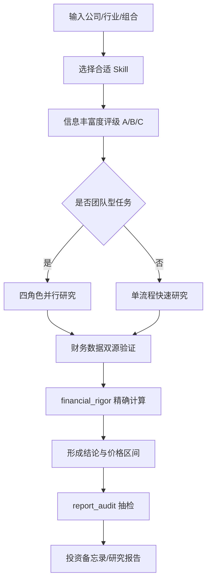

# AI Berkshire 使用教程

#ai-investing #investment-research #codex-skills

> [!info] 学习目标
> 学会把 AI Berkshire 当成一套“投研流程操作系统”使用：先筛选、再深研、再验证数据、最后形成可执行的投资判断。它不是自动荐股机，也不是量化交易系统。

## 一句话理解

AI Berkshire 是一个面向 Claude Code 和 Codex 的价值投资研究 Skill 合集。它把巴菲特、芒格、段永平、李录四类思维方式拆成可重复执行的研究流程，并用 Python 工具约束财务计算与报告抽检。

> [!warning] 使用边界
> 这个框架能提升研究质量和纪律，但不能替代一手数据核验、商业判断和最终投资责任。所有输出都应视为研究辅助，不构成投资建议。

---

## 框架总览



## 三层逻辑

| 层级 | 作用 | 你要关注什么 |
|---|---|---|
| Skill 层 | 把投研任务拆成固定入口 | 选对入口比直接问 AI 更重要 |
| Agent 层 | 多视角并行研究与相互挑战 | 团队型 skill 适合重要决策 |
| 工具层 | 精确计算、交叉验证、报告抽检 | 防止单位、汇率、心算错误 |

> [!tip] 核心使用观念
> 不要问“AI 觉得这只股票能买吗？”  
> 要让框架回答：“按什么证据、什么假设、什么价格、什么失败条件，才值得买？”

---

## 安装与启动

### 1. 克隆仓库

```powershell
git clone https://github.com/xbtlin/ai-berkshire.git
cd ai-berkshire
```

### 2. 安装 Codex Skills

```powershell
.\scripts\install-codex-skills.bat
```

可选：安装 slash prompts，让 Codex 里出现更接近 `/investment-research` 的入口。

```powershell
.\scripts\install-codex-prompts.bat
```

安装后重启 Codex。

### 3. Windows UTF-8 建议

在 Windows 控制台下，部分工具输出包含中文和符号。建议运行前设置：

```powershell
$env:PYTHONUTF8 = "1"
```

如果仍乱码，可以在 PowerShell 中加：

```powershell
[Console]::OutputEncoding = [System.Text.Encoding]::UTF8
```

---

## Skill 选择地图

| 目标 | 推荐 Skill | 典型输入 |
|---|---|---|
| 快速判断一家是否值得深挖 | `investment-checklist` | 使用 investment-checklist 分析腾讯 |
| 重要公司完整深研 | `investment-team` | 使用 investment-team 研究美团 |
| 单公司系统研究 | `investment-research` | 使用 investment-research 研究拼多多 |
| 财报精读 | `earnings-review` | 使用 earnings-review 分析 PDD 2025 年报 |
| 行业找标的 | `industry-funnel` | 使用 industry-funnel 筛选 AI 算力 |
| 排除劣质公司 | `quality-screen` | 使用 quality-screen 筛选恒生指数成分股 |
| 股价异动归因 | `news-pulse` | 使用 news-pulse 分析腾讯最近一周下跌 |
| 组合体检 | `portfolio-review` | 使用 portfolio-review 分析当前持仓 |
| 买入后跟踪论文 | `thesis-tracker` | 使用 thesis-tracker 跟踪拼多多 |

---

## 推荐工作流

### 工作流 A：从零筛选一个行业

1. 用 `industry-funnel` 从全市场筛到 2-3 家候选。
2. 对候选逐个跑 `quality-screen`。
3. 对剩下的公司跑 `investment-checklist`。
4. 只有通过 checklist 的标的，才进入 `investment-team`。
5. 报告写完后，用 `report_audit.py` 抽检关键数据。

> [!example] 示例
> ```
> 使用 industry-funnel 筛选 AI 基建电力
> 使用 quality-screen 分析 Eaton, Vertiv, Talen Energy
> 使用 investment-team 深度研究 Eaton
> ```

### 工作流 B：已经有一只关注股

1. 先跑 `investment-checklist`，确认是否值得花时间。
2. 再跑 `investment-research` 或 `investment-team`。
3. 用 `financial_rigor.py` 验算市值、PE、三情景估值。
4. 形成“空仓者/持有者/加仓者”三类行动建议。
5. 买入后用 `thesis-tracker` 定期复核。

### 工作流 C：股价突然大涨或大跌

1. 用 `news-pulse` 做 7-14 天事件归因。
2. 判断是价值事件、情绪波动、混合，还是原因不明。
3. 如果是价值事件，触发 `thesis-tracker` 或 `earnings-review`。
4. 如果只是情绪波动，回到原论文，不要被盘面牵着走。

---

## 财务验证工具

### 市值验算

```powershell
python tools\financial_rigor.py verify-market-cap `
  --price 510 `
  --shares 9.11e9 `
  --reported 4.65e12 `
  --currency HKD
```

用途：验证“股价 × 总股本”是否与报告市值一致，避免港币、人民币、美元和“亿/万亿”单位混淆。

### 估值验算

```powershell
python tools\financial_rigor.py verify-valuation `
  --price 510 `
  --eps 23.5 `
  --bvps 120 `
  --fcf-per-share 18
```

用途：计算 PE、PB、ROE、P/FCF、FCF Yield 等指标，避免 LLM 心算。

### 报告抽检

```powershell
python tools\report_audit.py extract --report reports\某公司\最终报告.md --seed 42
```

抽检清单生成后，需要你按可靠信源填入 `fetched_value`，再执行：

```powershell
python tools\report_audit.py verdict --results "<填好的 JSON>" --report "某公司最终报告"
```

> [!warning] 抽检局限
> `report_audit.py` 是辅助工具，不是完整审计系统。它可能抽到评分、百分比或表格里的非财务数字。关键结论相关数据仍需人工复核。

---

## 读报告的方法

一份合格的 AI Berkshire 报告，至少要回答这些问题：

| 问题 | 判断标准 |
|---|---|
| 这家公司到底靠什么赚钱？ | 能用一句话说清客户、付费原因、重复购买机制 |
| 护城河是什么？ | 不是“龙头”，而是网络效应、成本优势、品牌、资源、监管等机制 |
| 最大失败路径是什么？ | 能列出失败条件、概率、影响和观察信号 |
| 管理层是否可信？ | 看资本配置历史，不看宣传稿 |
| 当前价格隐含什么预期？ | 用反向 DCF 或三情景估值检验 |
| 空仓者和持有者动作是否不同？ | 好公司不等于当前价格可买 |

---

## 常见错误

| 错误 | 后果 | 修正 |
|---|---|---|
| 直接让 AI 给买卖建议 | 输出容易两边讨好 | 先指定 skill 和决策框架 |
| 只看一份深度报告 | 容易被单一叙事带偏 | 加 `news-pulse`、`thesis-tracker`、反面检验 |
| 忽略单位和币种 | 市值、PE、现金流可能错一个数量级 | 强制用 `financial_rigor.py` |
| 把资料多当作确定性高 | 大公司容易输出漂亮共识 | 先做 A/B/C 信息丰富度评级 |
| 把低估值当安全边际 | 便宜可能是价值陷阱 | 同时检查护城河、管理层、行业终局 |

---

## 决策纪律清单

- [ ] 我能用 5 句话讲清买入理由。
- [ ] 关键财务数据至少两个来源交叉验证。
- [ ] 我知道最强看空者会怎么反驳。
- [ ] 我知道什么信号出现时必须重审论文。
- [ ] 当前价格对应的预期回报高于现金和替代标的。
- [ ] 这笔仓位和现有组合风险不高度重复。

> [!quote] 镜子测试
> 如果你无法在镜子前用 5 句话讲清楚“我为什么在这个价格买入这家公司”，就先不要买。

---

## 练习题

## Related Concepts

- [[价值投资]]
- [[投资研究]]
- [[财务报表分析]]
- [[投资论文]]

> [!hint]- 答题关键词
> | 关键词 | 对应动作 |
> |---|---|
> | 初筛 | `quality-screen` / `investment-checklist` |
> | 深研 | `investment-research` / `investment-team` |
> | 异动 | `news-pulse` |
> | 买入后 | `thesis-tracker` |
> | 数字校验 | `financial_rigor.py` / `report_audit.py` |

### Question 1 - AI Berkshire 是什么 [recall]

> 用一句话解释 AI Berkshire 的定位。

> [!answer]- 答案
> 它是一套 AI 投资研究 Skill 合集，用固定流程、多视角 Agent 和财务验证工具，把公司/行业研究变成可复现的投资研究报告。

### Question 2 - 什么时候用 investment-team [application]

> 你准备认真研究一家公司，可能投入真实资金，应该优先用哪个 skill？

> [!answer]- 答案
> 用 `investment-team`，因为它会拆成商业、财务、行业、风险四个角色并行研究，更适合高重要性的单公司深研。

### Question 3 - 为什么不能只看 PE [analysis]

> 某公司 PE 很低，框架是否应该直接判断为便宜？

> [!answer]- 答案
> 不应该。低 PE 可能来自周期顶部、利润不可持续、护城河恶化或治理风险。需要同时验证现金流、资产负债表、行业终局和管理层。

### Question 4 - 股价异动怎么办 [application]

> 持仓一周跌了 12%，你第一步应该做什么？

> [!answer]- 答案
> 先用 `news-pulse` 做最近 7-14 天事件归因，判断是价值事件、情绪波动、混合，还是真因不明，再决定是否重审投资论文。

### Question 5 - 数据验证 [recall]

> 市值验算的基本公式是什么？

> [!answer]- 答案
> 市值 = 当前股价 × 总股本。验算时必须确认币种、股本单位和报告市值单位一致。

### Question 6 - 信息丰富度评级 [analysis]

> 为什么资料很多的公司反而可能更危险？

> [!answer]- 答案
> 因为资料多容易让 AI 输出市场共识，看起来完整但缺少信息优势。A 级信息充裕公司更需要反共识检查和失败路径分析。

### Question 7 - 报告抽检局限 [analysis]

> `report_audit.py` 抽检通过，是否代表整份报告完全可靠？

> [!answer]- 答案
> 不代表。它只是抽样验证数字点，且需要人工填核验值。关键投资结论仍要回到原始财报、交易所公告和可靠数据源。

### Question 8 - 空仓者与持有者 [application]

> 为什么同一家公司对空仓者和持有者的建议可能不同？

> [!answer]- 答案
> 因为买入决策看当前价格的预期回报，持有决策还要考虑已有成本、税费、替代机会和论文是否被证伪。好公司不等于任何价格都值得新买。

> [!summary]- 复习摘要
> | 要点 | 记忆句 |
> |---|---|
> | 框架定位 | 它是投研流程，不是荐股机器 |
> | 使用顺序 | 初筛、深研、验证、行动、跟踪 |
> | 最大价值 | 把 AI 输出变成可审计、可比较、可复盘 |
> | 最大风险 | 数据源、环境依赖、Agent 执行纪律和使用者误读 |

---

## 后续学习路径

1. 先用 `quality-screen` 跑 3 家熟悉公司，练习排除劣质标的。
2. 再用 `investment-checklist` 对其中 1 家做镜子测试。
3. 对最有兴趣的 1 家跑 `investment-team`。
4. 用 `financial_rigor.py` 手动复核市值和估值。
5. 将最终报告改写为自己的 `[[投资论文]]`，并设置月度复盘。

## Related Notes

- [[价值投资]]
- [[投资研究]]
- [[AI 投研]]
- [[财务验证]]
- [[投资论文]]
