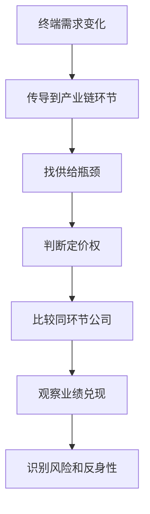

# 行业分析教程总览

> [!important]
> 本教程基于 `StudyVault/Industry` 中的 71 篇行业分析原文整理，目标读者默认不是行业内人士。学习重点不是背公司名，而是看懂一个行业内部：谁控制资源、谁掌握技术、谁承担资本开支、谁拥有定价权、谁最容易在景气周期里兑现利润。

## 学习路径

| 顺序 | 模块 | 先学什么 | 学完要能回答 |
|---|---|---|---|
| 1 | [[行业分析入门：从需求到利润池]] | 行业利润从哪里来 | 为什么同一行业有人暴赚、有人亏损 |
| 2 | [[产业链阅读框架：三张表]] | 上中下游、利润池、公司对比 | 如何把一篇行业文章拆成投资研究表 |
| 3 | [[AI算力产业链教程]] | GPU、光模块、AIDC、液冷、电力 | AI需求如何穿透到硬件、材料和电网 |
| 4 | [[电力新能源与储能产业链教程]] | 电网、光伏、储能、氢能、核电、风电 | 为什么新能源不只看发电量，还要看消纳和并网 |
| 5 | [[机器人与高端制造产业链教程]] | 控制器、伺服、减速器、本体 | 为什么机器人产业链的利润不一定在整机 |
| 6 | [[半导体与电子材料产业链教程]] | 设备、硅片、封装、光刻胶、特气、PCB | 国产替代到底替代的是哪一层 |
| 7 | [[锂电与新能源材料产业链教程]] | 正极、负极、隔膜、电解液、碳酸锂、固态电池 | 为什么电池产业链经常“需求好但公司不赚钱” |
| 8 | [[化工资源与新材料产业链教程]] | 磷、氟、钨、稀土、玻纤、维生素、钛白粉 | 为什么资源、配额和环保能变成护城河 |
| 9 | [[医药医疗与消费品产业链教程]] | CXO、创新药、血制品、医械、地产服务 | 如何区分政策压制、出海增量和牌照稀缺 |
| 10 | [[高端装备与军工产业链教程]] | 大飞机、燃气轮机、机床、船舶、商业航天 | 高端装备为什么常常先看瓶颈环节 |

## 快速工具

| 工具 | 用途 |
|---|---|
| [[行业上市公司与龙头股矩阵]] | 横向查看产业链环节、龙头、跟随者、风险点 |
| [[Industry原文索引与主题映射]] | 按主题回到 71 篇原始行业分析 |
| [[行业分析练习题]] | 用主动回忆检查是否真正理解产业链关系 |

## 本教程的核心判断框架

## 主题地图

| 大主题 | 代表原文 | 共同问题 |
|---|---|---|
| AI算力 | [[2026年3月11日3000亿美元的算力军备竞赛，钱正在换方向流｜算力产业链硬核拆解]]、[[2026年4月10日光模块深度：年赚200亿的暴利生意，被英伟达CPO盯上了]]、[[2026年5月1日【算力租赁深度】6858亿算力开支背后，谁是真玩家谁是施工队]] | 算力需求到底让谁赚到钱 |
| 能源电力 | [[2026年3月2日4万亿砸向电网，未来三年最确定的超级周期]]、[[2026年4月17日算电协同深度：AI每年烧5000亿度电，电从哪来——三条路径全拆解]]、[[2026年4月9日固态变压器深度：126年铜铁设计被SiC颠覆，效率98.5%但贵3-5倍]] | 电力基础设施如何成为 AI 和新能源共同瓶颈 |
| 机器人 | [[2026年3月8日机器人行业全景分析：500亿美元市场，四大家族统治50年，中国能打破吗？｜5期系列第1期]]、[[2026年3月10日伺服系统：汇川技术十年反超日本的逆袭之路  机器人系列 第3集]]、[[2026年3月18日人形机器人：从科幻到量产的最后一公里【机器人系列完结篇】]] | 产业链利润在控制、驱动、零部件还是本体 |
| 半导体材料设备 | [[2026年4月15日电子化学品深度（上）：洗芯片的药液，纯度差一级价格翻十倍  湿电子化学品 + CMP抛光材料]]、[[2026年4月18日先进封装深度：台积电CoWoS月产能不到8万片，英伟达锁走六成——中国三巨头怎么突围]]、[[2026年5月4日【硬核】半导体前道设备深度：9 家中国公司五赢四亏，国产化战争内部分化｜]] | 国产替代在哪些环节容易兑现，哪些环节只是概念 |
| 新能源材料 | [[2026年3月15日电解液产业链深度：5%的添加剂拿走40%的利润【谁在闷声发财】]]、[[2026年3月27日正极材料深度：占电芯成本40%的老大，三年亏了37亿——完整拆解]]、[[2026年4月4日固态电池终局深度：四大材料过堂，两层判了死缓  锂电系列收尾篇]] | 成本占比、技术壁垒和盈利能力为什么不总是一致 |
| 资源化工 | [[2026年3月14日中国锁死了全球一半的磷矿，但真正值钱的不是石头]]、[[2026年3月30日钨深度分析：中国82%垄断 + 出口管制 + AI军工三重引爆  谁是最大受益者]]、[[2026年5月9日玻纤 4 月分裂成两个市场——电子布 vs 粗纱涨幅差 20 倍，中国 70% 全球产能]] | 资源价格上涨为什么有时不等于公司利润上涨 |

## 标签规则

| 标签 | 含义 |
|---|---|
| `#industry/tutorial` | 教程型笔记 |
| `#industry/framework` | 分析框架 |
| `#industry/company-map` | 公司与产业链映射 |
| `#industry/ai-compute` | AI 算力 |
| `#industry/power-energy` | 电力能源 |
| `#industry/robotics` | 机器人与自动化 |
| `#industry/semiconductor` | 半导体 |
| `#industry/battery` | 锂电与储能 |
| `#industry/materials` | 化工、资源、新材料 |
| `#industry/healthcare` | 医药医疗 |
| `#industry/equipment` | 高端装备 |

## 学习提醒

> [!warning]
> 原文多为行业与投资视角材料，里面包含上市公司、股价、估值和业绩判断。本教程只做知识整理和行业研究训练，不构成投资建议。真正做投资决策时，需要再核对最新公告、财报、价格数据和监管政策。
