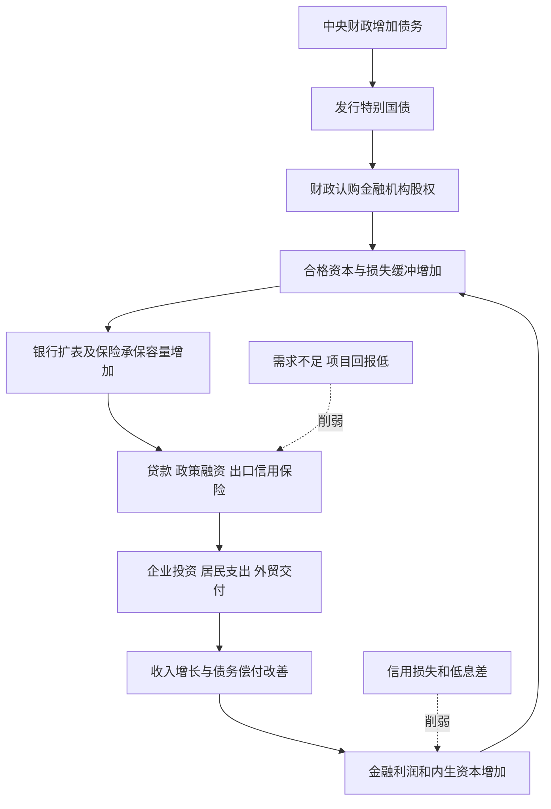

# 3600亿元中央金融企业增资：谁获得了价值，老股东需要什么回报？

> **核心判断**：这是一项以中央财政承担更多金融风险资本为核心、兼有预防风险、支持扩表和调整国有股权结构作用的安排。体系和金融机构首先获得更厚的损失缓冲；普通股股东是否获益，必须再过“发行价格是否公平、增量资本回报是否足够”两道检验。
>
> **最重要的测算**：暂以2026年9月4日A股收盘价模拟发行，工行1000亿元新增资本每年需增加约**123.14亿元普通股利润，回报率12.31%**；农行1600亿元需增加约**179.95亿元，回报率11.25%**，才能抵消完整年度EPS稀释。这些是以2025年普通股利润为基准的门槛，不是已确定发行条件，也不是盈利预测。

**研究口径。** 事件和市场信息截止2026年9月6日；报告整理及核验在9月7日继续完成。使用9月6日签署、部分平台9月7日镜像刊载的公告，不纳入9月7日股价反应。9月6日为非交易日，行情采用9月4日收盘。金额除另注外均为人民币**亿元**，股数为**亿股**，每股数为**元/股**；H股价格另标港元。

**事实、推算与观点。** 标为“事实”的内容有公告、财报或统计来源；“测算”有明确输入和公式；“判断”是对证据的解释。信息丰富度：上市银行财报为A，部分非上市集团增资条款为B/C。公开信息充足不代表资产质量完全透明，也不代表投资确定性高。所有前瞻回报表都是情景，不以官方“填补回报措施”代替利润证据。

## 一、先核查事实：3600亿元由什么组成？

### 1. 八家机构和资金分配

**事实：9月6日披露的是拟增资安排，不是3600亿元已经全部缴款、验资、登记完成。** 上市主体仍有股东会、监管批准、审核注册等实施条件。新华社当晚确认财政部将于近期发行3000亿元特别国债；银行和其他股东现金认购还需执行。[新华社财政资金报道，9月6日][F1]、[八家汇总，9月6日][F2]

| 接受资本的准确主体 | 计划增资 | 财政部计划出资 | 其他国有资本 | 方式、定价与资本归属 | 核查来源 |
|---|---:|---:|---:|---|---|
| 中国工商银行股份有限公司 | 不超过1000 | 700 | 烟草体系300 | 定向发行A股普通股、现金认购；最终价未定；扣发行费后补银行核心一级资本 | [9月6日预案][I1] |
| 中国农业银行股份有限公司 | 不超过1600 | 1300 | 烟草体系300 | 定向发行A股普通股、现金认购；最终价未定；净募集资金补银行核心一级资本 | [9月6日预案][A1] |
| 中国人寿保险（集团）公司 | 350 | 350 | 未披露其他出资 | 向未上市集团注资；不是向601628/02628上市寿险公司直接定增；短公告未披露每股定价、注册资本与公积拆分及下拨子公司安排 | [集团9月6日公告][L1] |
| 中国人民保险集团股份有限公司 | 不超过150 | 150 | 本次方案未列其他对象 | 向财政部定向发行A股、现金认购；发行期首日前20交易日均价为原则性底价；充实集团资本金 | [9月6日预案原件][P1] |
| 中国太平保险集团有限责任公司 | 70 | 70 | 未披露其他出资 | 向未上市母集团注资；不能记作00966上市控股公司直接收到70亿元；短公告未披露每股价格与资本科目细分 | [集团公告][T1]、[新华社][T2] |
| 中国再保险（集团）股份有限公司 | 不超过30 | 30 | 本次方案未列其他对象 | 定向发行内资普通股，价格**1.33元人民币**，约22.56亿股；净额增加保险监管口径核心一级资本 | [公司9月6日公告][R1] |
| 中国进出口银行 | 300 | 300 | 未披露其他出资 | 财政注资政策性银行；不是交易所新股发行；公开短消息未披露定价、公积拆分等完整交易条款 | [9月6日机构报道][X1]、[新华社汇总][F2] |
| 中国出口信用保险公司（中国信保） | 100 | 100 | 未披露其他出资 | 向政策性出口信用保险公司注资，公告表述补充核心一级资本，属保险承损资本；未提供每股价格及资本认定明细 | [9月6日公告报道][X2]、[新华社汇总][F2] |
| **合计** | **3600** | **3000** | **600** | 部分为上限，最终金额以批准及缴款结果为准 | 本文加总 |

**资本层级不能混用。** 工农的CET1是商业银行持续经营资本；中再公告的“核心一级资本”属于保险偿付能力框架，分母不是银行RWA。国寿、太平、进出口行、信保的短公告确认了出资主体和金额，但没有给出完整资本认定表。新华社将本轮概括为补充核心一级资本，不能据此伪造每一家监管报表中最终入账的精确科目。集团层面新增资本，也不能在集团和子公司两个层级重复相加。

**几个易混数字：** 四家商业保险集团为350+150+70+30=**600亿元**；若把政策性中国信保100亿元计入，保险机构共五家、**700亿元**。早期新闻中的“四家670亿元”包含信保而尚未包含中再，是不同时间及主体口径。进出口行300亿元与信保100亿元合计**400亿元**。对工农两家而言，财政出资是**2000亿元**，并非2600亿元；对全部八家而言，财政是**3000亿元**，并非3600亿元。[财新9月6日更新稿][F3]

### 2. 工行1000亿元：谁出多少钱？

| 认购人 | 认购额 |
|---|---:|
| 财政部 | 700 |
| 中国烟草总公司 | 100 |
| 上海烟草集团有限责任公司 | 50 |
| 云南中烟工业有限责任公司 | 50 |
| 湖南中烟工业有限责任公司 | 50 |
| 中国烟草总公司湖南省公司 | 50 |
| **合计** | **1000** |

各方拟以现金认购。A股面值1元，新发行数量不超过发行前普通股总股本的10%，取得股权后五年内不得转让。发行价原则上不低于**发行期首日前20个交易日A股成交金额/成交量所算均价**，按进一法保留两位小数；区间内除权除息应作相应调整。最终价格由获授权主体按监管要求和市场情况确定。[工行预案][I1]、[方案条款转录，9月6日][I2]

**没有找到本次方案明确设置“不得低于每股净资产”的条款，也不是“20日均价的八折定增”。** 前者决定破净发行是否可能，后者决定是否对短期市场价格明显折价，两者不同。

### 3. 农行1600亿元：结构与工行不同在哪里？

| 认购人 | 认购额 |
|---|---:|
| 财政部 | 1300 |
| 中国烟草总公司 | 100 |
| 中国烟草总公司江苏省公司（江苏省烟草公司） | 50 |
| 中国烟草总公司浙江省公司 | 50 |
| 中国烟草总公司湖北省公司 | 50 |
| 中国烟草总公司北京市公司 | 30 |
| 中国双维投资有限公司 | 20 |
| **合计** | **1600** |

同为现金认购、面值1元A股、五年限售，定价原则同工行；但新股上限是发行前普通股总股本的15%。财政认购占新增资本81.25%，高于工行70%，因此在相同其他条件下，农行财政部直接持股提升更明显。[农行预案][A1]、[上海证券报9月6日报道][A2]

600亿元烟草资金是国有企业出资，不是已经进入国库再支出的特别国债资金。它有财政机会成本——可能减少未来可上缴利润或其他投资——但不能将“最终国有”与“本次财政预算支出”混为一谈。公告没有逐笔披露烟草企业现金的历史形成来源，不能进一步断言全部来自当年经营现金流或某一专门账户。

### 4. 特别国债资金链：已经知道什么，仍缺什么？

1. **预算授权：** 2026年政府工作报告拟发行3000亿元特别国债支持国有大型商业银行补资本；财政部预算报告用更宽的“中央金融机构注资特别国债”口径，列收入3000亿元，政府性基金支出预算也列3000亿元。[政府工作报告][F4]、[财政预算报告，3月16日][F5]、[支出预算表，3月24日][F6]
2. **9月6日资金安排：** 财政出资对应工农2000亿元、四商业保险600亿元、两政策性机构400亿元；新华社称近期发行特别国债3000亿元支持本次增资。[财政资金报道][F1]
3. **实际发行：** 截止研究日，没有取得这3000亿元对应的完整发行批次、最终期限、票息、投资者配置及缴款记录。不能套用2025年债券或特别国债到期续作的条款。
4. **财政认购与银行验资：** 国债收入先进入财政，再依法支付认购款；银行收到权益资金、完成发行及资本认定后才增加可计入CET1的净额。公告上限不等于已经到账的净资本。
5. **后续应补证据：** 国债发行通知及结果、银行股东会和监管文件、发行情况报告书、验资报告、新股登记、发行后第三支柱资本表。

因此，“财政部实际承担多少”的严谨答案是：**已经公布的计划出资责任合计3000亿元；截至9月6日，尚不能以此证明实际缴款完成3000亿元。**

**发行时间的交叉检查：** 不应将早期发行日程当作发行结果。新华社2026年5月22日21:32报道，当天完成的是两笔普通记账式国债招标，同时明确中央金融机构注资特别国债发行时间调整。它与9月6日“近期发行”的表述相互衔接。因此，不能依据5月22日较早报道中的计划日期，写成3000亿元已经按原计划发行。[新华社5月22日晚报道][F8]

## 二、为什么是现在：低利润、高政策责任与未来资本要求叠加

### 1. 2024—2026年的证据不是单向“银行恶化”

| 观察项 | 核实数据与日期 | 对资本补充的含义 |
|---|---|---|
| 行业净息差 | 2024年1.52%；2025年1.42%；2026Q1 1.40%，H1 1.41% | 内生资本积累承压，但二季度已经微升1bp，不能说一直恶化 |
| 行业不良 | 2024末3.28万亿元、1.50%；2026H1约3.7万亿元、1.52% | 绝对风险存量扩大；没有仅凭总不良率就能证明的大行资本危机 |
| 行业盈利 | 2024净利2.32万亿元、同比-2.27%；2026H1约1.2万亿元 | 仍在盈利；半年整数不能用来推精确年度增速 |
| 行业CET1及流动性 | 2026H1 CET1 10.72%，LCR 148.53%、NSFR 128.13% | 资本与流动性是不同约束；流动性缓冲较足不代表资本不稀缺 |
| 房地产 | 2026年1—7月开发投资-19.2%，新房销售额-13.1%，开发企业到位资金-20.3% | 房企现金流和抵押物压力仍在，损失确认可能延迟 |
| 居民融资 | 2026前7月住户贷款净减8271亿元，中长期仅增1010亿元 | 居民修复资产负债表和有效需求不足是直接证据 |
| 融资结构 | 2026年7月末政府债存量+14.1%，实体人民币贷款+5.2%，企业债+9.2% | 中央/地方政府及直接融资承担更多信用增长，不是所有信贷少增都等于融资不足 |

来源：2024数来自[人民银行金融稳定报告2025][M1]；2025—2026息差由[中国金融信息网引用监管数据][M2]及[监管数据原文转载][M3]核对，未把二手转录伪称下载到官方附表；地产来自[统计局2026年8月17日发布][M4]；金融量来自[人民银行8月14日原文][M5]。2024、2025年1—7月地产投资降幅分别为10.2%、12.0%，为长期调整提供时间参照；各年同比是可比口径，不能用不同发布批次的绝对量直接替代官方同比。[统计局2024][M6]、[统计局2025][M7]

**银行本身的矛盾更具体。** 工行2026H1贷款平均收益率2.64%，低于上年同期2.92%；平均贷款规模增长6.8%，贷款利息收入却下降3.5%。这说明“多放贷款”不自动等于“多赚利息”。同时其房地产业贷款不良率由2025末5.39%升至6.27%，而全行不良率仅1.29%。总表面稳定与局部压力可以同时存在。[工行半年报，利息收入表及行业贷款质量表][B1]

低息差使利润留存增长变慢；化债、普惠、科技、制造业和乡村业务又要占资本。若仍按一定比例分红，银行在“扩大政策性支持、维持股东现金回报、保留安全缓冲”之间必须取舍。财政股权补充把一部分取舍转移到中央资产负债表，但没有取消取舍。

**盈利也有改善证据。** 工行和农行2026H1归母利润分别同比增长约3.3%、4.9%，六大行均为正增长；不能把行业长期息差压力写成两行最新利润仍在下降。利润改善可能含负债成本、非息收入和拨备等因素，不能仅凭营业收入增速判断贷款定价已恢复。[两行半年报][B1]、[B3]及[上海证券报8月31日六大行中报综述][M8]

### 2. 地方化债为什么既帮助银行，又可能压利润？

高息平台融资被更低息、较长期地方政府债务或重组融资替换，可降低违约概率、缓解到期流动性、改善部分风险权重；同时资产收益率下降，展期降息可能降低现值和利息收入。**信用风险下降与盈利下降可以同向发生。** 置换不是所有债务被免除，也不是所有额度都形成新增银行资本。

财政部2025年7月发布会确认2024年2万亿元置换债已全部使用，2025年2万亿元额度上半年发行1.8万亿元、使用1.44万亿元。这个时间顺序说明：银行是在多年化债与利率调整过程中补资本，并非孤立发生的单日政策。[财政部7月25日发布会][F7]

### 3. 工行还有一项可以量化的前瞻压力

FSB于2025年11月27日将工行由G-SIB第二档升入第三档，对应附加普通股资本缓冲由1.5%升至2.0%，上调自2027年1月1日生效；农行仍在第二档。[FSB名单及附表][G1]

**测算：** 按工行2026H1 RWA 298327.80亿元保持不变，额外0.5个百分点相当于约**1491.64亿元CET1**。本次1000亿元只能抵消其中一部分。这里的1491.64亿元是“维持原有高于监管线的缓冲距离”所需的额外资本，**不是工行已经缺资本1491.64亿元**；工行本来就高于底线。这使本轮“提前准备”比单纯救急更有证据。

### 4. 五种解释，分别成立到什么程度？

| 解释 | 支持证据 | 反证或限制 | 本文判断 |
|---|---|---|---|
| 1. 风险恶化后的被动救助 | 地产分项风险上升，低利率压盈利，不良余额增加 | 两行仍有较大盈利、资本达标，未见本次公开材料披露资本窟窿或偿付危机 | **作为唯一主因证据不足**；不能排除历史风险吸收功能 |
| 2. 预防潜在风险 | 房地产、外部贸易和利率风险长期化；工行2027缓冲上调 | 资本增加不代表风险已消失 | **证据较强** |
| 3. 为未来信用扩张备资本 | 现金普通股直接增加扩表容量；工农以外还覆盖承保和政策金融 | 资本容量不等于项目回报或贷款需求 | **明确的可实现条件，尚非扩张结果** |
| 4. 财政经金融体系扩信用 | 特别国债认购股权，金融杠杆可扩大资金支持量 | 企业不借、银行不愿冒险或资金买低风险债券时乘数弱 | **政策机制成立，效果取决于需求与配置** |
| 5. 国有金融资本结构调整 | 财政直接持股增加，烟草资本跨行业配置，六大行分批覆盖 | 不是市场化退出、私有化或控制权全面更替 | **事实层面成立** |

结论不应压成一个标签：**预防性资本补充+政策信用能力建设+国有资本再配置，是证据最充分的组合；“已发生系统性救助”是比现有资料更强的断言。**

## 三、从国家资产负债表看：不是白花掉，也不是免费赚钱

### 1. 四步资产负债表

下面以财政3000亿元为例，只描述经济实质，省略具体政府会计科目、发行费用和结算细节。

| 步骤 | 中央财政 | 金融机构/投资者 | 央行与结算 |
|---|---|---|---|
| 发行国债 | 现金/国库存款+3000；国债负债+3000 | 买方现金或准备金-3000；国债资产+3000 | 资金结算至国库；银行准备金可能暂时下降 |
| 财政支付认购款 | 国库存款-3000；金融股权资产+3000 | 接受出资机构现金资产增加；实收资本/股本和资本公积增加 | 国库存款转为收款银行准备金，发行期流动性抽离部分回流 |
| 完成股权与资本认定 | 持有更多国有金融股权及相关收益权 | 工农净募集资金计入CET1；保险依各自规则认定 | 不等于央行凭空增加银行权益 |
| 后续扩表 | 仍负担国债利息及偿还责任 | 发放贷款通常同时创造存款，结算后需要稳定资金；资本随RWA扩张被占用 | 央行可配合流动性，但不替代信用损失承担 |

**财政增加债务，同时取得资产。** 与工资、补贴等没有直接股权回收权的支出相比，注资形成对金融机构未来利润及剩余资产的权益。与基础设施支出相比，差别也不是“一个有资产、一个没有资产”，而是资产形式、回报渠道与风险不同。预算上仍有支出：本项列政府性基金预算，不列入狭义一般公共预算赤字，绝不意味着没有新增政府债务。[财政预算报告][F5]、[政府性基金支出表][F6]

### 2. 国家是不是利用低融资成本提供风险资本？

**判断：是，但这是风险转换，不是无风险套利。** 中央政府向债券投资者提供相对确定的偿付义务，换取金融股权的不确定回报；银行用能承担损失的权益支撑更大资产规模。政府承担了更多期限、信用与股权风险。低国债票息依赖中央财政信用及整个税基，不代表金融股权的经济资本成本等于票息。

**假设测算：** 3000亿元债务按1.5%、2.0%、2.5%融资，全年利息分别45、60、75亿元；这是融资成本敏感性，**不是本次未发行债券的实际票息**。

财政认购银行股份以后可以收股息，股权也可以长期增值。若按本报告现价发行、2025利润和分红总额不变的静态模型，财政新增工行股份获年度股息约25.83亿元、新增农行股份约43.73亿元，合计69.56亿元；只针对财政投入工农的2000亿元。这个量级说明股权投资可能产生现金回报，但不能据此说整个3000亿元项目必然盈利：保险和政策机构分红能力不同，银行分红不保证，国债还有本金及再融资风险。

### 3. 合并国家资产负债表后，不能双重创造财富

从财政单体看，是“加债务、加股权”；从包含财政和国有银行的合并公共部门看，财政持有银行的内部股权及对应权益应抵销，公共部门并未仅靠内部换手就多出3000亿元净财富。若国债也由合并范围内金融机构持有，相关内部债权债务同样需要抵销；来自公共部门外的真实融资及其负债才保留。

烟草600亿元同理：在国企单体是现金换金融股权，在公共部门整体更多是资产配置变化；不能把它同时算作新增财政收入、新增社会储蓄和新增国家净资产。

真正的价值来自后续：更低的危机损失概率、更有效的实体资本形成，以及金融机构创造的风险调整后利润。反面则是把低回报或潜在坏账继续滚大，未来再由税基兜底。**要用“新增公共负债对应资产的质量和回报”评价，而不是只看当年赤字数字，或只看买到了多少银行股份。**

## 四、核心一级资本究竟约束什么：资产负债表和敏感性

### 1. 100元资本，不是只能借出去100元

假设一家银行有100元普通权益，吸收900元存款，就能形成1000元资产。资产减值30元时，存款负债仍为900，权益由100降至70；资本的作用是吸收损失、保护债权人，不是一个独立封存的贷款资金池。若只有央行借款增加100，银行资产和负债各加100，权益不变；若发行普通股增加100，则资产与权益各加100，才改变承损结构。

CET1一般来自普通股实收资本及溢价、可计入的留存收益等，经监管扣除得到净额。优先股、其他一级资本工具和二级资本债各有作用，但不能全部替代普通股核心资本。监管不仅看CET1，还看一级、总资本、杠杆率、流动性和TLAC。[现行商业银行资本管理办法][G2]

### 2. 正确公式：先算RWA，再算资产

设净新增CET1为K，目标CET1率为c，新增组合综合风险权重为w：

$$\Delta RWA_{容量}=K/c,\qquad \Delta A_{容量}=K/(c\times w)$$

这里w应是包含信用、市场、操作风险增量影响的有效风险密度；表中是简化组合假设，不是声称所有贷款监管风险权重固定为某个数。若只拿信用风险权重计算，还要扣除另外两类风险对容量的占用。

| 目标CET1率c | 100元资本可支撑RWA | 100元资本可支撑资产：w=100% / 75% / 50% | 1000亿元资本的RWA容量（万亿元） | 2600亿元资本的RWA容量（万亿元） |
|---|---:|---:|---:|---:|
| 10.0% | 1000.00 | 1000.00 / 1333.33 / 2000.00 | 1.0000 | 2.6000 |
| 11.5% | 869.57 | 869.57 / 1159.42 / 1739.13 | 0.8696 | 2.2609 |
| 12.5% | 800.00 | 800.00 / 1066.67 / 1600.00 | 0.8000 | 2.0800 |
| 14.0% | 714.29 | 714.29 / 952.38 / 1428.57 | 0.7143 | 1.8571 |

**2600亿元两行资本对应的理论资产容量：**

| 目标CET1率 | w=100% | w=75% | w=50% |
|---|---:|---:|---:|
| 10.0% | 2.6000万亿元 | 3.4667万亿元 | 5.2000万亿元 |
| 11.5% | 2.2609万亿元 | 3.0145万亿元 | 4.5217万亿元 |
| 12.5% | 2.0800万亿元 | 2.7733万亿元 | 4.1600万亿元 |
| 14.0% | 1.8571万亿元 | 2.4762万亿元 | 3.7143万亿元 |

**如何使用区间？** 10%—14%、50%—100%假设下，1000亿元可增加约0.71—2.00万亿元资产容量；两行2600亿元约1.86—5.20万亿元。较保守使用11.5%—14%、75%—100%时，两行约**1.86—3.01万亿元**。这些是“相对于没有本次增资的额外容量”，不是下一年实际新增贷款预测。更低风险权重可以支持更多名义资产，却往往对应更低收益；更高风险贷款也不是只按100%权重封顶。

### 3. 为什么不能称为“2600亿撬动5万亿贷款”？

更完整地看：

$$\Delta RWA_{可用}\leq\max\{0,(C_0+K+留存利润-额外损失-资本扣除)/c_{未来}-RWA_0\}$$

其中“额外损失”只计未包含在留存利润中的资本损耗；已经通过损益计入净利润的信用损失不能再扣一次。

还要与一级资本、总资本、杠杆率、TLAC、稳定负债、内部限额及有效项目需求所能支持的规模取较小者。上式里原有资本高于或低于管理目标的空间也在变化，不能把全部扩张都归因于K。

本次现金尚未投放时，资本率升高；一旦扩表，分母增加，资本率又会回落。因此“更高资本率”和“把全部新资本充分使用”的两个好处不能无条件同时拿满。工行2027额外监管缓冲还会消耗部分增量空间。对实体而言，新增资产可能是政府债、同业、存量债务置换或贷款，不等于同额新增民间投资。

## 五、工行与农行：同口径基础数据和定增模拟

### 1. 最新资产负债表与2025完整年度盈利基准

| 指标 | 工商银行 | 农业银行 | 日期/口径 |
|---|---:|---:|---|
| 总资产 | 570705.93 | 510588.73 | 2026-06-30，集团 |
| 风险加权资产RWA | 298327.80 | 262816.08 | 同日，监管口径 |
| 核心一级资本净额 | 39407.80 | 28387.83 | 同日 |
| CET1率 | 13.21% | 10.80% | 同日，披露四舍五入值 |
| 归母所有者权益 | 43269.94 | 33280.14 | 同日，含其他权益工具 |
| 其他权益工具 | 3646.66 | 4700.00 | 同日；不是普通股权益 |
| **归母普通股权益** | **39623.28** | **28580.14** | 上两行相减 |
| 普通股BVPS | 11.12 | 8.17 | 同日披露值；模型分别11.117448、8.166150 |
| 2026H1集团净利润 | 1764.75 | 1480.62 | 半年、含少数股东 |
| 2026H1归母净利润 | 1736.82 | 1463.81 | 半年 |
| 2026H1普通股利润 | 1692.68 | 1395.60 | 归母扣优先股/永续等权益工具分派 |
| 2026H1基本EPS | 0.47 | 0.40 | 半年，不能直接与全年EPS比较 |
| 2026H1 ROE | 8.63% | 10.14% | 年化、加权平均普通股净资产 |
| 2026H1净息差 | 1.29% | 1.28% | 累计期间口径 |
| 2026H1不良率 | 1.29% | 1.25% | 期末 |
| 2026H1拨备覆盖率 | 217.58% | 290.10% | 期末 |
| 2025归母净利润 | 3685.62 | 2910.41 | 完整财年 |
| **2025普通股利润N** | **3567.98** | **2739.56** | EPS模拟分子 |
| 2025基本EPS | 1.00 | 0.78 | 披露值；精确模拟1.001099、0.782769 |
| 2025 ROE | 9.45% | 10.16% | 加权平均口径 |
| 2025普通股BVPS | 10.83 | 7.91 | 年末普通权益/普通股数，四舍五入 |
| 2025全年现金分红 | 1105.93 | 873.21 | 归属2025年度中期+末期，不是仅2025现金支付 |
| 2025 DPS | 0.3103 | 0.2495 | 税前人民币，A/H同股经济分红基准 |
| 2025分红/归母利润 | 约30% | 约30% | 公告常用分红口径 |
| 2025分红/普通股利润 | 31.00% | 31.87% | 模型计算，用于DPS情景 |
| 2026中期拟DPS | 0.1511 | 0.1297 | 计划，不能直接乘二当全年承诺 |

来源：[工行2026半年报][B1]、[工行2025年报][B2]、[农行2026半年报][B3]、[农行2025年报][B4]、[工行摊薄回报公告][I3]。财报中的百万元已除以100换算为亿元。普通股权益是每股净资产分子；CET1净额是监管比例分子，两者不同，不可互换。

| 股本及财政直接持股 | 工商银行 | 农业银行 |
|---|---:|---:|
| A股（股） | 269,612,212,539 | 319,244,210,777 |
| H股（股） | 86,794,044,550 | 30,738,823,096 |
| 总普通股（股） | 356,406,257,089 | 349,983,033,873 |
| 财政部直接持股（股） | 110,984,806,678 | 123,515,185,240 |
| 财政部直接比例 | 31.14% | 35.29% |

来源为两行半年报股本及主要股东表。财政部直接持股不包括汇金、社保基金和烟草的股份；不能把不同国有主体都记作“财政部当前持股”。模型假设从6月末至本次发行前普通股数及财政持股未发生其他变化；公司后续登记结果仍需复核。

### 2. 发行价没有定，先明确模拟规则

本文主要模拟采取：工行P=8.13元、农行P=6.96元，即9月4日A股收盘价；募集上限足额完成；忽略发行费、整股尾差；采用6月末普通权益测BVPS，以2025全年普通股利润和分红作为盈利不增长基准。**这是固定存量盈利与资产负债表的备考比较，不是预测2026年末实际报表。** 期间新增利润、已宣告分红、OCI、资本扣除和实际到账日都会改变最终数值。

设原股数S、普通股权益E、普通股利润N、募集额K、发行价P、财政原持股H、财政认购额F：

$$n=K/P;\quad BVPS_1=(E+K)/(S+n);\quad EPS_1=(N+\Delta N)/(S+n)$$

$$财政部持股比例_1=(H+F/P)/(S+K/P)$$

$$EPS\text{零增量利润稀释率}=n/(S+n)$$

### 3. 静态结果：公司资本更厚，普通股每股指标不自动更好

| 项目 | 工行：8.13元假设发行 | 农行：6.96元假设发行 |
|---|---:|---:|
| 募集现金/增加普通权益 | 1000亿元 | 1600亿元 |
| 新增普通股/面值股本 | 123.0012亿股/亿元 | 229.8851亿股/亿元 |
| 增加资本公积（忽略费用） | 876.9988亿元 | 1370.1149亿元 |
| 普通股股数增幅 | 3.4512% | 6.5685% |
| 发行后普通股总数 | 3687.0638亿股 | 3729.7154亿股 |
| BVPS：前→后 | 11.1174→11.0178 | 8.1662→8.0918 |
| BVPS变动 | **-0.8964%** | **-0.9104%** |
| 2025利润不变的完整年度EPS：前→后 | 1.0011→0.9677 | 0.7828→0.7345 |
| EPS及持股比例相对稀释 | **3.3360%** | **6.1636%** |
| 2025 ROE按同一平均权益基准备考：前→后 | 9.45%→9.2062% | 10.16%→9.5909% |
| 财政部直接比例：前→后 | 31.1400%→32.4364% | 35.2918%→38.1244% |
| CET1：原始净额/RWA→注资后 | 13.2096%→13.5448% | 10.8014%→11.4102% |
| CET1提升 | 0.3352个百分点 | 0.6088个百分点 |

**ROE口径说明：** 表中以2025普通股利润N/2025披露ROE反推原平均普通权益，再把全年新增K计入分母，利润不变；9.2062%和9.5909%只是“相同原经营基准、资本全年在账”的备考ROE，不能冒充2026财报预测。若使用最新6月末权益分母，2025利润/期末权益代理值分别由9.0048%降至8.7831%、9.5855%降至9.0774%，这不是加权平均ROE。两种口径都显示机械稀释，但数值不能混用。

**A/H影响：** 新发的是A股，H股股数不变；但是两类普通股分享同一普通股利润池，H股持股比例、EPS及DPS同样受影响。五年锁定减少短期可售新股，不消除经济稀释。

### 4. 为什么官方公告的当年EPS稀释看起来很小？

工行摊薄公告假设11月30日完成、新股12,787,723,783股，零增长情景中2026 EPS从1.0005降为0.9975。原因之一是新股只进入约一个月的当年加权平均股数。该股数倒算的约7.82元只是测算隐含价，**不能当作已定发行价，也不能当作9月4日8.13元收盘价**。农行公告也使用假设发行时间进行当年加权测算。[工行摊薄公告][I3]、[农行公告栏目][A3]

长期投资者更应看新股存续完整年度的稀释。某年全年利润增长3%，并不能证明本次定增创造3%的利润；原有业务在没有定增时也可能增长。正确比较对象是**同样宏观情景下“有注资”相对于“无注资”的利润差**。

### 5. 增多少利润才够：EPS与ROE是两道不同的门槛

$$\Delta N_{EPS}=EPS_0\times K/P;\qquad r_{新增资本,EPS}=EPS_0/P$$

$$\Delta N_{ROE}=ROE_0\times K$$

第二式要求与所选平均权益时间口径一致。在同一静态权益口径下，EPS门槛还可以写成ROE/(发行价/BVPS)：**低于净资产发行时，维持EPS需要的增量资本回报通常高于维持ROE的门槛。**

| 门槛 | 工行 | 农行 |
|---|---:|---:|
| 维持2025盈利基准EPS的增量年利润 | **123.14亿元** | **179.95亿元** |
| 对新资本的税后普通股回报 | **12.31%** | **11.25%** |
| 维持2025加权平均ROE所需增量年利润 | 94.50亿元 | 162.56亿元 |
| 最新期末权益代理ROE所需增量年利润 | 90.05亿元 | 153.37亿元 |
| 以2026H1普通利润简单年化计算的EPS回报门槛 | 11.68% | 11.46% |

H1简单年化只是稳健性检查，季节性、权益工具派息和信用拨备节奏均可能使它偏离全年。模型不把某一个年度门槛当作未来十年的固定标准。

**公司与老股东的区别：** 公司获得K元现金，并向新股东让出n股未来利润权；老股东没有无偿收到K元。只有新增利润及风险下降的价值足以补偿让出的权益，老股东每股内在价值才增加。

**EPS保平门槛不等于价值创造的充分必要条件。** 前述12.31%/11.25%只回答一年利润如何覆盖新增股数；若头两年低回报、以后长期高回报，首年EPS摊薄仍可能值得。若短期少计拨备暂时跨过门槛、以后出现损失，也可能毁损价值。设无注资时普通股内在总价值为V，新资本及风险变化带来的全部增量现值为ΔV，则老股东每股价值提高的条件为：

$$\frac{V+\Delta V}{S+K/P}>\frac{V}{S}\quad\Longleftrightarrow\quad\Delta V>\frac{K}{P}\frac{V}{S}$$

这里ΔV已经包括收到的资本及其后续经济效果，不能再把K重复加一次。年度增量利润门槛便于跟踪，最终仍需比较全生命周期风险调整后的现值，且以“没有本轮注资”的可比情景为基准。

## 六、定增价格：判断老股东得失的第一道关

### 1. 当前市场价格和净资产的对应关系

下表行情日均为**2026年9月4日**，净资产为**2026年6月30日普通股权益**，盈利及分红为**2025完整年度**。H股以人民银行9月4日中间价1港元=0.86458元人民币换算，只作同币种比较；不是投资者实际换汇价格。

| 比较项目 | 工行 | 农行 |
|---|---:|---:|
| A股收盘价，人民币 | 8.13 | 6.96 |
| H股收盘价，港元 | 7.70 | 6.54 |
| H股折人民币 | 6.6573 | 5.6544 |
| A股相对H股溢价 | 22.12% | 23.09% |
| 普通股BVPS | 11.1174 | 8.1662 |
| A股PB | 0.7313倍 | 0.8523倍 |
| H股PB | 0.5988倍 | 0.6924倍 |
| A股静态PE，2025普通股利润口径 | 8.12倍 | 8.89倍 |
| H股静态PE，同一利润口径 | 6.65倍 | 7.22倍 |
| A股税前历史股息率 | 3.82% | 3.58% |
| H股税前历史股息率，同币种 | 4.66% | 4.41% |
| 已确定的最终定增价格 | **未确定** | **未确定** |

来源：[工行A股9月6日收盘价回顾][Q1]、[9月4日行情交叉][Q8]、[新华社9月4日港股收市行情][Q2]、[农行A股9月4日行情][Q3]、[农行H股日期行情][Q5]、[券商报价交叉][Q6]、[人民银行9月4日汇率][Q4]及[中国经济网汇率转录][Q9]；财报见[B1]—[B4]。报价网站展示的自动PB、PE可能使用不同权益、利润或年化口径；本文只取已明确日期的价格，估值全部重新计算。未把网站“最新”栏中9月7日数字混入。

这意味着：若以9月4日A股价格发行，财政认购价与当日A股价相同，却高于H股折人民币价约22%—23%，同时低于普通股账面净资产。**“相对A股没有折价”“相对H股有溢价”“相对净资产有折价”可以同时成立。** A、H市场分割、资金来源和税负不同；H股折价不是可无摩擦套利，也不是发行人必须按H股价格发行A股的依据。

若仅用A股价格乘全部A/H股数，得到的是“全股本按A股计价的等价市值”；两市场合计市值应为A股数×A价+H股数×H价×汇率。本模型分别算得两行分市场加总约27697.58亿元、23957.48亿元。不能混用H股流通市值与总普通权益算PB。

### 2. 为什么破净发行会稀释账面净资产？

设发行价与原BVPS之比为q，原权益为E，则：

$$\frac{BVPS_1}{BVPS_0}=\frac{1+K/E}{1+K/(qE)}$$

q<1时，新股东每投入1元获得的账面净资产份额超过1元，原股东每股账面权益下降；q=1时BVPS不变；q>1时BVPS增厚。公司总净资产在三种情况下都增加。**账面净资产转移的方向很清楚，但账面价值不等于内在价值**：若账面资产隐含未确认损失，低于账面的认购价也可能合理；若未来盈利价值很高，账面增厚也不足以证明发行价格公平。

下表固定募集额、6月末权益、2025普通股利润，忽略发行费；只改变发行价。PB倍数为情景输入，数值均由附件模型计算。

| 银行 | 发行价/BVPS | 假设发行价 | 发行后BVPS | BVPS增减 | 利润不变的EPS稀释 | 保住原EPS所需新增资本年回报 |
|---|---:|---:|---:|---:|---:|---:|
| 工行 | 0.6 | 6.6705 | 10.9379 | -1.61% | 4.04% | 15.01% |
| 工行 | 0.8 | 8.8940 | 11.0494 | -0.61% | 3.06% | 11.26% |
| 工行 | 1.0 | 11.1174 | 11.1174 | 0 | 2.46% | 9.00% |
| 工行 | 1.2 | 13.3409 | 11.1632 | +0.41% | 2.06% | 7.50% |
| 农行 | 0.6 | 4.8997 | 7.8874 | -3.41% | 8.53% | 15.98% |
| 农行 | 0.8 | 6.5329 | 8.0593 | -1.31% | 6.54% | 11.98% |
| 农行 | 1.0 | 8.1662 | 8.1662 | 0 | 5.30% | 9.59% |
| 农行 | 1.2 | 9.7994 | 8.2390 | +0.89% | 4.46% | 7.99% |

即使以1.2倍PB发行，新增资本不赚钱时EPS仍下降；即使0.8倍PB发行，只要新增税后回报超过相应门槛，EPS也可增加。**定价解决分配问题，资本使用效率解决创造问题，两者必须一起看。**

### 3. 历史估值：有可核验参照，不能虚构完整区间

光大证券2024年1月3日银行周报第7页记录：2023年12月29日工行A股4.78元、最新PB约0.52倍，农行3.64元、约0.55倍。本次同类A股测算分别约0.73倍、0.85倍，已经高于该历史观察点。[光大证券原研报镜像，第7页][Q7]

这只是历史截面；旧研报的“最新PB”采用当时数据库口径，本次则明确使用普通股权益。**本次未取得统一普通股权益、逐次除息和披露时点处理后的完整历史PB序列，因此不报告2021—2026最高、最低或分位数。** 将上述两个观察点写成“历史PB区间0.52—0.73/0.55—0.85”会把样本端点冒充全历史极值，本报告不这样做。当前破净也不等于处于历史底部。

从定价逻辑看，若可持续ROE低于股东要求回报，长期低于1倍PB可以是理性结果。稳定增长模型PB≈(ROE−g)/(股权成本−g)只能用来解释方向，不能在ROE、增长和风险均未稳定时直接给出精确目标价。

## 七、把新增资本完整传到EPS、DPS和十年回报

### 1. 不能把资本杠杆倍数直接变成利润

完整链条是：

**新增普通权益 → 可分配资本缓冲 → 新增RWA → 新增贷款/其他资产 → 资产利息与手续费 → 扣融资成本 → 扣经营费用 → 扣预期信用损失 → 扣税及其他权益工具分派 → 普通股利润 → ROE/EPS → 分红比例 → DPS → 买入价格对应的长期回报。**

构造一个满足资产负债表平衡的边际业务模型：新增普通权益K，使用比例u，目标CET1比率c，资产有效风险权重w。新增生息贷款L=uK/(cw)，未投入资金I=(1−u)K，所需新增存款或其他负债D=L−uK；于是L+I=K+D。取贷款收益率y、负债成本f、手续费收入率a、经营费用率o、信用成本l、闲置资金收益率z、所得税率t：

$$\Delta N=[yL+zI-fD+aL-oL-lL](1-t)$$

这是新增普通权益支持业务的简化税后利润；假设没有新增优先股或永续工具分派。现有报表净息差不能直接代入y，它已经扣除负债利息且以平均生息资产为分母。资本计量中还存在操作风险等，本模型的w是用于综合敏感性的有效权重。

### 2. 三种业务场景：同样1000亿元资本，结果可以差一个数量级

**下表所有经营参数都是本文假设，不是两行指引。** 贷款收益率围绕当前低利率环境设置，信用成本与投放进度用于展示盈亏来源；假设税率25%，对免税债券等税务差异未作单独预测。

| 输入/结果，每1000亿元新资本 | 压力场景 | 中性场景 | 改善场景 |
|---|---:|---:|---:|
| 已投放资本比例u | 50% | 80% | 100% |
| 目标CET1 c / 有效风险权重w | 14% / 100% | 12.5% / 75% | 11.5% / 65% |
| 贷款收益率y | 2.60% | 2.90% | 3.20% |
| 新增负债成本f | 1.30% | 1.20% | 1.10% |
| 手续费/贷款a | 0.10% | 0.15% | 0.20% |
| 经营费用/贷款o | 0.50% | 0.45% | 0.40% |
| 信用成本/贷款l | 0.80% | 0.50% | 0.35% |
| 闲置资金收益率z | 1.25% | 1.25% | 1.25% |
| 新增贷款L，亿元 | 3571.43 | 8533.33 | 13377.93 |
| 闲置资金I，亿元 | 500.00 | 200.00 | 0 |
| 新增融资负债D，亿元 | 3071.43 | 7733.33 | 12377.93 |
| 利息收入，亿元 | 99.11 | 249.97 | 428.09 |
| 减：融资利息，亿元 | 39.93 | 92.80 | 136.16 |
| 加：手续费，亿元 | 3.57 | 12.80 | 26.76 |
| 减：经营费用，亿元 | 17.86 | 38.40 | 53.51 |
| 减：信用损失，亿元 | 28.57 | 42.67 | 46.82 |
| **税后普通股增量利润，亿元** | **12.24** | **66.68** | **163.77** |
| **新增资本回报** | **1.22%** | **6.67%** | **16.38%** |
| 按2600亿元同比例放大：新增利润 | 31.83 | 173.36 | 425.80 |

数字有两层含义。第一，保留更多缓冲、贷款定价偏低或信用成本偏高，都能吃掉所谓“杠杆收益”。第二，中性场景能让公司多赚利润，却仍低于两行维持EPS所需的11%—12%以上新增资本回报。

| 现价假设发行、原有2025利润不变 | 压力 | 中性 | 改善 |
|---|---:|---:|---:|
| 工行完整年度EPS | 0.9710 | 0.9858 | 1.0121 |
| 相对发行前EPS | -3.00% | -1.53% | +1.10% |
| 农行完整年度EPS | 0.7398 | 0.7631 | 0.8048 |
| 相对发行前EPS | -5.49% | -2.51% | +2.81% |

本模型没有给风险下降强行标价。若注资降低原有存款或批发融资成本、避免低价出售资产、减少原有贷款损失，这些也属于“有注资相对无注资”的增量价值，应加进来。反过来，抢夺已有业务、挤出本可依靠留存利润发放的贷款、为已有坏账补洞，都应扣除。用全部新发贷款的利润归功于注资，会高估因果效果。

### 3. 分红总额和每股分红必须分开

在2025普通股利润不变、普通股支付率也不变、按参考价足额发行的完整年度中：

| 分红项目 | 工行 | 农行 |
|---|---:|---:|
| 分红总额，亿元 | 1105.93，维持不变 | 873.21，维持不变 |
| DPS：发行前→后 | 0.3103→0.2999 | 0.2495→0.2341 |
| DPS下降 | 3.34% | 6.16% |
| 以9月4日A价买入：税前股息率前→后 | 3.82%→3.69% | 3.58%→3.36% |
| 同日H价：税前股息率前→后 | 4.66%→4.51% | 4.41%→4.14% |

这些不是下一次分红预告。年度权益登记日、新股权利、当年利润、派息决议和支付率都可能变化。A/H税后收益还取决于持有身份、渠道、期限及换汇成本，本表只作税前比较，不假定税负相同。

若银行选择维持DPS，利润不增长也可以暂时提高支付率。但它会减少留存资本、加快消耗本轮补充的缓冲；不能把“更多分红”与“更多资本积累”同时无条件最大化。保持相同比例分红时，保住EPS的利润门槛也就是保住DPS的门槛。

| 新增资本税后回报假设 | 工行增量利润/亿元 | 工行EPS / DPS | 农行增量利润/亿元 | 农行EPS / DPS |
|---|---:|---:|---:|---:|
| 0 | 0 | 0.9677 / 0.2999 | 0 | 0.7345 / 0.2341 |
| 4% | 40 | 0.9786 / 0.3033 | 64 | 0.7517 / 0.2396 |
| 8% | 80 | 0.9894 / 0.3067 | 128 | 0.7688 / 0.2451 |
| 12% | 120 | 1.0002 / 0.3100 | 192 | 0.7860 / 0.2505 |
| 16% | 160 | 1.0111 / 0.3134 | 256 | 0.8032 / 0.2560 |

**判断：完整年度初期，B“股数增加、每股回报承压”的机械力量更确定；A“扩表带来足够利润”的力量有条件、可能滞后。** 工行未来附加缓冲上升，还会占用注资带来的余量；农行注资对原资本的比例更大，缓冲改善更明显，零利润稀释也更大。中长期谁主导，要看资产收益率、负债成本和信用成本，现有证据不足以保证A必然战胜B。

### 4. 十年持有不能只外推第一年股息率

以2025普通股利润减现金分红估算，两行留存约2462.05亿元、1866.35亿元，分别相当于2026年6月末CET1的6.25%、6.57%。这只是内生资本增长能力的量级：OCI、资本扣除、权益工具变动和监管要求调整尚未计入。若RWA持续比有效资本增长更快，注资可能只争取几年空间。

为了分开ROE、留存和估值的作用，构造独立的十年算例：起始每股净资产1元、买入价0.70元、支付率30%、ROE作用于每年期初权益、其余利润全部留存、没有后续增发或回购。以下并非工农预测；终值PB也是假设，现金分红按各年末到账，用十年现金流求IRR。

| 假设 | 低回报 | 中间回报 | 高回报 |
|---|---:|---:|---:|
| 持续ROE | 6% | 9% | 12% |
| 第10年PB | 0.55 | 0.70 | 0.85 |
| BVPS/DPS年增长率，ROE×70% | 4.2% | 6.3% | 8.4% |
| 第10年BVPS | 1.5090 | 1.8422 | 2.2402 |
| 第1年DPS→第10年DPS | 0.0180→0.0261 | 0.0270→0.0468 | 0.0360→0.0744 |
| 十年累计现金分红 | 0.2181 | 0.3609 | 0.5315 |
| 含期末出售价格的税前IRR | 4.57% | 10.16% | 15.28% |

十年股东回报由“ROE能否持续、留存能否按同样回报再投资、买入和退出估值”共同决定。资本更厚可以提高路径的稳定性，但如果ROE永久下降，安全性改善并不自动抵消复利速度下降。若未来再有低价增发，上表的每股复利还会被打断。

## 八、保险为什么也要资本：负债久期、利差与投资风险

### 1. 保险资本解决的不是银行同一种缺口

银行主要用资本缓冲信贷、市场、操作风险，负债大量为存款；寿险机构先收取保费、承担多年给付及保证责任，用投资回报覆盖负债成本。长期利率下行时，存量高收益债券可能短期升值，但到期再投资收益下降；保险负债估值也可能随折现率下降而上升。结果取决于资产负债久期缺口、合同分红机制、计量口径与套保，而非“利率下行保险债券一定赚钱”。

若旧保单的长期保证成本高于未来可实现的净投资收益，利差损会侵蚀股东利润及资本。一次性注资提供缓冲，不能永久修复每年负利差。真正修复还需新产品负债成本下降、费用改善、资产负债匹配和合理投资收益；提高股票比例会增加收益机会，也增加资本波动。

| 机构/本轮资本 | 更直接的资本逻辑 | 对上市股东的边界 |
|---|---|---|
| 国寿集团350亿元 | 寿险长期负债、投资波动及对子公司的资本支持能力；集团亦有非上市业务 | 资金先到未上市集团，不能当上市中国人寿EPS直接增厚350亿元 |
| 人保集团150亿元 | 财险承保规模、巨灾及赔付波动，叠加寿险健康险和资产配置风险 | 上市集团增发有直接股数影响；不能全部用寿险利差损解释 |
| 太平母集团70亿元 | 跨境保险集团的寿险、财险与投资风险，集团资本配置和缓冲 | 未上市母公司与00966不是同一法律主体，向下传递及少数股东利益需后续条款 |
| 中再30亿元 | 再保险灾害聚集风险、长尾赔付、分保业务与投资组合；增强承接风险的余量 | 本次内资股发行会改变上市集团普通股总数，不能把它与银行RWA套同一倍数 |

资金事实来源见[L1]、[P1]、[T2]、[R1]；业务含义为本文机制分析。人保预案披露2026年6月末集团综合偿付能力充足率246.6%、核心197.7%，并讨论低利率、资产波动及资本需求。这组数字支持“有缓冲仍需要前瞻资本”，不能推成“人保已经不满足偿付要求”。[人保预案，资本必要性部分][P1]

### 2. 注资怎样扩大权益配置能力？有两种机制

第一，现金进入后，可投资资产增加，其中一部分可能配置权益。第二，合格资本增加，综合偿付能力改善；相同股票风险需要的最低资本没有同步增加时，现有资产也可能有重新配置余量。第二种渠道意味着潜在投资变化不一定以600亿元为绝对上限，但绝不能凭此给出一个没有底层资产数据的“万亿入市”数字。

在本次核验的2025年4月8日金规〔2025〕12号框架下，按上季末综合偿付能力充足率分档，权益类资产比例上限为：低于100%为10%；100%至低于150%为20%；150%至低于250%为30%；250%至低于350%为40%；不低于350%为50%。这是**监管上限**，并非经营目标；还有资质、集中度和其他审慎约束。[金融监管总局通知][G4]

集团适用母公司或合并口径亦按业务性质区分，不能拿上市寿险子公司偿付率代替收到注资的母集团偿付率。即便集团在注资后跨过一个分档，也不能立即假设所有子公司权益上限同步上升。人保246.6%接近250%的分界，为这种机制提供研究线索；但缺少同口径最低资本及实际资本变动表，不能断言150亿元必然令它跨档。

假设X为合格资本、M为最低资本、内部目标偿付比率s、增加股票的边际最低资本因子m，则约束近似为：

$$X+K\geq s(M+m\Delta Q)$$

$$\Delta Q\leq\frac{X+K-sM}{sm}$$

同时还要满足权益总额上限及流动性、集中度约束。m不是通用常数，取决于资产类型、计量规则、穿透、分散和相关性。它与银行风险权重w不是一回事。实际入市规模需要逐家取集团及承接资金子公司的X、M、资产A、已有权益Q和投资计划，公开增资短公告没有提供这些完整输入。

### 3. 3600亿元里可能有多少直接成为A股买盘？

可先对四家商业保险的**600亿元**做透明的增量现金算例：

| 假设600亿元中新配置权益比例 | 权益金额 | 占3600亿元 |
|---|---:|---:|
| 10% | 60亿元 | 1.67% |
| 20% | 120亿元 | 3.33% |
| 30% | 180亿元 | 5.00% |

这仅是直接资金渠道的情景区间，**不是对真实买盘的统计估计或政策承诺**。若并非全部下拨到投资主体，应再乘资金到达比例；权益类包括股票、基金及部分其他股权，若其中只有一部分为境内上市股票，还需再乘A股比例。最终直接A股买入可能远低于60—180亿元，未部署时也可以暂时为零。相反，资本缓冲释放存量资产的调仓能力可能放大效果，但缺少数据，不能量化净买入。

工农2600亿元为银行资本，不能当成普通商业银行获准直接炒股的2600亿元；进出口行和信保400亿元也以政策融资、承保为核心。通过贷款、基金或其他合法渠道间接影响资本市场，不等于相同金额直接进入二级市场。**本轮最可靠的资本市场含义是长期风险承担能力扩大，最不可靠的说法是“3600亿元全部入市”。**

## 九、进出口银行和中国信保：为外贸风险链条准备资本

进出口行获得300亿元，信保100亿元，合计400亿元、占本轮约11.11%。这不是两家商业银行的附属安排，而是把信用支持覆盖到境内企业与海外买方之间。[9月6日机构汇总][X1]

出口企业面临的不只是银行贷款利率，还包括海外买方付款期限、国家风险、政治事件、汇兑与转移限制以及长期项目回款。政策性银行可提供贸易、设备出口和海外项目融资；出口信用保险可承担约定范围内的商业与政治信用风险，帮助出口商或融资银行降低损失暴露。**贷款解决资金先行，保险解决部分不付款风险，两者可以互补。**

从机制看，更多资本可支持更大风险限额、更长融资期限和更高承保责任，为外贸、共建“一带一路”项目及跨境产业链提供余量。它也可能服务人民币计价结算和人民币融资，但资本注入本身并不创造境外主体持有人民币的意愿，项目也不一定都以人民币融资。不能把400亿元一律认定为某一国别、“一带一路”专项或人民币国际化专项，公告没有这样的逐项用途分配。

风险约束尤其重要：海外项目的政治与信用风险可能高度相关；出口信保可以转移一部分银行风险，但没有消灭整个国家部门承担的风险。若政策银行贷款、信保承保和财政最终损失都对应同一项目，合并国家资产负债表时不能计算三次风险分散收益。资本带来的长期价值取决于项目现金流、担保和回收质量，而非放贷或承保总量。

**判断：本轮确实超出了国内商业银行资本问题，在为外贸和海外金融支持能力准备缓冲。** 对宏观稳定有意义，但不能用跨境融资的政策价值直接证明工农普通股的每股价值提高。

## 十、与2025年联系：六大行都纳入，但不能宣称从此重构完成

### 1. 六家银行放在同一张表

**2025列实际发行结果，2026列拟发行上限；不可混成全部已完成。** 2025四行3月预案价格与6月最终价格不同，主要因为期间派息调整；表中同时列两者。“参照PB”是预案价除2024末普通股BVPS，明确不是发行日市场PB。2026 PB用本文9月4日价格情景除6月末普通股BVPS。

| 银行 | 年份/状态 | 融资总额 | 财政认购 | 预案价→最终价，元 | 参照PB及口径 | CET1：前期→后期 | 财政部直接持股：前→后 |
|---|---|---:|---:|---|---|---|---|
| 中国银行 | 2025已发行 | 1650 | 1650 | 6.05→5.93 | 0.740，6.05/8.18 | 2024末12.20%→2025H1 12.57% | 0→8.64% |
| 建设银行 | 2025已发行 | 1050 | 1050 | 9.27→9.06 | 0.733，9.27/12.65 | 14.48%→14.34% | 0→4.43% |
| 交通银行 | 2025已发行 | 1200 | 1124.2006 | 8.71→8.51 | 0.667，8.71/13.06 | 10.24%→11.42% | 23.88%→35.02% |
| 邮储银行 | 2025已发行 | 1300 | 1175.7994 | 6.32→6.21 | 0.755，6.32/8.37 | 9.56%→10.52% | 0→15.77% |
| 工商银行 | 2026计划 | 1000 | 700 | 最终价未定；本文假设8.13 | 情景0.731 | 2026H1 13.21%→静态模拟13.54% | 31.14%→情景32.44% |
| 农业银行 | 2026计划 | 1600 | 1300 | 最终价未定；本文假设6.96 | 情景0.852 | 10.80%→静态模拟11.41% | 35.29%→情景38.12% |
| **两批六行** | 实际+计划 | **7800** | **7000** | 另有国有资本800 | — | 不可平均作体系资本率 | 不等于汇金等国有主体合计持股 |

2025交易数据来自各行发行报告书：[中行6月14日][Y1]、[建行6月24日公告][Y2]、[交行6月13日][Y3]、[邮储6月17日][Y4]；BVPS及实际资本率来自[中行2025半年报][Y5]、[建行半年报][Y6]、[交行半年报][Y7]、[邮储半年报摘要][Y8]。2026见前述预案及模型。2025新增A股分别为278.2462亿、115.8940亿、141.0106亿和209.3398亿股，精确股数及费用见[2025核查笔记](2026-09-06-prior-round-macro-notes.md)。

2025其他认购合计200亿元：交行中国烟草45.7994亿元、双维30亿元；邮储中国移动78.540607亿元、中国船舶45.659993亿元。财政出资5000亿元对应特别国债，四行融资总额5200亿元。财政部2025年7月25日确认，相关5000亿元国债于4月下旬至6月上旬分四次发行完毕，四行增资完成。[财政部首批注资说明][Y9]、[7月25日发布会][F7]

### 2. 为什么不是按资本率最低顺序全部一起补？

**能证明的事实：** 两轮分批覆盖六大行；金额因行而异；部分银行财政从零直接持股变成股东；交行财政直接持股由23.88%升到35.02%，并取得控股股东地位。中、建原有汇金控股与新增财政直接持股要区分，这不是国家从“无持股”变成“有持股”。

**不能证明的说法：** 2025只挑最危险的四家、工农直到2026才被发现缺资本。建行2024末CET1 14.48%，明显高于交行10.24%和邮储9.56%，也不是六行最低；仅按资本率不能解释完整名单。

**合理推断：** 分批安排兼顾各行资本需求、业务增长、股东结构、审批准备以及财政发行与市场承受节奏。2026工行又临近2027更高附加资本缓冲的生效时间。这些有机制支持，但公开材料未给出可以精确排序的决策权重，不能冒充内部决策内幕。

### 3. 注资完成也不保证资本率一直上升

建行是实际检验：2025上半年CET1净额从31655.49亿元增加到33679.25亿元，增长6.39%；RWA从218545.90亿元增加到234836.01亿元，增长7.45%。虽然收到1050亿元注资，CET1率仍由2024末14.48%降至14.34%。发行前2025Q1是13.98%，与该时点相比又是上升。[建行2025半年报及第三支柱][Y6]

因此必须问“与哪个时点相比”“有注资相对无注资怎样”，不能只看一个前后百分比。本轮可称**六大国有商业银行均已纳入一次系统性的分批国家资本补充安排**；截至9月6日尚不能称六行本轮交易全部完成，更不能称国家资本结构从此定型、未来不再增发。

## 十一、宏观传导：资本供给有了，需求和回报仍可能断开



| 传导环节 | 为什么可能有效 | 可能失效在哪里 | 应观察什么 |
|---|---|---|---|
| 财政加杠杆→国债融资 | 中央信用集中筹资 | 发行节奏、期限成本、配置挤出；财政空间也有限 | 实际发行结果、期限及利息成本 |
| 国债资金→机构资本 | 现金普通股提高承损能力 | 批准缴款滞后、发行费、集团资金未下拨 | 验资、登记、资本认定及子公司补充 |
| 资本增加→扩表 | 原先受约束的业务可恢复或增长 | 新监管缓冲先占用、存量损失消耗、负债与集中度限制 | 超额CET1缓冲、RWA增速、资本扣除 |
| 扩表→实体融资 | 更多贷款和承保额度 | 银行买债、债务置换、贷款转移，未必形成新增净融资 | 贷款结构、票据与债券占比、净新增融资 |
| 融资→有效投资消费 | 有盈利项目、有订单、有收入预期的主体愿借 | 企业回报低、居民降债、房产预期弱，或借款只偿旧债 | 企业中长贷、居民中长贷、订单和资本开支 |
| 支出→收入增长 | 项目形成产出和就业 | 低效投资、产能过剩、进口泄漏、建设周期长 | 项目经营现金流、产能利用和收入 |
| 收入→金融利润 | 偿债能力提升，规模收入覆盖成本 | 贷款压价、费用补贴、信用损失侵蚀回报 | 边际收益率、负债成本、信用成本、普通股利润 |

**当前约束判断：有效融资需求不足，是宏观总量层面更直接的约束；资本是部分机构、业务和未来时点的重要供给约束。** 2026前7月住户贷款净减少8271亿元，中长期仅增加1010亿元；同时住户存款增加6.95万亿元，7月人民币存款增长8.1%、贷款增长5.1%。这比抽象声称“银行没有钱”更符合已见数据。[人民银行7月金融统计][M5]

但这不是“所有企业都不想借钱”的证据：政府与企业债融资替代、地方债置换也会令银行贷款少增；新产业和民营中小企业可以同时存在融资缺口。资本注入可能改善银行愿意供给的范围，却不能代替企业订单、居民可支配收入和资产价格预期的修复。

**如果私人部门不增加负债，资本仍有防止信用收缩的价值。** 银行可以在确认损失、降低风险偏好时少砍一些正常贷款，避免资产抛售和顺周期紧缩。它未必表现为下一年信贷突然大增，但不能因此认定注资毫无效果。反过来，若资本最终只支持低回报项目延续，短期违约率下降也不能证明长期国家净资产改善。

## 十二、财政与货币：增加的是不同种类的承受能力

### 1. 降准与补核心一级资本的根本差别

| 维度 | 央行降准 | 财政认购银行普通股 |
|---|---|---|
| 直接改变什么 | 部分法定准备金约束放松，可用流动性增加 | 现金资产和普通股权益同时增加 |
| 银行权益是否当场增加 | 不会；准备金用途变化不产生股东资本 | 会，按净额及监管规则增加CET1 |
| 主要缓解 | 结算、资金来源、流动性和部分融资成本压力 | 承担信用损失、CET1约束和风险资产扩张 |
| 银行损失由谁承担 | 不因降准自动转给央行 | 新老股东按普通股权利共同承担，财政更多暴露于股权风险 |
| 普通股股数 | 不增加 | 增加，可能影响BVPS/EPS/DPS |
| 对融资价格与信贷的作用 | 影响资金供求、传导到资产负债定价 | 影响风险承担容量；贷款价格仍受市场与政策影响 |
| 不能解决什么 | 不能直接填平资本损失，不能保证借款需求 | 不能直接创造有回报的贷款项目，也不代替流动性管理 |

降息与MLF等工具也要分开：降息影响全市场定价和存量资产重定价；MLF增加银行对央行负债及对应流动性，通常不增加银行净权益。银行如果资本不足，即使有充裕准备金，继续增加RWA也会压低资本率。相反，资本充足的银行在短期支付紧张时仍可能需要央行流动性。因此两类政策互补。

### 2. 是否意味着宏观稳定更多依靠中央财政资产负债表？

**判断：本轮与2025安排共同表明，财政直接提供金融风险资本的作用更突出。** 它把稳定功能从“让银行借钱更便宜、让流动性更充裕”进一步延伸到“中央财政愿意承担更多金融剩余风险”。这在低利率、内生资本积累慢、政策性业务要求高时尤其有意义。

但不能推成财政取代货币政策。国债发行会改变资金供求，央行仍需维持合理流动性和利率环境；降低实体融资成本也仍依赖货币传导。存款重定价可以改善银行息差，资产端降息又可能抵消改善。当前LCR等数据支持“流动性整体并非最紧的那根弦”，不能证明每家银行在所有期限均有充裕廉价资金。

### 3. TLAC为什么重要，却不能独自解释普通股增发？

财政部发布的2021年相关办法要求，适用全球系统重要性银行的外部TLAC风险加权比率在2025年起不低于16%、2028年起不低于18%，相应杠杆比率门槛为6%、6.75%；具体适用年份和过渡期还取决于入选时间。资本缓冲另有要求，用于满足缓冲的CET1不能重复计入外部TLAC分子。[财政部TLAC办法][G3]

TLAC可以包括合格监管资本，也可以包括符合条件的非资本债务工具。普通股增强持续经营时的承损能力；合格TLAC债主要补充进入处置阶段的损失吸收能力。**“有TLAC要求”不能推导为“全部必须用普通股融资”，也不能把16%直接与CET1率比较。** 六大行不应无视G-SIB身份和入选时间一律套同一时间表。

## 十三、长期普通股投资者的结论：安全性改善与每股回报分开定价

### 1. 从九个维度评价工行和农行

| 维度 | 工行 | 农行 | 投资含义 |
|---|---|---|---|
| 安全性 | 原CET1较高，新增1000亿元提供缓冲；2027附加要求也更高 | 原CET1较低，1600亿元改善更显著 | 金融安全性边际提高，但需扣未来监管和风险消耗 |
| 盈利能力 | 最新利润正增长，低贷款收益率仍制约边际利润 | 最新利润正增长，扩表及县域业务需兼顾回报 | 注资金额不等于利润增长额 |
| ROE | 相同利润、全年资本在账时机械下降 | 同样下降，资本增加相对更大 | 资本回报长期低于旧业务会拉低整体ROE |
| 资本充足率 | 固定RWA提高约0.335个百分点 | 固定RWA提高约0.609个百分点 | 这是静态增量，不是持续资本率承诺 |
| 分红能力 | 更能承受不利年份，完整年度每股分红仍可能承压 | 缓冲更厚，完整年度股数稀释也较明显 | 比较DPS与支付率，不只看总分红 |
| 每股价值 | 参考价发行BVPS约-0.90%；EPS须约123亿元增利保平 | BVPS约-0.91%；EPS须约180亿元增利保平 | 发行价和税后边际资本回报是核心 |
| 估值 | 同日A/H约0.73/0.60PB | 同日A/H约0.85/0.69PB | 不同买入价可让同一资产产生不同回报；破净非充分条件 |
| 国家支持 | 本次认购显示具体行动，烟草也提供资本 | 同样有行动，财政认购1300亿元更大 | 支持机构履行功能不等于保证市场股价或每股股息 |
| 尾部风险 | 部分转由新增财政及国有股东共同承担 | 同理 | 股权仍是先承担损失的一层，未来融资和利润压缩风险仍在 |

**对“今天买入是否得到更安全的长期股息资产”的回答：在其他条件相同时，获得的是更厚资本缓冲支撑的银行普通股；但没有证据保证获得更高或不下降的每股股息。** 按本报告价格情景和零增量利润基准，工农完整年度DPS分别下降约3.34%、6.16%。低于这个价格买入可能取得更高收益率，但低价不能使坏资本配置自动变好。

把“国家支持”当作股息保证，会忽略普通股与债权的区别；把股数增加当作永久利空，又会忽略资本创造利润和减少尾部损失的价值。较合理的长期立场是：**体系支持提高持有的安全基础，买入理由仍需由价格及可持续普通股回报成立。**

### 2. 3600亿元主要提高谁的价值？

以下按**好处的确定性与政策直接性**排序，而不是声称已经测出五者获益的人民币现值。这些类别有重叠，不能把其收益相加。

| 排序 | 受益者 | 理由和限制 |
|---|---|---|
| 1 | **A. 国家金融体系** | 在银行、保险、政策性融资间增加系统缓冲，降低信用收缩与风险传染的可能；同时国家承担更多集中风险，净价值仍取决于配置质量 |
| 2 | **C. 债权人、存款人及保险受益人** | 在其他条件不变下，普通股缓冲更厚，先于其承担损失的资本增加；原有国家支持已强，增量市场信用利差未必很大 |
| 3 | **B. 金融机构本身** | 持续经营、承保和扩表选择增加，原本需要压缩业务或利润留存的压力减轻；是否提升企业经济价值仍受回报约束 |
| 4 | **E. 实体经济** | 有效项目可以获得融资和承保，危机时信用收缩可能更小；实际收益依赖融资需求、信贷分配和项目效率 |
| 5 | **D. 原有普通股股东** | 同时得到风险下降与承担股权稀释，净效应最依赖发行价格、增量利润与未来资本配置，不能从新闻直接判定为正 |

把D列第五不等于断言股票下跌，也不等于股东最终受益金额最少。若新资本取得高回报、降低股权风险溢价且以公平价格发行，D的长期回报可以很高；若资本主要用于低回报政策任务，即使A、C、E受益，D仍可能仅承受更低的每股复利。

### 3. 把判断变成可验证的持有条件

应在发行和随后年报中持续核对以下项目；这是报告给出的观察框架，并未创建自动跟踪任务。

1. **交易完成：** 最终价格、实际新股、净募集额、财政持股与发行费用，重新计算BVPS及完整年度EPS门槛。发行价低于本模型时，相同利润需要分给更多新股。
2. **资本去了哪里：** CET1增量与RWA增量、监管缓冲变化、损失及扣除项，分清“风险缓冲”与“产生收益的新增业务”使用量。
3. **贷款是否赚钱：** 收益率、负债成本、净息差、手续费、经营成本和信用成本一起看。仅有贷款增长不能验证投资逻辑。
4. **每股是否改善：** 普通股利润、完整年度加权股数、DPS、支付率、ROE。归母净利增长但普通股EPS下降时，要检查权益工具派息和股数影响。
5. **风险是否延后：** 关注及逾期贷款、重组和展期、房地产行业质量、拨备覆盖与核销。不良率低但分母扩张、关注贷款上升，不代表损失风险下降。
6. **是否再次稀释：** 后续资本计划、政策任务及低价增发可能性；高分红若靠持续外部补资本维持，其经济实质与内生盈利支持分红不同。

### 4. 三个层次的最终结论

**第一层，新闻表面：** 八家中央金融企业拟增资合计3600亿元，其中财政计划3000亿元、烟草体系600亿元；工行1000亿元、农行1600亿元占主要部分，保险和政策机构另获1000亿元。它是方案公布，不能视为全部到账。

**第二层，金融机制：** 中央财政通过特别国债融资取得金融股权，把较低成本的主权融资转换成承担不确定损失的金融风险资本；同时将部分烟草国有资本配置到银行。它增加的是资本与承担风险的容量，有潜力支持数万亿元资产，但实际信用和经济增长取决于项目需求、风险约束与回报。

**第三层，工农长期普通股股东：** 持有的公司更有承损能力，持有的每股利润权却需要与新股东分享。在最终价格未定时，不能预先宣布利好或利空。以本文参考价及2025普通股盈利为基准，工行每1元新资本需创造约0.123元、农行约0.112元年度税后普通股增量利润，才能保住完整年度EPS；这是利润门槛，不包含风险下降可能带来的额外内在价值。

最终要判断的是：**新增资本支持的资产，扣完融资、经营和信用成本后，能否留下足够的普通股利润；这些利润能否以可持续ROE继续积累，并形成更高的每股分红与长期回报。** 国家需要金融体系更稳，银行需要更厚资本，普通股股东需要的是为每一股留下更多风险调整后价值。这三件事相关，但不相等。

## 附录一、证据边界与复算方法

**仍未核实或尚未发生的关键事项：** 本轮特别国债最终期限、票息、实际发行结果；工农及人保最终发行价和实际登记股数；非上市集团认购定价、资本公积和监管资本细目；国寿、太平向上市及其他子公司的下拨安排；保险资金实际A股净配置；统一口径完整历史PB区间。上述缺口已在对应章节明确，不以估计数填成事实。

**原件与转载：** 两行年报、半年报及农行预案优先取官网PDF；部分工行、人保公告使用财经平台托管的发行人原件或全文转录，属于公告来源而非记者估计。宏观个别监管附表通过官方媒体转录取得，已标识。相同公告的多网站转载只支持抄录核验，不等于两个独立经济来源。

**发现的来源冲突：** [新华财经汇总稿][X1]的机构金额可与各机构公告核对，但稿内“5月、6月安排发行”不能代替特别国债发行结果，且其末段把2025四行5200亿元融资总额概括成财政特别国债注资，与财政部5000亿元口径不符。本文分别以[5月22日调整报道][F8]、[9月6日近期发行报道][F1]和[财政部2025完成情况][F7]为准。来源的机构权威性不能替代逐项核对。

**计算附件：** [输入数据](attachments/2026-09-06-capital/bank_inputs.json)、[Decimal复算脚本](attachments/2026-09-06-capital/calculate.py)、[完整计算结果](attachments/2026-09-06-capital/calculations.json)。所有金额及股数先统一为亿元/亿股；EPS模型扣除其他权益工具分派，BVPS扣除其他权益工具；CET1另取监管净额。使用精确股数计算后才四舍五入，正文与原财报披露EPS可能出现尾差。

**研究定位：** 这是事件、机制与条件化投资价值研究，不是基于完整历史估值序列和个体税务情况的精确买卖价格报告。敏感性范围不代表概率分布，“中性场景”也不意味着已经估出最高概率结果。

## 附录二、关键数据交叉验证记录

执行日期2026年9月7日。使用`financial_rigor.py`检查已取数记录和市值算术，使用`report_audit.py`以种子20260906从**20个关键交易及市场事实标记**中抽取15%，即3项重新查源。该抽样池不涵盖正文全部数字；“PASS”仅表示所抽数据与记录一致，不能理解为所有事实或前瞻假设通过独立审计。原件有时访问不稳定，抽查时改用明确注明来源的报道，保留出处。

| 程序核验项目 | 主观察值 | 对照值 | 工具差异率 | 结果及处理 |
|---|---:|---:|---:|---|
| 工行2026H1归母利润，亿元 | 半年报1736.82 | 上海证券报1736.82 | 0 | PASS；媒体依据同一披露 |
| 农行2026H1归母利润，亿元 | 半年报1463.81 | 上海证券报1463.81 | 0 | PASS；媒体依据同一披露 |
| 工行2025普通股利润，亿元 | 年报3567.98 | 本次摊薄公告历史列3567.98 | 0 | PASS；同发行人跨文件核对 |
| 农行9月4日H价，港元 | 日期行情6.54 | 券商行情6.54 | 0 | PASS；均为未复权当日收盘 |
| **农行A股PB** | **普通权益重算0.85229880** | **中财网自动显示0.73** | **14.349287%** | **FLAG；采用财报普通股权益重算值，不平均** |
| 工行全股本按A价等价市值，亿元 | 8.13×3564.06257089 | 行情回顾28975.83 | 0.000004% | PASS；仅单位与股本算术核验，不是A/H分市场加总 |

工具差异率使用两值中较大的绝对值作分母。农行PB差异超过阈值，已排查：自动页面的权益分母口径及更新过程无法完整复原；本报告计算由6月末归母权益33280.14亿元扣其他权益4700亿元，再除总普通股3499.83033873亿股，得到BVPS8.166150，6.96/BVPS=0.852299。该结论可以复算，网站0.73不用于估值判断。**价格一致不代表同一网页所有自动财务指标均可信。**

抽查输出中的三项结果如下（完整原始JSON在附件）：

```json
{
  "verdict": "PASS",
  "tolerance_pct": "1",
  "sample": [
    {"field": "农行财政认购计划", "reported": "1300", "observed": ["1300", "1300"], "source_pair_gap_pct": "0.000000", "status": "PASS"},
    {"field": "信保计划注资", "reported": "100", "observed": ["100", "100"], "source_pair_gap_pct": "0.000000", "status": "PASS"},
    {"field": "工行9月4日A价", "reported": "8.13", "observed": ["8.13", "8.13"], "source_pair_gap_pct": "0.000000", "status": "PASS"}
  ]
}
```

原始记录：[抽样清单](attachments/2026-09-06-capital/audit_sample.json)、[重新查源记录](attachments/2026-09-06-capital/audit_observed.json)、[抽查完整结果](attachments/2026-09-06-capital/audit_verdict.json)、[金融数据工具输出](attachments/2026-09-06-capital/financial_checks.json)、[公式及文档完整性检查](attachments/2026-09-06-capital/arithmetic_checks.json)、[复核脚本](attachments/2026-09-06-capital/verify.py)。银行存款是经营资金来源，通用非金融公司“现金减债务”和FCF收益率没有在这里充当估值依据。

<!-- AUDIT {"field":"2026八家计划总额","reported":"3600","unit":"亿元","source1":"F2 新华社八家汇总","source2":"X1 中国金融信息网机构汇总"} -->
<!-- AUDIT {"field":"2026财政计划出资","reported":"3000","unit":"亿元","source1":"F1 新华社9月6日","source2":"F5 财政预算报告"} -->
<!-- AUDIT {"field":"工行计划融资","reported":"1000","unit":"亿元","source1":"I1 工行预案","source2":"I2 方案报道"} -->
<!-- AUDIT {"field":"农行计划融资","reported":"1600","unit":"亿元","source1":"A1 农行预案","source2":"A2 上海证券报"} -->
<!-- AUDIT {"field":"国寿集团计划注资","reported":"350","unit":"亿元","source1":"L1 集团公告","source2":"F2 新华社汇总"} -->
<!-- AUDIT {"field":"人保计划融资","reported":"150","unit":"亿元","source1":"P1 人保预案","source2":"F2 新华社汇总"} -->
<!-- AUDIT {"field":"太平母集团计划注资","reported":"70","unit":"亿元","source1":"T2 新华社机构报道","source2":"X1 机构汇总"} -->
<!-- AUDIT {"field":"中再计划融资","reported":"30","unit":"亿元","source1":"R1 中再官网","source2":"R2 新华社"} -->
<!-- AUDIT {"field":"进出口行计划注资","reported":"300","unit":"亿元","source1":"X1 机构汇总","source2":"F2 新华社"} -->
<!-- AUDIT {"field":"信保计划注资","reported":"100","unit":"亿元","source1":"X1 机构汇总","source2":"F2 新华社"} -->
<!-- AUDIT {"field":"工行财政认购计划","reported":"700","unit":"亿元","source1":"I1 工行预案","source2":"I2 方案报道"} -->
<!-- AUDIT {"field":"农行财政认购计划","reported":"1300","unit":"亿元","source1":"X1 新华财经逐机构汇总；原预案PDF复取不稳定","source2":"A2 上海证券报"} -->
<!-- AUDIT {"field":"2025财政四行注资","reported":"5000","unit":"亿元","source1":"F7 财政部7月25日","source2":"Y9 财政部首批方案"} -->
<!-- AUDIT {"field":"中再内资股发行价","reported":"1.33","unit":"元","source1":"R1 中再官网","source2":"R2 新华社"} -->
<!-- AUDIT {"field":"工行9月4日A价","reported":"8.13","unit":"元","source1":"Q1 证券之星报道","source2":"Q8 金投网日期行情"} -->
<!-- AUDIT {"field":"农行9月4日A价","reported":"6.96","unit":"元","source1":"Q3 中财网日期行情","source2":"https://data.agoer.com/cms/Index/detail?id=601288 日期历史行情"} -->
<!-- AUDIT {"field":"农行9月4日H价","reported":"6.54","unit":"港元","source1":"Q5 Investing日期行情","source2":"Q6 华盛证券行情"} -->
<!-- AUDIT {"field":"9月4日港元人民币中间价","reported":"0.86458","unit":"人民币每港元","source1":"Q4 人民银行","source2":"Q9 中国经济网"} -->
<!-- AUDIT {"field":"工行2026H1归母利润","reported":"1736.82","unit":"亿元","source1":"B1 半年报","source2":"M8 上海证券报"} -->
<!-- AUDIT {"field":"农行2026H1归母利润","reported":"1463.81","unit":"亿元","source1":"B3 半年报","source2":"M8 上海证券报"} -->

## 附录三、主要来源索引

文中数字旁的链接以机构、文件和日期标识；跨期表格的日期以列名为准。主要原件和官方来源入口如下：

- 事件总额和财政资金：[新华社八家汇总，2026-09-06][F2]、[财政特别国债安排，2026-09-06][F1]、[发行时间调整，2026-05-22][F8]。
- 财政预算：[2026政府工作报告][F4]、[财政部预算报告，2026-03-16][F5]、[政府性基金支出表，2026-03-24][F6]。
- 银行交易：[工行预案转录][I1]、[农行预案官网PDF][A1]、[农行预案全文备用转录][A4]、[工行摊薄公告][I3]、[农行摊薄公告][A3]，均为2026-09-06事项。
- 银行财务：[工行2026半年报][B1]、[工行2025年报][B2]、[农行2026半年报][B3]、[农行2025年报][B4]。
- 保险交易：[国寿集团官网公告][L1]、[人保预案原件][P1]、[太平集团注资报道][T2]、[中再官网公告][R1]、[信保公告报道][X2]，均为2026-09-06事项。
- 2025实际发行：[中行发行报告][Y1]、[建行发行公告][Y2]、[交行发行报告][Y3]、[邮储发行报告][Y4]、[财政部完成情况，2025-07-25][F7]。
- 宏观与规则：[人民银行2026年7月统计][M5]、[统计局2026年1—7月房地产数据][M4]、[FSB 2025名单][G1]、[TLAC办法][G3]、[2025保险权益比例规则][G4]。
- 行情与历史参照：[工行2026-09-04日期报价][Q8]、[同日港股收市][Q2]、[农行同日A股报价][Q3]、[H股日期行情][Q5]、[汇率中间价转录][Q9]、[光大证券2024-01-03历史估值截面][Q7]。

[F1]: https://www.news.cn/fortune/20260906/c29819c4af5e499fac0fee08e4f4dd85/c.html "新华社，2026-09-06，财政拟近期发行3000亿元特别国债"
[F2]: https://www.news.cn/fortune/20260906/2247a7afb8a84de59f29551aa6cdaab7/c.html "新华社，2026-09-06 19:53，八家增资汇总；原人民网转载页面访问不稳定"
[F3]: https://finance.caixin.com/m/2026-09-06/102482419.html "财新，2026-09-06，保险注资更新稿"
[F4]: https://www.miit.gov.cn/xwfb/szyw/art/2026/art_a0f73af7d13b44b080ae9b71903939af.html "2026年政府工作报告，政府网站全文"
[F5]: https://www.mof.gov.cn/zhengwuxinxi/caizhengxinwen/202603/t20260316_3985331.htm "财政部，2026-03-16，预算报告"
[F6]: https://yss.mof.gov.cn/2026zyczys/202603/t20260324_3986003.htm "财政部，2026-03-24，政府性基金支出预算表"
[F7]: https://www.mof.gov.cn/zhengwuxinxi/caizhengxinwen/202507/t20250725_3968586.htm "财政部，2025-07-25，财政收支发布会"
[F8]: https://www.news.cn/fortune/20260522/c0ee4079546c46e7b1f5fbda118e8af0/c.html "新华社，2026-05-22 21:32，特别国债发行时间调整"
[I1]: https://stock.stockstar.com/notice/SN2026090600010469.shtml "工行2026-09-06定增预案，公告全文转录"
[I2]: https://finance.sina.com.cn/jryx/bank/2026-09-06/doc-iniqwnkx0135397.shtml "工行方案条款，2026-09-06"
[I3]: https://money.finance.sina.com.cn/corp/view/vCB_AllBulletinDetail.php?id=12586007&stockid=601398 "工行摊薄即期回报公告，2026-09-06签署，9月7日镜像"
[A1]: https://www.abchina.com/cn/AboutABC/investor_relations/announcements/a-announcement/202609/P020260906714381572782.pdf "农行2026-09-06定增预案，官网PDF"
[A2]: https://finance.eastmoney.com/a/202609063866094449.html "上海证券报，2026-09-06，农行增资"
[A3]: https://www.abchina.com/cn/AboutABC/investor_relations/announcements/a-announcement/202609/t20260906_2670993.htm "农行2026-09-06摊薄回报公告入口"
[A4]: https://stock.stockstar.com/notice/SN2026090600010471.shtml "农行2026-09-06定增预案全文备用转录"
[B1]: https://file.finance.sina.com.cn/211.154.219.97:9494/MRGG/CNSESH_STOCK/2026/2026-8/2026-08-29/12567200.PDF "工行2026半年报原件，2026-08-29披露镜像"
[B2]: https://v.icbc.com.cn/userfiles/resources/icbcltd/download/2026/2026032706.pdf "工行2025年报，2026-03-27官网PDF"
[B3]: https://www.abchina.com/cn/aboutABC/investor_relations/announcements/a-announcement/202608/P020260828675540278460.pdf "农行2026半年报，2026-08-28官网PDF"
[B4]: https://www.abchina.com/cn/AboutABC/investor_relations/report/am/202603/P020260423651717803079.pdf "农行2025年报，2026年披露官网PDF"
[L1]: https://www.chinalife.com.cn/chinalife/2026-09/06/article_2026090615595447078.html "国寿集团，2026-09-06注资公告"
[P1]: https://file.finance.sina.com.cn/211.154.219.97:9494/MRGG/CNSESH_STOCK/2026/2026-9/2026-09-07/12586078.PDF "人保集团2026-09-06定增预案原件，9月7日托管"
[T1]: https://www.cntaiping.com/ "太平集团官网，9月6日公告索引"
[T2]: https://www.xinhuanet.com/20260906/b0abacfc7d5148bd99d2bd5d89c62f7d/c.html "新华社，2026-09-06，太平集团注资70亿元"
[R1]: https://www.chinare.com.cn/zhzjt/441147/gsxw/2026090708462040251/index.html "中再官网，2026-09-06事项，内资股1.33元和核心一级资本"
[R2]: https://www.xinhuanet.com/fortune/20260906/91a5ed1dd6d343f3bd0c7b0cf3f626a9/c.html "新华社，2026-09-06，中再增资30亿元"
[X1]: https://www.cnfin.com/zs-lb/detail/20260906/4465812_1.html "中国金融信息网，2026-09-06，八家机构金额汇总（更新稿）"
[X2]: https://finance.eastmoney.com/a/202609063866136897.html "央广财经，2026-09-06 21:21，信保公告及核心一级资本用途"
[M1]: https://www.pbc.gov.cn/goutongjiaoliu/113456/113469/2025122616592613805/2025122616590775273.pdf "人民银行中国金融稳定报告2025，2024年监管数据"
[M2]: https://www.cnfin.com/hb-lb/detail/20260817/4455836_1.html "中国金融信息网，2026-08-17，净息差监管数据"
[M3]: https://finance.sina.com.cn/money/bank/bank_hydt/2026-08-14/doc-ininhtfm2837237.shtml "监管总局2026二季度指标新闻，2026-08-14原文转载"
[M4]: https://www.stats.gov.cn/sj/zxfb/202608/t20260817_1965053.html "国家统计局，2026-08-17，1—7月房地产数据"
[M5]: https://www.pbc.gov.cn/goutongjiaoliu/113456/113469/2026081414193264304/index.html "人民银行，2026-08-14，7月金融统计"
[M6]: https://www.stats.gov.cn/sj/zxfb/202408/t20240815_1955982.html "国家统计局，2024-08-15，1—7月房地产数据"
[M7]: https://www.stats.gov.cn/sj/zxfbhjd/202508/t20250815_1960787.html "国家统计局，2025-08-15，房地产数据"
[M8]: https://www.xinhuanet.com.cn/20260831/04009c44bf09420c93fed8a1c39d858f/c.html "上海证券报/新华网，2026-08-31，六大行半年报"
[G1]: https://www.fsb.org/uploads/P271125.pdf "FSB，2025-11-27，G-SIB名单及2027缓冲生效安排"
[G2]: https://jrj.sh.gov.cn/YWTBZCCX166/20231102/e1bd76ccaca24e79a9ae2f41685a2e69.html "商业银行资本管理办法，2023年发布、2024年施行"
[G3]: https://m.mof.gov.cn/czxw/202111/t20211101_3762240.htm "财政部，2021-11-01，全球系统重要性银行TLAC管理办法"
[G4]: https://policy.mofcom.gov.cn/claw/clawContent.shtml?id=102306 "金规〔2025〕12号，2025-04-08；商务部法规库全文"
[Q1]: https://www.laohu8.com/m/news/2665451365 "2026-09-06报道，工行9月4日A股收盘8.13元"
[Q2]: https://www.news.cn/20260904/697fb9ce2d8b48fba4676cb476a1fd4c/c.html "新华社，2026-09-04，港股收市"
[Q3]: https://quote.cfi.cn/quote11143_601288.html "中财网行情，取2026-09-04 15:00:01收盘6.96元"
[Q4]: https://www.pbc.gov.cn/zhengcehuobisi/125207/125217/125925/2026090409004494582/index.html "人民银行，2026-09-04，人民币汇率中间价"
[Q5]: https://cn.investing.com/equities/agricultural-bank-of-china-historical-data "农行H股日期历史行情，取2026-09-04收盘6.54港元"
[Q6]: https://www.hstong.com/quotes/10000-01288-HK "华盛证券农行H股报价，取09-04 16:10收盘6.540港元"
[Q7]: https://file.iyanbao.com/pdf/ec958-b8bb87fa-436e-4a6b-9c29-dc7d43a9ba55.pdf "光大证券2024-01-03银行周报，第7页，2023-12-29估值"
[Q8]: https://m.cngold.org/bank/xw10737942.html "2026-09-04 15:10，工行日期行情"
[Q9]: https://finance.ce.cn/fe/gdxw/202609/t20260904_3193468.shtml "中国经济网，2026-09-04，外汇交易中心中间价转录"
[Y1]: https://static.cninfo.com.cn/finalpage/2025-06-14/1223879677.PDF "中行2025年6月发行情况报告书"
[Y2]: https://paper.cnstock.com/html/2025-06/24/content_2084170.htm "建行2025-06-24发行情况提示性公告"
[Y3]: https://www1.hkexnews.hk/listedco/listconews/sehk/2025/0613/2025061301645_c.pdf "交行2025-06-13发行情况报告书，港交所"
[Y4]: https://www.psbc.com/cn/gyyc/tzzgx/gsgg/aggg/202506/P020250617662449917136.pdf "邮储2025-06-17发行情况报告书，官网"
[Y5]: https://www.boc.cn/investor/ir3/202508/P020250829610484273117.pdf "中行2025半年报，2025-08-29"
[Y6]: https://group2.ccb.com/chn/attachDir/2025/08/2025082916174115513.pdf "建行2025半年报，2025-08-29"
[Y7]: https://www1.hkexnews.hk/listedco/listconews/sehk/2025/0829/2025082903370_c.pdf "交行2025半年报，2025-08-29"
[Y8]: https://big5.sse.com.cn/site/cht/www.sse.com.cn/disclosure/listedinfo/announcement/c/new/2025-08-30/601658_20250830_CD9J.pdf "邮储2025半年报摘要，2025-08-30"
[Y9]: https://www.mof.gov.cn/zhengwuxinxi/caizhengxinwen/202503/t20250329_3961036.htm "财政部2025年首批5000亿元注资特别国债安排"
