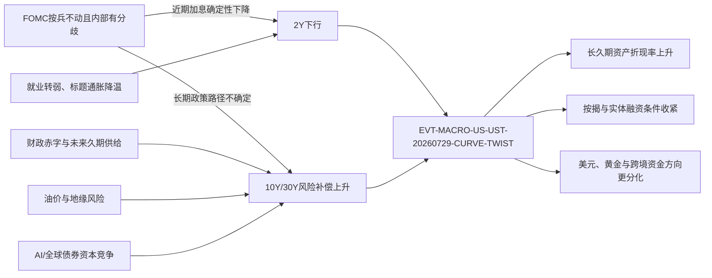

<!-- event-graph: {"schema_version":1,"event_id":"EVT-MACRO-US-UST-20260729-CURVE-TWIST","as_of":"2026-08-19T21:10:00+08:00","data_cutoff":"2026-08-18","primary_window":["2026-07-28","2026-08-18"],"context_window":["2026-07-01","2026-08-18"],"pattern":"twist_steepening","metrics":{"ust_2y_change_bp":-7,"ust_10y_change_bp":10,"ust_30y_change_bp":19,"ust_2s10s_change_bp":17,"ust_2s30s_change_bp":26}} -->
<!-- event-link: {"source":"EVT-US-FOMC-20260729-HOLD","relation":"causes","mechanism":"policy_path_divergence_and_long_end_risk_repricing","target":"EVT-MACRO-US-UST-20260729-CURVE-TWIST","confidence":"high"} -->
<!-- event-link: {"source":"EVT-US-NFP-20260807-WEAK","relation":"causes","mechanism":"lowers_front_end_yields","target":"EVT-MACRO-US-UST-20260729-CURVE-TWIST","confidence":"high"} -->
<!-- event-link: {"source":"EVT-US-CPI-20260812","relation":"amplifies","mechanism":"near_term_relief_with_sticky_long_end_compensation","target":"EVT-MACRO-US-UST-20260729-CURVE-TWIST","confidence":"medium_high"} -->
<!-- event-link: {"source":"EVT-US-PPI-20260813","relation":"amplifies","mechanism":"near_term_relief_with_sticky_underlying_prices","target":"EVT-MACRO-US-UST-20260729-CURVE-TWIST","confidence":"medium_high"} -->
<!-- event-link: {"source":"EVT-US-TREASURY-BORROWING-20260803","relation":"amplifies","mechanism":"raises_expected_duration_supply_and_term_premium","target":"EVT-MACRO-US-UST-20260729-CURVE-TWIST","confidence":"medium_high"} -->
<!-- event-link: {"source":"EVT-GEO-MIDEAST-OIL-202608","relation":"amplifies","mechanism":"raises_inflation_tail_risk","target":"EVT-MACRO-US-UST-20260729-CURVE-TWIST","confidence":"medium"} -->
<!-- event-link: {"source":"EVT-GLOBAL-AI-BOND-SUPPLY-2026","relation":"amplifies","mechanism":"competes_for_long_term_capital","target":"EVT-MACRO-US-UST-20260729-CURVE-TWIST","confidence":"medium"} -->
<!-- event-link: {"source":"EVT-MACRO-US-UST-20260729-CURVE-TWIST","relation":"transmits_to","mechanism":"raises_discount_rates","target":"WATCH-GLOBAL-DURATION-ASSETS","confidence":"high"} -->
<!-- event-link: {"source":"EVT-MACRO-US-UST-20260729-CURVE-TWIST","relation":"transmits_to","mechanism":"raises_mortgage_and_housing_financing_costs","target":"WATCH-US-MORTGAGE-HOUSING","confidence":"high"} -->
<!-- event-link: {"source":"EVT-MACRO-US-UST-20260729-CURVE-TWIST","relation":"transmits_to","mechanism":"changes_rate_differentials_and_cross_border_flows","target":"WATCH-USD-EM-CAPITAL-FLOWS","confidence":"medium"} -->
<!-- event-link: {"source":"EVT-US-UST-BUYBACK-20260909","relation":"offsets","mechanism":"supports_off_the_run_long_end_liquidity_only","target":"EVT-MACRO-US-UST-20260729-CURVE-TWIST","confidence":"medium","status":"scheduled","causality_status":"temporal_followup_not_officially_attributed"} -->

# 2026年7—8月美债收益率曲线扭转事件报告

> [!summary] 核心判断
> 2026年7月28日至8月18日，美债不是“全期限同步抛售”，而是出现了**前端下行、长端上行的扭转式陡峭化**：2Y下降7bp，10Y上升10bp，30Y上升19bp。它反映近期加息预期因就业转弱而降温，但长期资金价格仍被财政与债券供给、通胀尾部风险、政策路径不确定性以及全球资本竞争共同抬高。
>
> 把窗口拉长至7月1日后，10Y和30Y名义收益率分别上升23bp和31bp，其中实际收益率分别贡献16bp和25bp。因而这轮行情的主线不是单纯的“通胀预期上升”，而是**长期实际回报要求与期限风险补偿的重新定价**；但在7月28日之后，10Y上行更多体现通胀补偿回升，阶段驱动已经发生变化。
>
> 对市场的含义是：长久期资产的折现率与融资门槛上升，按揭和资本密集型投资最直接承压；股票、美元和黄金的方向则取决于“实际利率、增长与避险需求”谁占主导，不能只按一个利率变量机械外推。

## 一、事件定义与口径

- **主事件窗口：** 2026-07-28 至 2026-08-18，用于识别FOMC前后发生的曲线形态变化。
- **背景窗口：** 2026-07-01 至 2026-08-18，用于分解整段长端上行来自实际利率还是通胀补偿。
- **数据截止：** 收益率使用美国财政部截至2026-08-18、约美东时间15:30的日度Constant Maturity Treasury（CMT）曲线；其他公开信息检索至北京时间2026-08-19 21:10。检索时8月19日的官方CMT与7月FOMC会议纪要均尚未发布；盘中报价不能与CMT直接混用。
- **事件边界：** 本报告分析的是收益率曲线的变化，不把“收益率上升”直接等同于“拍卖失败”“外国资金撤离”或“财政危机”。

### 1. 收益率发生了什么

| 窗口 | 2Y | 10Y | 30Y | 2s10s | 2s30s | 形态 |
|---|---:|---:|---:|---:|---:|---|
| 7/28 → 8/18（主窗口） | **-7bp** | **+10bp** | **+19bp** | +17bp | +26bp | 前端下、长端上；扭转式陡峭化 |
| 7/1 → 8/18（背景窗口） | +2bp | +23bp | +31bp | +21bp | +29bp | 长端主导的熊市陡峭化 |
| 1/2 → 8/18（年初至今） | +72bp | +52bp | +42bp | -20bp | -30bp | 全年仍是熊市趋平 |

最近三周的陡峭化因此是2026年全年债券抛售中的一次**内部机制切换**：年初至今更像高政策利率推动的前端重定价，7月底以后则变为近期政策路径缓和、长期风险价格上升。

| 日期 | 2Y | 10Y | 30Y | 2s10s | 2s30s | 关键背景 |
|---|---:|---:|---:|---:|---:|---|
| 2026-07-28 | 4.26% | 4.61% | 5.09% | 35bp | 83bp | FOMC前基准 |
| 2026-07-29 | 4.22% | 4.67% | 5.20% | 45bp | 98bp | FOMC按兵不动但3票主张加息 |
| 2026-07-31 | 4.28% | 4.75% | 5.27% | 47bp | 99bp | FOMC后长端重新定价集中发生 |
| 2026-08-07 | 4.19% | 4.65% | 5.19% | 46bp | 100bp | 弱就业压低前端 |
| 2026-08-13 | 4.15% | 4.63% | 5.21% | 48bp | 106bp | CPI/PPI后，长端回落更少 |
| 2026-08-17 | 4.19% | 4.72% | 5.31% | 53bp | 112bp | 油价及全球长债压力再起 |
| 2026-08-18 | 4.19% | 4.71% | 5.28% | 52bp | 109bp | 本报告官方数据截止点 |

数据来源：[美国财政部名义收益率曲线](https://home.treasury.gov/resource-center/data-chart-center/interest-rates/TextView?field_tdr_date_value=2026&type=daily_treasury_yield_curve)。CMT是基于指示性市场报价插值得出的同期限收益率，并非某笔国债的成交价或严格意义上的“收盘价”，口径见[财政部数据说明](https://home.treasury.gov/treasury-daily-interest-rate-xml-feed)。

### 2. 实际利率与通胀补偿分解

| 窗口与期限 | 名义收益率变化 | 实际收益率变化 | 通胀补偿代理变化 | 读法 |
|---|---:|---:|---:|---|
| 7/1 → 8/18，10Y | +23bp | **+16bp** | +7bp | 约七成来自实际利率 |
| 7/1 → 8/18，30Y | +31bp | **+25bp** | +6bp | 约八成来自实际利率 |
| 7/28 → 8/18，10Y | +10bp | 0bp | **+10bp** | FOMC后阶段更偏通胀补偿回升 |
| 7/28 → 8/18，30Y | +19bp | +11bp | +8bp | 实际利率与通胀补偿共同推动 |

这里的“通胀补偿代理”是财政部名义CMT减去实际CMT，仅用于方向分解；它还包含通胀风险和流动性溢价，且两条曲线的现金流结构不同，**不等同于纯粹的通胀预期**。实际利率本身也混合了增长预期、自然利率与实际期限溢价，不能把全部实际利率上行都归因于财政风险。

数据来源：[美国财政部实际收益率曲线](https://home.treasury.gov/resource-center/data-chart-center/interest-rates/TextView?field_tdr_date_value=2026&type=daily_treasury_real_yield_curve)。

## 二、时间线与驱动因素

### 1. 7月29日FOMC：曲线扭转的直接起点

美联储将目标利率维持在3.50%—3.75%，表决为9比3；Hammack、Kashkari和Logan主张加息25bp。声明同时称经济活动仍稳健、通胀高于目标，能源供给冲击增加了价格压力。[FOMC声明](https://www.federalreserve.gov/newsevents/pressreleases/monetary20260729a.htm)

当天2Y下降4bp，10Y上升6bp，30Y上升11bp，2s30s扩大15bp。可观测事实是“短端与长端反向”；对其最合理的市场解释是：维持利率降低了立即加息的确定性，而罕见的内部异议、通胀仍高和前瞻指引不清，使投资者对更长期的政策路径与通胀风险要求更高补偿。后半句属于市场推断，不是美联储官方结论。

### 2. 8月7日就业转弱：把短端往下拉

7月非农就业减少2.3万人，失业率为4.1%，5—6月就业合计下修10.3万人。[BLS就业报告（历史版）](https://www.bls.gov/news.release/archives/empsit_08072026.htm) 8月6日至7日，2Y、10Y和30Y分别下降6bp、4bp和3bp，短端反应最大。这说明就业降温主要改变近期政策利率路径，却没有消除长端风险溢价。

### 3. 8月12—13日通胀：标题降温，底层压力仍黏

7月CPI环比上涨0.1%、同比上涨3.4%，核心CPI环比上涨0.2%、同比上涨2.5%；能源价格环比下降1.5%，但同比仍上涨14.7%。[BLS CPI（历史版）](https://www.bls.gov/news.release/archives/cpi_08122026.htm) 7月PPI最终需求环比持平、同比上涨4.7%；剔除食品、能源和贸易后的指标环比上涨0.4%、同比上涨4.7%。[BLS PPI（历史版）](https://www.bls.gov/news.release/archives/ppi_08132026.htm)

8月11日至13日，2Y和10Y均下降约7bp，30Y仅下降约3bp。市场接受了近期通胀压力边际缓和，但对长期通胀与期限风险仍要求较高补偿。

### 4. 财政融资与久期供给：结构性压力，不是单次拍卖事故

财政部8月3日把第三季度私人净市场化借款估计上调至7,390亿美元，较5月估计增加680亿美元；第四季度估计为6,280亿美元。[财政部借款估计](https://home.treasury.gov/news/press-releases/sb0584) 这提高了市场对未来国债供给与资本占用的预期。

CBO在2026年2月的基线中预计，2026财年联邦赤字约1.9万亿美元、相当于GDP的5.8%；公众持有联邦债务将从2026年的GDP 101%升至2036年的120%，净利息支出同期由约1.0万亿美元升至2.1万亿美元。[CBO预算与经济展望](https://www.cbo.gov/publication/62105) 这说明财政压力是一个随债务滚动逐步进入利息成本的慢变量，而不是某一天突然出现的偿付危机。

但需要限定口径：8月5日季度再融资的3Y、10Y、30Y发行分别为580亿、420亿和250亿美元，合计1,250亿美元，其中替换到期债务后新增现金约287亿美元；财政部同时表示未来数季票息券和浮息券拍卖规模预计保持不变。[季度再融资声明](https://home.treasury.gov/news/press-releases/sb0590) 因而本轮财政渠道主要是**长期债务路径、预期供给与期限溢价**，不是7,390亿美元突然全部压到长债市场。

8月12日10Y拍卖高收益率4.683%、投标倍数2.53；8月13日30Y拍卖高收益率5.216%、投标倍数2.39。30Y融资成本很高，但投标倍数与投资者结构并未显示需求崩溃。[TreasuryDirect拍卖原始数据](https://www.treasurydirect.gov/TA_WS/securities/search?startdate=2026-08-11&enddate=2026-08-13&format=json) 正确结论是“高成本下供给仍被吸收”，而不是“拍卖失败”。

### 5. 油价、地缘冲突与全球资本竞争：放大长端波动

8月17日布伦特原油升至90美元/桶以上，中东冲突重新抬高能源通胀尾部风险；8月14日至17日，2Y、10Y、30Y分别上升2bp、4bp和6bp。[AP市场报道](https://apnews.com/article/bf398d5a01f611921c0b48a8bfc884d9)

同时，大型科技公司为AI基础设施融资、其他主要经济体长期利率与债券供给上升，都在与美债竞争长期资本。[Reuters分析](https://finance.yahoo.com/markets/stocks/articles/analysis-ai-driven-surge-bond-040956476.html) 这一渠道方向合理，但较难从日度价格中单独识别，可信度低于FOMC、就业和财政部公告等事件证据。

### 6. 外资需求：不能用“全面抛售美债”概括

截至2026年6月，外国持有美债9.299万亿美元，较5月减少721亿美元，但仍比一年前增加2,054亿美元。6月外国私人部门净买入美国中长期国债约166亿美元，官方机构净卖出约98亿美元，合计仍为净买入约68亿美元；当月外国投资者另净卖出约290亿美元国库券。[财政部TIC公告](https://home.treasury.gov/news/press-releases/sb0606)、[主要外国持有者表](https://ticdata.treasury.gov/resource-center/data-chart-center/tic/Documents/slt_table5.txt)

TIC数据滞后、受托管地与估值变化影响，也无法解释8月的逐日行情。官方机构需求边际偏弱可能放大长端压力，但现有证据不足以把本轮行情归因于“外国资金撤离”。

## 三、因果判断：主因、放大器与反向力量

| 因素 | 对曲线的作用 | 证据强度 | 判断 |
|---|---|---|---|
| FOMC政策路径分化与长期政策不确定性 | 近端加息确定性下降，长端风险补偿上升 | **高** | 7/29当日曲线反向最清晰，是扭转的直接触发器 |
| 弱就业与标题通胀降温 | 压低2Y及中端，形成陡峭化的“前端腿” | **高** | 有官方数据与当日期限反应支持 |
| 财政赤字、未来供给与高利息负担 | 抬升长期实际回报要求和期限溢价 | **中高** | 是结构性背景，但当前票息券规模未突然跳升 |
| 7月以来实际利率重定价 | 抬升长久期折现率 | **高** | 7/1—8/18的10Y、30Y实际收益率分别上升16bp、25bp |
| 油价与中东风险 | 提高通胀尾部风险，放大8月中旬长端波动 | **中** | 时点吻合，但通胀补偿在背景窗口只上升约6—7bp |
| AI与全球债券融资竞争 | 提高长期资本稀缺度和融资门槛 | **中** | 方向一致，难与财政和增长预期完全分离 |
| 外国官方需求走弱 | 可能减少边际吸收能力 | **中低** | 月度数据混合且滞后，不支持“全面撤离”叙事 |

综合而言，本轮变化更适合被定义为：**近期政策利率预期缓和与长期资金价格上升同时发生的曲线制度切换**。它不是一个单变量事件，而是“政策路径分化 + 实际利率高位 + 期限风险补偿”的合成结果。



## 四、市场影响

| 市场/主体 | 一阶影响 | 需要避免的机械推论 | 后续确认指标 |
|---|---|---|---|
| 美债与TIPS | 长久期债券价格承压；再投资收益率提高。实际收益率上行意味着TIPS也会发生市值损失 | “抗通胀”不等于TIPS价格必涨 | 10Y/30Y实际收益率、期限溢价模型、长债拍卖尾差 |
| 美股成长与AI | 更高的实际折现率压低远期现金流现值，融资型AI资本开支的回报门槛上升 | 高收益率是估值逆风，不自动等于股市崩盘；盈利增长可部分抵消 | 盈利上修能否跑赢估值压缩、AI公司债利差与发行量 |
| 价值股与高股息 | 相对久期较短，可能跑赢成长；但若无风险利率高于股息率，防御估值也会承压 | “高股息必然受益”不成立 | 股息—国债利差、盈利周期、行业杠杆 |
| 住房与按揭 | 10Y、美债波动和MBS利差共同推高按揭成本，压制可负担性、再融资与成交 | 按揭利率不与10Y一比一同步 | Freddie Mac 30Y按揭、MBS利差、购房申请 |
| 企业信用 | 即使信用利差不变，无风险利率上升也抬高全口径融资成本；高杠杆与远期项目更敏感 | 不能只看信用利差判断融资环境 | 全口径收益率、再融资墙、低评级违约率 |
| 银行与保险 | 陡峭曲线有利于长期再投资收益和部分净息差，但旧债浮亏、存款成本与借款人信用风险上升 | “曲线陡峭银行一定受益”过于简单 | AOCI/HTM损失、存款迁移、贷款逾期 |
| 美元 | 更高美国实际利差可支撑美元；若收益率上升被视为财政风险溢价，美元支持会减弱 | 长端收益率上升不保证美元单边走强 | 实际利差、美元与收益率相关性、跨境资金流 |
| 黄金 | 实际利率上升提高持有黄金的机会成本；地缘与财政风险又增加避险需求 | 两条渠道方向相反，净影响取决于主导因素 | 实际收益率、美元、ETF流量、油价与冲突升级 |
| 新兴市场与中国资产 | 美国实际利率高企吸引美元资本，可能压制本币、港股及长久期成长估值，并收窄宽松空间 | 中国内需周期、资本管制和政策仍可能主导本地资产 | 人民币、北向/南向与外资流、离岸融资利差 |
| 美国财政 | 新债和再融资成本逐步进入有效利息率，形成“利息支出—赤字—发行”的慢反馈 | 不是即时偿付危机，传导取决于债务期限与滚动速度 | CBO净利息、加权平均期限、季度借款估计 |

住房渠道已经开始体现：Freddie Mac 30Y固定按揭利率从7月2日的6.43%升至8月6日的6.69%，8月13日为6.67%。[Freddie Mac PMMS](https://www.freddiemac.com/pmms) 这比“股市一天涨跌”更能说明长端利率如何进入实体经济。

## 五、反证、替代解释与误读清单

### 替代解释

1. **高实际利率也可能代表更强的长期增长与生产率。** AI投资、资本开支和更高自然利率都能抬升实际收益率，不应把它全部解释成财政信用恶化。若盈利预期和生产率持续上修、信用利差保持稳定，这一解释的权重应上升。
2. **主窗口与背景窗口的驱动不同。** 7月初至8月18日主要是实际利率上升；7月28日以后，10Y实际收益率持平而通胀补偿代理上升10bp。后续分析必须保留窗口，不能复制“主要是实际利率”的结论而忽略阶段变化。
3. **全球因素可能比美国单国因素更重要。** 若日、欧、英长债同步上行而美元和美国特有风险指标稳定，应提高全球期限溢价与资本供给解释的权重。

### 当前证据不支持的表述

- **“通胀预期失控”：** 背景窗口的通胀补偿代理仅上升约6—7bp，远小于实际利率升幅。
- **“30Y拍卖失败”：** 拍卖以很高收益率成交，但投标倍数与投资者结构尚未显示需求崩溃。
- **“外国投资者全面抛售”：** 6月中长期国债交易仍为小幅净买入，且持仓高于一年前。
- **“财政部回购等于QE或减少净融资”：** 回购用于改善旧券流动性，通常由新券融资替代，不改变财政赤字本身。
- **“收益率上升必然利好美元、利空黄金、利空所有股票”：** 实际利率、增长、避险和盈利渠道可能相互抵消。

## 六、8月19日后续节点：财政部长端回购扩容

财政部于8月19日宣布，自9月9日起至本季度再融资期结束的11月4日，将10—20Y及20—30Y名义券的流动性支持回购单次上限从20亿美元提高至**至少40亿美元**。[财政部8月19日公告](https://home.treasury.gov/news/press-releases/sb0607) 8月5日原暂定日程仍把相关操作上限列为20亿美元，因此这是季度中途的定向调整。[原暂定回购日程PDF](https://home.treasury.gov/system/files/221/Tentative-Buyback-ScheduleQ32026.pdf)

这一动作边际利好旧券流动性，并可能减轻流动性溢价；但官方给出的理由是长端操作获得持续、强劲的市场参与和大量高质量报价，并未宣称市场失灵。它不是QE、不是新增长端发行，也不是财政部确认“紧急救市”。由于9月9日才生效，本报告把它记为**后续验证节点**，不把它倒推为截至8月18日收益率变化的原因。

## 七、情景与可证伪跟踪表

以下阈值是监测触发器，不是点位预测。

| 情景 | 触发/确认信号 | 对当前判断的含义 |
|---|---|---|
| 长端压力继续 | 官方30Y CMT连续5个交易日高于5.35%；30Y实际收益率高于3.10%；2s30s超过120bp | 期限溢价和实际融资压力继续占主导，长久期资产再承压 |
| 供给吸收恶化 | 多次长债拍卖投标倍数低于约2.2，同时一级交易商获配超过20%；未来票息券发行指引上调 | “需求不足/供给压力”从背景因素升级为主要驱动 |
| 通胀尾部降温 | 油价明显回落、通胀补偿收窄，30Y回到5.00%以下且30Y实际收益率低于2.80% | 地缘与期限风险溢价缓和，久期资产获得修复窗口 |
| 增长冲击占优 | 就业继续显著恶化，2Y和长端共同下行、信用利差扩大 | 曲线交易从扭转转向衰退/避险定价 |
| 生产率解释增强 | 长端实际收益率高位，但盈利、生产率与资本开支预期持续上修，信用利差稳定 | 高实际利率更像高增长/高自然利率，而不只是财政风险 |
| 回购改善流动性 | 9月9日后旧券交易深度改善、买卖价差收窄，而长端收益率未必同步下降 | 证明回购改善的是市场流动性，不等于改变宏观利率中枢 |

近期关键日历：7月FOMC会议纪要（8月19日14:00 ET）、9月9日长端回购扩容生效、8月就业与CPI/PPI、9月FOMC、新一轮10Y/30Y拍卖及财政部季度借款估计。

## 八、事件关联图谱与后续复用规范

### 1. 关联节点

| 节点ID | 与本事件关系 | 方向 | 置信度 | 后续动作 |
|---|---|---|---|---|
| `EVT-US-FOMC-20260729-HOLD` | 直接触发：近端政策路径与长期风险补偿分化 | 上游 | 高 | 关联7月FOMC纪要与9月会议 |
| `EVT-US-NFP-20260807-WEAK` | 弱就业压低前端收益率 | 上游 | 高 | 用后续就业数据验证持续性 |
| `EVT-US-CPI-20260812` / `EVT-US-PPI-20260813` | 近期通胀降温，但底层压力仍黏 | 上游 | 中高 | 更新通胀补偿分解 |
| `EVT-US-TREASURY-BORROWING-20260803` | 预期供给与期限溢价背景 | 上游 | 中高 | 关联季度再融资与拍卖结果 |
| `EVT-GEO-MIDEAST-OIL-202608` | 能源通胀尾部风险 | 上游 | 中 | 用油价与通胀补偿验证 |
| `EVT-GLOBAL-AI-BOND-SUPPLY-2026` | 长期资本竞争与实际利率放大器 | 上游 | 中 | 跟踪发行量、全口径融资成本 |
| `EVT-US-UST-BUYBACK-20260909` | 旧券流动性支持 | 后续响应 | 中 | 9月9日生效后检查流动性 |
| `WATCH-US-MORTGAGE-HOUSING` | 长端利率向实体经济传导 | 下游 | 高 | 跟踪按揭、成交和住房投资 |
| `WATCH-GLOBAL-DURATION-ASSETS` | 股票、信用、黄金和全球长债重估 | 下游 | 高 | 区分实际利率与风险偏好渠道 |
| `WATCH-USD-EM-CAPITAL-FLOWS` | 利差与财政风险共同影响跨境资金 | 下游 | 中 | 跟踪美元、人民币和资金流 |

### 2. 后续报告如何回溯本事件

后续事件报告只需同时完成以下三项，即可通过Obsidian反向链接和全文检索形成可回溯链：

1. 在YAML中加入：

   ```yaml
   related_event_ids:
     - EVT-MACRO-US-UST-20260729-CURVE-TWIST
   ```

2. 在正文加入链接：`[[2026-08-19-美债收益率曲线扭转-事件报告|2026年7—8月美债曲线扭转]]`。
3. 在正文顶部加入一行机器可读关系，例如：

   ```html
   <!-- event-link-template: {"source":"NEW-EVENT-ID","relation":"confirms_or_reverses","target":"EVT-MACRO-US-UST-20260729-CURVE-TWIST","confidence":"medium"} -->
   ```

   实际使用时将 `event-link-template` 改为 `event-link`；模板使用不同标记，是为了避免索引器把示例误收录为真实关系。

关系词建议保持稳定：`causes`、`amplifies`、`offsets`、`confirms`、`reverses`、`transmits_to`、`policy_response_to`。若结论改变，不覆盖旧判断，而是在更新日志新增一行并说明哪条证据使置信度发生变化。

### 3. 本报告的检索键

`EVT-MACRO-US-UST-20260729-CURVE-TWIST` · `US_TREASURY_LONG_END_REPRICING` · `twist_steepening` · `UST2s30s` · `real_yield` · `term_premium`

## 九、来源分级

### A级：官方原始资料

- [美国财政部2026年名义收益率曲线](https://home.treasury.gov/resource-center/data-chart-center/interest-rates/TextView?field_tdr_date_value=2026&type=daily_treasury_yield_curve)
- [美国财政部2026年实际收益率曲线](https://home.treasury.gov/resource-center/data-chart-center/interest-rates/TextView?field_tdr_date_value=2026&type=daily_treasury_real_yield_curve)
- [美联储2026年7月29日FOMC声明](https://www.federalreserve.gov/newsevents/pressreleases/monetary20260729a.htm)
- [BLS 2026年7月就业报告](https://www.bls.gov/news.release/archives/empsit_08072026.htm)
- [BLS 2026年7月CPI](https://www.bls.gov/news.release/archives/cpi_08122026.htm)；[BLS 2026年7月PPI](https://www.bls.gov/news.release/archives/ppi_08132026.htm)
- [财政部第三、第四季度借款估计](https://home.treasury.gov/news/press-releases/sb0584)
- [财政部季度再融资声明](https://home.treasury.gov/news/press-releases/sb0590)
- [TreasuryDirect拍卖数据](https://www.treasurydirect.gov/TA_WS/securities/search?startdate=2026-08-11&enddate=2026-08-13&format=json)
- [财政部6月TIC公告](https://home.treasury.gov/news/press-releases/sb0606)；[外国持有美债表](https://ticdata.treasury.gov/resource-center/data-chart-center/tic/Documents/slt_table5.txt)
- [财政部8月19日长端回购扩容公告](https://home.treasury.gov/news/press-releases/sb0607)
- [Freddie Mac按揭市场调查](https://www.freddiemac.com/pmms)
- [CBO 2026—2036预算与经济展望](https://www.cbo.gov/publication/62105)

### B级：用于市场解释的报道

- [AP：8月17日油价、收益率与股市](https://apnews.com/article/bf398d5a01f611921c0b48a8bfc884d9)
- [Reuters：AI债券融资与长期资本竞争](https://finance.yahoo.com/markets/stocks/articles/analysis-ai-driven-surge-bond-040956476.html)
- [Axios：长期美债收益率压力的市场解释](https://www.axios.com/2026/08/17/treasury-yields-warsh-bonds)

## 十、更新日志

| 日期 | 版本 | 变更 | 判断变化 |
|---|---|---|---|
| 2026-08-19 | v1.0 | 建立7/28—8/18主窗口、7/1—8/18背景窗口及事件关系图谱；纳入8/19长端回购扩容 | 初始判断：中高置信度，曲线扭转由政策路径分化与长期风险重定价共同驱动 |
