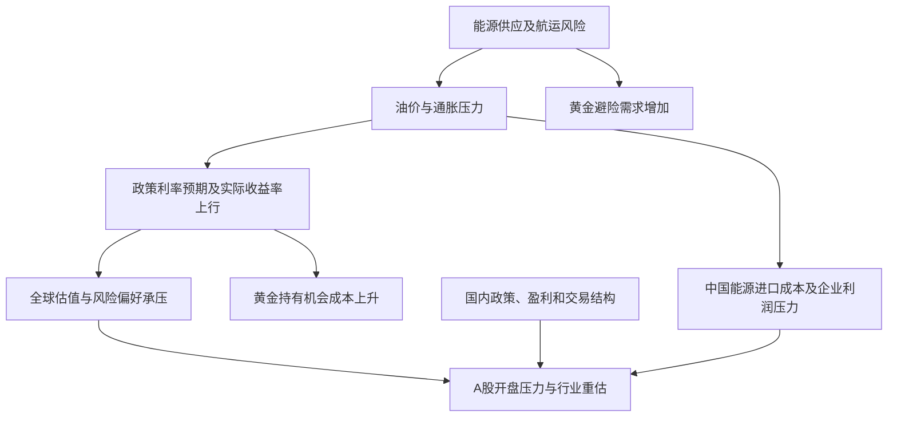

<!-- event-graph: {"schema_version":1,"event_id":"EVT-MACRO-GLOBAL-20260911-OIL-RATES-ASHARE","as_of":"2026-09-11T21:42:00+08:00","data_cutoff":"2026-09-11","ust_data_cutoff":"2026-09-10","pattern":"bear_flattening","metrics":{"ust_2y_change_bp_since_20260818":37,"ust_10y_change_bp_since_20260818":24,"ust_30y_change_bp_since_20260818":9,"ust_2s30s_change_bp_since_20260818":-28,"ust_10y_real_change_bp_on_20260910":9,"sse_return_pct":-1.18,"szse_return_pct":-1.08,"chinext_return_pct":-0.49},"causality_status":"qualitative_hypothesis_not_statistically_identified"} -->
<!-- event-link: {"source":"EVT-MACRO-GLOBAL-20260911-OIL-RATES-ASHARE","relation":"confirms","target":"EVT-MACRO-US-UST-20260729-CURVE-TWIST","scope":"long_end_rate_pressure_persists","confidence":"high"} -->
<!-- event-link: {"source":"EVT-MACRO-GLOBAL-20260911-OIL-RATES-ASHARE","relation":"reverses","target":"EVT-MACRO-US-UST-20260729-CURVE-TWIST","scope":"front_end_direction_and_curve_pattern_only","confidence":"high"} -->
<!-- event-link: {"source":"EVT-GEO-MIDEAST-OIL-20260909","relation":"amplifies","target":"EVT-MACRO-GLOBAL-20260911-OIL-RATES-ASHARE","mechanism":"energy_supply_risk_inflation_and_profit_margin_pressure","confidence":"medium","causality_status":"hypothesis"} -->
<!-- event-link: {"source":"EVT-US-PPI-20260910","relation":"amplifies","target":"EVT-MACRO-GLOBAL-20260911-OIL-RATES-ASHARE","mechanism":"policy_path_repricing","confidence":"medium","causality_status":"hypothesis"} -->
<!-- event-link: {"source":"EVT-EU-ECB-20260910-HIKE","relation":"amplifies","target":"EVT-MACRO-GLOBAL-20260911-OIL-RATES-ASHARE","mechanism":"global_tightening_signal","confidence":"medium","causality_status":"hypothesis"} -->
<!-- event-link: {"source":"EVT-US-UST-BUYBACK-20260909","relation":"offsets","target":"EVT-MACRO-GLOBAL-20260911-OIL-RATES-ASHARE","scope":"intended_liquidity_support_only","confidence":"low","status":"operation_reported","effectiveness":"yield_reversal_not_observed_liquidity_effect_unverified"} -->
<!-- event-link: {"source":"EVT-MACRO-GLOBAL-20260911-OIL-RATES-ASHARE","relation":"transmits_to","target":"WATCH-CN-ENERGY-MARGINS","mechanism":"imported_energy_costs","confidence":"medium","causality_status":"forward_hypothesis"} -->

# 2026年9月11日油价冲击、美债熊平与A股普跌事件报告

> [!summary] 本次判断
> **外围正在交易“能源供给风险上升、通胀回升、政策利率可能更高”的组合，对A股同时形成估值、成本与风险偏好压力。** 但今天的跌幅不能全部归于美债：A股此前已偏弱，今天午后又明显修复，行业表现也有分化。
>
> 相比[[2026-08-19-美债收益率曲线扭转-事件报告|8月19日美债报告]]，最重要的更新是：**长端高利率压力延续，曲线形态却从“短端降、长端升”切换成“全期限升、短端升得更多”的熊市趋平。** 旧报告关于近端政策压力缓和的阶段判断需要更新，长期融资压力的判断仍成立。
>
> **时间边界：今晚20:30发布的美国CPI，不能解释今天15:00以前的A股下跌。** 它只进入收盘后的信息集，影响下一交易日判断。本文没有使用尚未结束的9月11日美国交易日“收盘价”。

## 1. 市场快照：哪些事实已经核实

| 资产或指标 | 观察值 | 时间与口径 | 验证状态 |
|---|---|---|---|
| 上证指数 | 3888.11，-1.18% | 9/11 A股收盘 | 新华财经与21财经一致[S1][S2] |
| 深证成指 | 13471.26，-1.08% | 同上 | 两来源一致[S1][S2] |
| 创业板指 | 3322.04，-0.49% | 同上 | 两来源一致[S1][S2] |
| 沪深成交额 | 19719亿元；较昨日增加3248亿元 | 沪市9582＋深市10137；创业板成交包含在深市中 | 新华财经单源，约放量19.72%[S1] |
| 市场广度 | 开盘时逾4600股下跌 | 9/11 09:34报道；不是收盘统计 | 东方财富单源；收盘精确家数未核实[S3] |
| 美债2Y / 10Y / 30Y | 4.56% / 4.95% / 5.37% | 美国9/10官方CMT；日增13 / 12 / 9bp | 官方原始曲线；非逐笔成交收盘价[T1] |
| 美债10Y / 30Y实际收益率 | 2.55% / 3.05% | 同日实际CMT；日增9 / 7bp | 官方原始曲线[T2] |
| WTI原油 | 102.48美元/桶，+6.69% | 9/10，10月交货合约结算 | 新华财经与Canadian Press一致[O1][O2] |
| Brent原油 | 107.63美元/桶，+6.34% | 9/10，11月交货合约结算 | 新华财经单源[O1] |
| 现货黄金 | 9/10盘中4349.32美元/盎司，-1.2%；9/11 08:20北京时4324.79，+0.2% | Reuters两个不同时点的现货快照，各自涨跌相对其报道基准 | 只判断昨夜承压、今早小幅反弹，不能拼成同口径结算序列[G1][G2] |
| 国内贵金属 | 沪银主力跌超5%，沪金主力跌超1% | 9/11日盘收盘 | 新华财经单源[G3] |
| 中国10Y国债 | 1.6845%，日升0.6bp | 9/11银行间“26附息国债10” | 单只活跃券，非中国CMT[D1] |

**价格差异审计。** 东方财富早餐把WTI连续合约报为103.93美元、+8.20%，与明确交割月份的102.48美元相差1.41%；黄金连续合约4358.5美元与Canadian Press的12月黄金4407.30美元相差1.11%。合约、取价时刻或收盘/结算定义不同，现有证据不足以逐项消除差异，故不合并、不平均。原油采用双源一致且月份明确的结算价；黄金采用带时间的现货观察，不给出未经核对的统一收盘价。[Q1][O2]

美元方向方面，Reuters在9/10欧洲时段记录美元回升；但本次未取得9/11人民币16:30收盘和美元指数同口径双源快照。因此“利差压制人民币、外资卖出A股”只作为待检验渠道，不能写成已经确认的资金事实。[X1]

## 2. 从旧报告走到今天：曲线已经换了形态

以下收益率单位为%，利差为bp，均来自财政部名义/实际曲线；保留关键日期供未来逐点复查。[T1][T2]

| 美国日期 | 2Y | 10Y | 30Y | 2s30s | 10Y实际 | 30Y实际 |
|---|---:|---:|---:|---:|---:|---:|
| 8/18：旧报告基准 | 4.19 | 4.71 | 5.28 | 109 | 2.41 | 3.03 |
| 8/19 | 4.19 | 4.65 | 5.19 | 100 | 2.35 | 2.94 |
| 8/25 | 4.17 | 4.64 | 5.17 | 100 | 2.32 | 2.92 |
| 8/28 | 4.34 | 4.73 | 5.22 | 88 | 2.42 | 2.96 |
| 9/9 | 4.43 | 4.83 | 5.28 | 85 | 2.46 | 2.98 |
| 9/10 | 4.56 | 4.95 | 5.37 | 81 | 2.55 | 3.05 |

用整数bp计算变化，避免浮点误差：

| 窗口 | 2Y变化 | 10Y变化 | 30Y变化 | 2s30s变化 | 结论 |
|---|---:|---:|---:|---:|---|
| 7/28—8/18（旧报告） | -7 | +10 | +19 | +26 | 扭转式陡峭化 |
| 8/18—9/10（本次续接） | +37 | +24 | +9 | -28 | 熊市趋平 |
| 9/9—9/10（隔夜冲击） | +13 | +12 | +9 | -4 | 全线抛售，短中端更敏感 |

**分析：** 债券价格与收益率反向，因此这里的“熊”指债价下跌。市场要求的近期资金价格重新上升，不能再用“弱就业让短端持续下行”解释最新阶段；也不能仅因为30Y创新高便称曲线继续陡峭化。

10Y在8/18—9/10上升24bp，其中实际收益率贡献14bp、名义减实际的通胀补偿代理贡献10bp；9/10单日12bp中，分别贡献9bp和3bp。因此昨夜既有通胀压力，也有明显的实际利率压力。**名义减实际并非纯通胀预期，实际收益率也不等于纯财政期限溢价。** 本文未取得期限溢价模型，不能宣称财政风险贡献了多少。[T1][T2]

## 3. 时间线：发生时间、当时信息与判断变化

美国数据发布时间换算为北京时间；没有精确时刻的节点只记录日期，不猜测盘中顺序。

| 节点 / 事件ID | 发生及可知时间 | 新信息 | 相对旧判断的变化 |
|---|---|---|---|
| 旧报告 / `EVT-MACRO-US-UST-20260729-CURVE-TWIST` | 7/28—8/18；8/19形成报告 | 短端缓和、长端仍承压 | 历史基线；不修改当时版本 |
| 回购安排 / `EVT-US-UST-BUYBACK-20260909` | 8/19公告，9/9起生效 | 长端流动性回购上限至少翻倍；并非QE[B1] | 由计划节点进入实施验证阶段 |
| 曲线暂缓 | 8/19—8/25美国日度数据 | 长端先回落，随后反弹[T1] | 本轮并非从8月中旬起单边直线上升 |
| 就业 / `EVT-US-NFP-20260904` | 9/4公布 | 8月非农增加16.2万人、失业率4.1%[N1] | 就业恢复削弱了“持续转弱”的简单外推；不凭单月确认增长加速 |
| 国内资本补充背景 | 9/6已有本地报告 | [[2026-09-06-3600亿元中央金融企业增资-投资者研究|中央金融企业拟增资研究]] | 中期政策对冲背景；不是今天新发布的直接催化 |
| 油价冲击 / `EVT-GEO-MIDEAST-OIL-20260909` | 9/9美国时段，9/11 A股开盘前已可知 | 航运攻击与供应担忧升温，Brent突破100美元[O3] | 能源风险从旧报告的放大器上升为本次主要候选触发器 |
| 回购上限更新 | 9/9公告，9/10操作 | 10—20Y操作上限60亿美元[B2] | 上限高于8月承诺的至少40亿美元；上限不等于实际成交 |
| PPI / `EVT-US-PPI-20260910` | 9/10 20:30北京时 | 8月环比+0.4%、同比+5.4%；7月环比修订至+0.1%[P1] | 通胀降温不稳固；不可继续沿用旧报告7月初值0.0%作最新比较 |
| ECB / `EVT-EU-ECB-20260910-HIKE` | 9/10欧洲时段；A股9/11开盘前 | 宣布加息25bp；存款利率9/16起为2.50%[E1] | 海外货币收紧已在欧洲落地，美联储仍属待决策 |
| 回购结果 | 9/10美国时段 | Bloomberg报道买回51.9亿美元，低于60亿美元上限[B3] | 单一通讯社，未取得官方结果表；不能写成“回购失败” |
| 海外收盘/结算 | 9/10美国交易日，A股9/11开盘前 | 油涨、美债跌、美股跌；长端压力未被回购逆转[O1][O2][T1] | 与“通胀和实际利率同时压估值”一致 |
| A股开盘 | 9/11 09:30附近 | 主要指数低开、开盘逾4600股下跌[S3] | 外围向开盘情绪传导的时序证据 |
| A股收盘 | 9/11 15:00 | 指数仍跌，但午后收窄，部分电子和电力逆势[S1][S2] | 反驳“全部行业持续单向去风险” |
| CPI / `EVT-US-CPI-20260911` | 9/11 20:30北京时，A股收盘后 | AP、Axios报道8月CPI环比+0.4%，AP报道同比+3.4%[C1][C2] | 后续节点；官方历史页本次未成功读取，数值暂列二手待复核，不作今日A股原因 |
| FOMC / `WATCH-US-FOMC-20260916` | 9/15—16会议，未来节点 | 需核验最终利率决策及指引[G1] | 市场概率不能替代已发生的加息 |

### 回购这条旧线索如何更新

此前假设是“回购可能改善旧券流动性，未必改变利率中枢”。当前只能确认：回购扩容已有操作报道，但长端收益率未持续下降。**这支持其不足以抵消宏观压力的判断，却不能证明流动性支持无效。** 判断流动性还需要旧券买卖价差、深度和成交折价；判断拍卖需求还需要另外的拍卖数据。回购、发债拍卖和央行资产购买是不同操作。

## 4. 为什么出现油涨、金跌、股票承压

**原油：本轮首先是供给风险定价。** 航道、出口和保险成本变化可抬高能源价格，同时侵蚀净进口经济体的实际购买力。因而油价上涨不必伴随工业金属或股票上涨，不能把它直接解读为全球需求繁荣。冲突报道与油价时点吻合，但能源冲击占涨幅多少尚未识别。[O3]

**利率：能源涨价令宽松更难，实际资金价格也在上升。** 8月PPI反弹已有官方证据。Reuters在9/10 09:24美东附近的报道中，引用CME工具称次周加息概率由数据前62%升至70%；这是报道时点的衍生品定价快照，不是当前概率，更不是70%的客观保证。该报道也提示经济学家调查多数预期按兵不动，显示判断并不一致。[P1][G1]

**黄金：避险需求与持有成本的方向相反。** 实际利率抬高无息黄金的机会成本，美元回升也可能施压；战争引发的避险买盘未必足以抵消。今天亚洲早盘现货小反弹，而国内黄金主力日盘仍跌，二者并不矛盾：时点、人民币计价、合约和基准不同。ETF赎回、保证金追缴或央行售金本次均无直接证据，不列为确定原因。[G1][G2][G3]

**宏观定性：更接近供给冲击下的滞胀风险交易。** 这是资产价格的情景解释，不是已经确认美国或中国进入滞胀。若随后油价回落、实际利率下降、增长数据稳定，这一解释应降低权重。

图为候选传导机制，箭头不代表已经完成因果识别。

## 5. 对A股的影响：主因候选与反证同时保留

**目前最有把握的说法是：外围冲击是今天普跌的重要催化候选，国内原有弱势提供了放大条件。** 9/10 A股已缩量下跌，不能把这部分弱势归给当晚尚未发布的PPI；9/11则出现低开、放量、午后修复。缺少分钟级跨市场数据、可核实的资金流和完整行业收益分解，暂不量化外围贡献比例。[S1][S4]

| 渠道或假设 | 支持证据 | 反证/限制 | 归因置信度 |
|---|---|---|---|
| 海外实际利率上升压估值 | 美债实际收益率跳升，A股随后低开 | A股本币折现率不等于美债利率；部分科技逆势 | 中 |
| 油价冲击侵蚀进口成本与需求 | 原油结算大涨，国内能源期货承接波动 | 行业套保、调价与库存不同；未见盈利预测集中下修 | 中，偏前瞻 |
| 金属价格走弱传到资源股 | 铜、贵金属板块领跌有色[S1] | 原油涨不等于所有资源股涨 | 中 |
| 美元利差引发外资撤离 | 理论上存在跨境配置渠道 | 同时点人民币、外资流量未核实 | 低，未确认 |
| 国内交易结构放大波动 | 前日已弱，今日放量；金融板块下挫 | 放量不自动等于机构净卖出或被动平仓 | 中低 |
| 单纯“科技久期崩塌” | 开盘风险偏好偏弱 | 创业板跌幅小于沪指；MLCC、PCB活跃[S1][S2] | 不足以独立解释全日 |

### 行业传导：区分机制预期与今天已发生的表现

| A股方向 | 未来影响机制（分析） | 应继续核对的变量 |
|---|---|---|
| 上游油气、油服 | 销售价或资本开支预期可能改善；也面临运营及需求风险 | 实现油价、产量、税费、油服订单；不等同于今天必涨 |
| 航空、物流、下游化工 | 油价成本压力；能否转嫁决定利润 | 燃油套保、运价、裂解/加工价差、库存周期 |
| 黄金股 | 金价与成本共同影响利润，另叠加股票风险溢价 | 实现金价、全维持成本、汇率；黄金股不是现货黄金替代品 |
| 铜等工业金属 | 高能源成本与需求担忧可同时挤压利润 | 库存、订单、现货升贴水；不能用原油涨幅预测铜价 |
| 科技成长 | 实际利率与风险偏好是估值逆风，盈利和订单仍可抵消 | 业绩修正、资本开支回报、板块内部强弱 |
| 银行、保险、券商 | 国内利率、资产质量、交易活跃度及资本补充更直接 | 净息差、信用成本、增资每股稀释；不机械套用美国曲线 |
| 电力、公用事业、高股息 | 国内债券收益率与分红可靠性影响估值；燃料结构导致差异 | 水风光与火电分别看；股息率—人民币国债利差 |
| 消费、出口制造 | 能源挤占可支配收入；海外需求减弱可能滞后传导 | 实际销量、订单、毛利率及汇率敞口 |

中国10Y活跃券收益率当天仅上行0.6bp，远小于昨夜美国10Y的12bp；二者日期和券种口径不同，不能据此精确计算冲击系数，但足以提示中国金融条件并未简单复制美国。国内逆周期政策仍有自身作用空间。[D1][T1]

## 6. 对旧判断逐项验收

| 8月报告判断/触发器 | 本次证据 | 状态 |
|---|---|---|
| 长端融资压力持续 | 30Y从5.28%升至5.37% | 延续 |
| 短端下行构成曲线扭转 | 2Y从4.19%升至4.56%，2s30s收窄28bp | 阶段形态反转，不抹掉旧窗口事实 |
| 30Y连续5个交易日高于5.35% | 最新一日5.37%；此前9/9为5.28% | 尚未满足连续性条件 |
| 30Y实际收益率高于3.10% | 最新3.05% | 未触发 |
| 2s30s超过120bp | 最新81bp | 未触发，反向运行 |
| 回购改善旧券流动性 | 已有回购结果报道，缺价差与深度数据 | 待验证；收益率上涨不能单独否证 |
| 油价风险放大长期压力 | 油价重返三位数 | 机制重要性上升；贡献未定量 |

## 7. 后续观察和证伪条件

以下为本报告新设监测规则，不是预测、交易指令或旧报告既有阈值。

| 场景 | 需要共同观察的信号 | 对A股判断的更新 |
|---|---|---|
| 压力延续 | Brent明确合约结算连续3日高于100美元；10Y实际CMT连续3日不低于2.55%；A股下跌广度继续恶化 | 加强“外围持续压估值与利润”假设 |
| 冲击缓和 | 油价回落且10Y实际CMT回到2.46%以下，A股上涨家数占比修复 | 估值压力减轻；仍需盈利与国内资金确认 |
| 转为增长担忧 | 油价、名义利率下行，但信用利差扩大、股票继续跌 | 将解释由通胀收紧改为增长/信用风险 |
| 黄金机制切换 | 实际利率不降、美元不弱，黄金仍持续上涨并获ETF流量支持 | 提高避险或其他需求渠道权重 |
| 国内因素主导 | 外围修复后A股仍持续弱，或外围更弱但A股广度改善 | 降低外围单因素解释，增加国内政策和盈利调查 |

优先检查：下一美国完整交易日CMT与同合约原油结算、9月CPI官方历史版、FOMC最终决策；随后补人民币16:30与23:30口径、A股收盘广度、可验证的资金流、信用利差、长债拍卖和回购官方结果。**不以实时涨跌、搜索摘要或后来的修订值覆盖本次快照。**

## 8. 如何让后续事件可回溯、可做关联分析

本事件在[[宏观事件时间线与关联索引]]登记；通过稳定事件ID、旧报告链接及顶部JSON关系共同定位。当前是定性机制链，尚未计算相关系数或因果贡献。

每次新报告应保存：`event_id`、`related_event_ids`、事件发生时间、首次公开时间、信息截止、资产观察时间、来源、数值口径、修订版本及置信度。关系必须写清“确认/反转的是哪条判断”，不能用一个笼统的“相关”覆盖全部机制。

后续实证建议预先固定以下规范：

1. **时间对齐。** 对A股交易日t，将此前已结束的美国交易时段映射为隔夜因子；A股收盘后发布的美国数据映射到下一A股交易日。中美节假日分别处理，不能简单按日历减一天。
2. **变量口径。** 利率用bp变化；资产用收益率；汇率固定USD/CNH或USD/CNY及取价时刻；能源使用固定合约或有换月规则的连续序列；个股历史回报使用一致复权口径。不要对非平稳价格水平直接算相关。
3. **固定窗口。** 当前主窗口9/9—9/11用于事件描述；未来补齐日度数据后，可检查A股t、t+1及t+5表现，以及20/60个交易日滚动关联。报告本次不填虚构系数。
4. **控制共同因素。** 同时观察油价、实际利率、美元、美股及国内政策；它们可能源自同一冲击，不能把各自解释的跌幅相加。区分开盘缺口与日内回报，有助于比较隔夜与本地驱动。
5. **记录反证。** 每次更新增加“新证据—旧判断—新判断—置信度变化”，保留初版。只有机制、先后顺序和替代解释均得到支持，才升级因果判断。

### 待补数据账本

| 数据 | 当前状态 | 对分析的限制 |
|---|---|---|
| CPI官方8月历史版 | 读取未成功；两家媒体确认环比，未全面复核分项 | 收盘后临时节点 |
| 回购官方结果及流动性数据 | 仅Bloomberg报道实际规模 | 不判定回购成功/失败 |
| A股收盘涨跌家数 | 仅有开盘广度 | 不把开盘4600家当收盘 |
| 人民币/美元同步收盘及外资流 | 未核实 | 不认定跨境撤资 |
| 9/11美国收盘与结算 | 截止时尚未结束 | 下一次报告补录 |
| 日度多资产完整序列 | 本文只有关键日快照 | 不输出相关系数、回归或归因百分比 |

## 9. 来源与审计记录

访问截止为2026-09-11 21:42北京时。A级为官方原始资料；B级为通讯社或财经媒体。部分B级页面正文打开失败但搜索工具返回了当日报道文本，已据此保留“单源/摘要”状态；转载同一通讯社不算两个独立来源。动态页面未来可能更新，因此正文关键值作为本次冻结摘录。

[T1]: https://home.treasury.gov/resource-center/data-chart-center/interest-rates/TextView?field_tdr_date_value=2026&type=daily_treasury_yield_curve "A级：财政部2026名义CMT，正文读取成功；截至9/10"
[T2]: https://home.treasury.gov/resource-center/data-chart-center/interest-rates/TextView?field_tdr_date_value=2026&type=daily_treasury_real_yield_curve "A级：财政部实际CMT，正文读取成功"
[P1]: https://www.bls.gov/news.release/archives/ppi_09102026.htm "A级：BLS 9/10 PPI历史版；7月数据已修订"
[N1]: https://www.bls.gov/news.release/archives/empsit_09042026.htm "A级：BLS 9/4就业报告；亦与BLS新闻汇总核对，非独立第二源"
[E1]: https://www.ecb.europa.eu/press/pr/date/2026/html/ecb.mp260910~314e508016.en.html "A级：ECB 9/10决议，9/16生效"
[B1]: https://home.treasury.gov/news/press-releases/sb0607 "A级：财政部8/19回购扩容安排"
[B2]: https://www.investing.com/news/economy-news/us-treasury-to-buy-up-to-6-billion-in-sept-10-buyback-operation-4894098 "B级：Reuters 9/9，60亿美元是上限"
[B3]: https://ca.finance.yahoo.com/news/treasury-takes-less-expected-buyback-183919692.html "B级：Bloomberg 9/10，51.9亿美元实际回购；搜索返回文本，未取得官方结果"
[S1]: https://www.cnfin.com/yw-lb/detail/20260911/4468708_1.html "B级：新华财经9/11收评，搜索返回正文"
[S2]: https://m.21jingji.com/article/20260911/herald/37dc3eb553de11059ea59fe22384f370.html "B级：21财经9/11 15:13，指数交叉核验"
[S3]: https://finance.eastmoney.com/a/202609113871529715.html "B级：东方财富9/11 09:34，开盘广度"
[S4]: https://www.cs.com.cn/gppd/gsyj/2026/09/11/detail_2026091110038388.html "B级：中国证券报9/11早间报道，实际描述9/10行情"
[O1]: https://www.cnfin.com/hs-lb/detail/20260911/4468437_1.html "B级：新华财经9/11报道9/10美国市场，明确WTI十月和Brent十一月"
[O2]: https://ca.finance.yahoo.com/news/p-tsx-composite-down-u-152938435.html/ "B级：Canadian Press 9/10 16:20 ET；独立核对WTI，黄金为十二月合约"
[O3]: https://in.marketscreener.com/news/asian-stocks-wilt-as-brent-holds-above-100-yields-near-2023-peak-ce785bded88ef627 "B级：Reuters 9/10亚洲市场与航运风险"
[G1]: https://www.marketscreener.com/news/gold-falls-over-1-as-u-s-inflation-data-boosts-fed-hike-bets-ce785bdede89f725 "B级：Reuters 9/10 09:24 ET现货及概率快照"
[G2]: https://in.marketscreener.com/news/gold-on-track-for-third-weekly-loss-as-us-inflation-data-looms-ce785bdfd88ff421 "B级：Reuters 9/11 00:20 GMT现货快照"
[G3]: https://www.cnfin.com/yw-lb/detail/20260911/4468863_1.html "B级：新华财经9/11商品日报，搜索返回文本"
[D1]: https://www.cnfin.com/zs-lb/detail/20260911/4468733_1.html "B级：新华财经9/11债市日报，搜索返回文本"
[Q1]: https://finance.eastmoney.com/a/202609103870889835.html "B级：东方财富9/11早餐；连续合约报价存在口径差异"
[X1]: https://www.marketscreener.com/news/dollar-crawls-higher-ahead-of-ecb-us-inflation-data-100-oil-spooks-investors-ce785bdedc88f624 "B级：Reuters 9/10欧洲时段美元报道"
[C1]: https://apnews.com/article/c76f53f7a53def0c464ca44ac637f203 "B级：AP 9/11 CPI报道；搜索文本可读，页面时间元数据异常，按BLS发布时间隔离"
[C2]: https://www.axios.com/2026/09/11/cpi-august-inflation-trump "B级：Axios 9/11 13:03 UTC CPI报道；交叉确认环比0.4%"

## 10. 更新日志

| 日期 | 版本 | 新证据及变更 | 判断变化 |
|---|---|---|---|
| 2026-09-11 | v1.0 | 续接8月报告；记录熊平、油价冲击、A股反应、报价差异及收盘后CPI节点 | 长端压力延续；短端方向反转；A股归因为中等置信度候选机制 |
