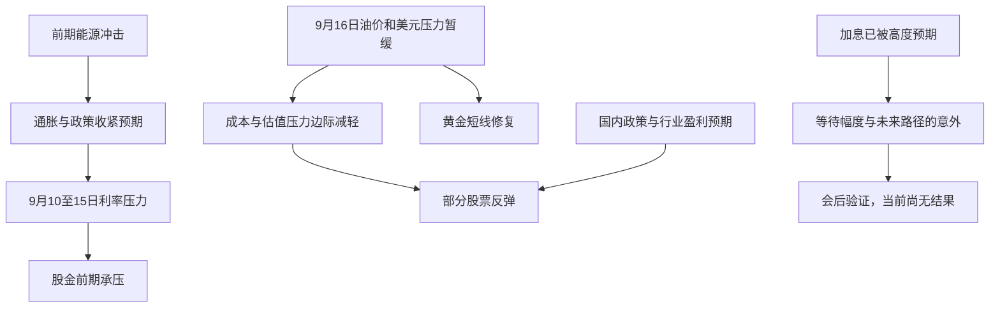

<!-- event-graph: {"schema_version":1,"event_id":"EVT-MACRO-GLOBAL-20260916-EQUITY-GOLD-REBOUND","as_of":"2026-09-16T22:02:00+08:00","data_cutoff":"2026-09-16","ust_data_cutoff":"2026-09-15","pattern":"intraday_rebound_with_tightening_still_priced","metrics":{"ust_2y_change_bp_since_20260910":11,"ust_10y_change_bp_since_20260910":5,"ust_30y_change_bp_since_20260910":-1,"ust_10y_real_change_bp_since_20260910":7,"ust_2s30s_bp_on_20260915":69},"causality_status":"qualitative_hypothesis_not_statistically_identified"} -->
<!-- event-link: {"source":"EVT-MACRO-GLOBAL-20260916-EQUITY-GOLD-REBOUND","relation":"confirms","target":"EVT-MACRO-GLOBAL-20260911-OIL-RATES-ASHARE","scope":"rate_pressure_persists_through_20260915_official_close","confidence":"high","causality_status":"descriptive"} -->
<!-- event-link: {"source":"EVT-MACRO-GLOBAL-20260916-EQUITY-GOLD-REBOUND","relation":"reverses","target":"EVT-MACRO-GLOBAL-20260911-OIL-RATES-ASHARE","scope":"observed_equity_gold_direction_on_20260916_only_not_tightening_regime","confidence":"medium","causality_status":"descriptive_non_synchronous_snapshots"} -->
<!-- event-link: {"source":"EVT-GEO-MIDEAST-OIL-20260909","relation":"transmits_to","target":"EVT-MACRO-GLOBAL-20260916-EQUITY-GOLD-REBOUND","scope":"partial_retracement_of_oil_shock_may_relieve_common_asset_pressure","confidence":"medium","causality_status":"hypothesis"} -->
<!-- event-link: {"source":"EVT-US-CPI-20260911","relation":"amplifies","target":"EVT-MACRO-GLOBAL-20260916-EQUITY-GOLD-REBOUND","scope":"hawkish_policy_background_not_direct_rebound_catalyst","confidence":"medium","causality_status":"hypothesis"} -->
<!-- event-link: {"source":"EVT-MACRO-GLOBAL-20260916-EQUITY-GOLD-REBOUND","relation":"precedes","target":"WATCH-US-FOMC-20260916","scope":"pre_decision_snapshot_no_policy_outcome_known","confidence":"high","causality_status":"temporal_only"} -->

# 2026年9月16日加息预期下股金反弹事件报告

> [!summary] 核心判断
> **加息预期与股金上涨可以同时出现：资产价格交易的是相对已有预期的变化，以及整条未来利率路径。今天较有证据支持的解释是，油价、美元和名义债券收益率暂时回落，减轻共同压力；此前连续下跌的部分股票与黄金出现修复。**
>
> “全球股市、黄金在上涨”应限定为**9月16日多个市场的阶段性反弹**，不能扩展为所有市场同步收涨或多日持续上涨。截至9月15日的官方实际收益率仍在上升，紧缩背景并未消失。
>
> 本报告冻结于北京时间9月16日22:02。FOMC声明计划在北京时间**9月17日02:00**公布，记者会为02:30。今天A股收盘、欧洲早盘及美国开盘的上涨，均不能归因于尚未公布的本次决议。[F1]

## 1. 先核实“上涨”发生在哪个窗口

以下是不同市场各自的观察快照，不是一条同步收盘序列；涨跌幅沿用来源的比较基准。

| 资产/变量 | 核验值或方向 | 资产观察时间（北京时间） | 来源与限制 |
|---|---|---|---|
| 上证指数 | 3891.60，+0.71% | 9/16 15:00收盘 | 新华财经、证券时报数据宝一致[A1][A2] |
| 深证成指 / 创业板指 | 13454.74，+1.26% / 3311.47，+1.96% | 同上 | 深成指双源一致；创业板精确值见数据宝，新华财经为“近2%”[A1][A2] |
| MSCI亚太除日本指数 | 亚洲早盘+0.2%，此前连跌四个交易日 | 9/16亚洲早盘；报道发布约09:59，取价分钟未列 | Reuters单源，不能当作全日收盘[AS1] |
| STOXX 600 | 636.81，+0.4%；前两日下跌 | 9/16 15:05，欧洲早盘 | Reuters单源，多个转载不算独立来源[EU1] |
| 标普500 / 纳指 / 道指 | +0.2% / +0.5% / -0.1% | 9/16 21:35，美国09:35 ET | AP单源盘中快照，道指下跌说明并非全面普涨[US1] |
| 美元现货黄金 | 4324.36美元/盎司，+0.7%；周一曾触及一个多月低位 | 9/16 16:42（08:42 GMT） | Reuters单源；非期货结算、非人民币金价[G1] |
| 美债10Y市场报价 | 亚洲早盘4.9875%；美国开盘附近约4.97% | 两个不同盘中时点 | Reuters与AP均描述回落，只交叉支持方向，不把差值当成同步误差[AS1][US1] |
| 原油、美元 | 油价涨势暂停/回落；美元偏弱 | 欧洲早盘及黄金报价时段 | Reuters黄金与欧股报道；不据此认定能源风险解除[G1][EU1] |
| 9月加息25bp概率 | 92.4%，一周前59.4% | Reuters 9/16亚洲报道所引CME快照 | 二手衍生品隐含概率，未取得CME历史截面原件；不是实际决议[P1] |

**核验结论：** 股金当日反弹有依据，持续牛市和“加息利好所有风险资产”均不由这些快照推出。A股科技板块明显强于大盘，存在本地产业与政策预期；不能把各地上涨全部归于同一个美联储因素。[A1][A3]

黄金只完成带时刻的单源核验，未取得第二独立来源的同一现货快照，故精确报价置信度低于双源一致的A股收盘。美元与油价的盘中方向来自媒体报道，亦未完成同步原始序列核验。

## 2. 续接旧时间线：从曲线扭转到冲击，再到反弹

前序报告：[[2026-08-19-美债收益率曲线扭转-事件报告]]、[[2026-09-11-油价冲击与美债熊平-A股普跌-事件报告]]。总入口为[[宏观事件时间线与关联索引]]。

| 发生/观察时间 | 稳定事件ID或阶段 | 当时已知信息 | 本次如何更新 |
|---|---|---|---|
| 7/28—8/18；8/19形成报告 | `EVT-MACRO-US-UST-20260729-CURVE-TWIST` | 旧报告记录短端下、长端上，曲线扭转式陡峭化 | 保留历史窗口事实，不能外推为9月短端仍下行 |
| 8/19公告，9/9起实施 | `EVT-US-UST-BUYBACK-20260909` | 财政部回购扩容是旧线索 | 本次未取得新增操作/流动性证据，不能用它解释今天上涨，也不等同于QE |
| 9/4公布 | `EVT-US-NFP-20260904` | 就业背景详见9/11报告 | 历史承接，本次未重新审计数据，不作为9/16新消息 |
| 9/9—10 | `EVT-GEO-MIDEAST-OIL-20260909` | 旧报告记录能源供应风险、油价上涨 | 是本轮利率压力上游候选；今天油价局部回落构成边际缓和 |
| 9/10 20:30；ECB同日宣布、9/16生效 | `EVT-US-PPI-20260910` / `EVT-EU-ECB-20260910-HIKE` | 旧报告记录通胀与欧洲收紧 | 维持历史节点，本次未重新核验；ECB生效日不能误作当日新宣布 |
| 9/10美国交易日；9/11 A股 | `EVT-MACRO-GLOBAL-20260911-OIL-RATES-ASHARE` | 油涨、实际利率升、黄金承压，A股下跌 | 构成本次修复的前期冲击基线 |
| 9/11 20:30公布 | `EVT-US-CPI-20260911` | 8月总体CPI季调环比+0.4%、同比+3.4%；核心环比+0.3%、同比+2.4% | 本次成功读取BLS历史版，将旧报告的总体数据由“媒体待复核”升级为“官方核验”；不回写成9/11 A股已知[C1] |
| 9/14—15 | `OBS-GLOBAL-20260915-PRE-FOMC-STRESS` | 黄金周一触及一个多月低位；欧股连续回落；9/15美债10Y官方5.00%、10Y实际2.62% | 会前压力继续，反驳“本周一直在上涨”[G1][EU1][T1][T2] |
| 9/16亚洲早盘 | `OBS-ASIA-20260916-REBOUND` | 亚太除日本指数小涨，油与收益率涨势暂停 | 先记录会前修复，尚不足以确认趋势反转[AS1] |
| 9/16 15:00、15:05、16:42 | `EVT-MACRO-GLOBAL-20260916-EQUITY-GOLD-REBOUND` | A股收涨，欧股早盘上涨，美元现货金反弹 | 不同市场的短时同向，非同步全日样本[A1][EU1][G1] |
| 9/16 21:35 | `OBS-US-20260916-OPEN` | 美股开盘分化，标普与纳指小涨，道指微跌 | 全球普涨说法需保留边界[US1] |
| 美国9/16 14:00，即北京9/17 02:00 | `WATCH-US-FOMC-20260916` | 截止时尚未公布的决议、预测与指引 | 保留WATCH身份；会后核验才建立正式决策节点[F1] |

`OBS-`表示市场观察，不自动当作外生冲击；`EVT-`为已登记事件；`WATCH-`为待发生/待核验节点。历史节点沿用旧ID，避免同一事件在多篇报告里被重复创建。

## 3. 关键数据：压力水平仍高，今日增量压力却可减轻

美债官方同口径数据单位为%，曲线斜率为bp。9/10与9/15名义、实际曲线均在本次读取核验；8/18为旧报告承接基准。[T1][T2]

| 美国交易日 | 2Y名义 | 10Y名义 | 30Y名义 | 10Y实际 | 2s30s斜率 |
|---|---:|---:|---:|---:|---:|
| 8/18旧基准 | 4.19 | 4.71 | 5.28 | 2.41 | 109 |
| 9/10上次冲击 | 4.56 | 4.95 | 5.37 | 2.55 | 81 |
| 9/15最新完整日 | 4.67 | 5.00 | 5.36 | 2.62 | 69 |
| 9/10—9/15变化（bp） | +11 | +5 | -1 | +7 | -12 |

9/10—9/15不能笼统称为所有期限继续熊平：短端继续上行，30Y小幅回落，曲线进一步趋平。10Y名义增加5bp、实际增加7bp，二者之差的通胀补偿代理下降2bp（2.40%→2.38%）。它说明**总体CPI较热，并不要求长期通胀补偿每天都上升**；但不能仅凭这个差值认定市场相信加息已成功压制通胀，差值还含风险与流动性补偿。

尤其不能把“9/16盘中10Y名义收益率回落”写成“9/16实际收益率已经回落”：本报告尚无9/16官方实际曲线。9/11、9/14、9/15的10Y实际收益率分别为2.60%、2.60%、2.62%，旧报告“连续3个交易日不低于2.55%”这一**单项条件已经满足**；原油与A股广度的完整联合条件未补齐，不能直接宣布整组压力规则全部触发。[T2]

## 4. 为什么加息预期下股金能够一起反弹

### 4.1 加息预期的高低，与今天新增多少利空，是两回事

假设大家昨天已经预计会加息，今天价格不会因为同一个消息无限下跌。价格更敏感的是：加息幅度是否超预期、后续还会加多少、何时结束、经济和企业盈利能否承受。

92.4%的会前概率支持“25bp加息已被高度预期”，但**不等于充分定价、没有风险，也不保证落地上涨**。概率还明显高于一周前，因此不能据此说“本周加息预期下降了”。[P1]

仅作理解示例：若未来结果只有不变和+25bp两种，概率加权增量为23.1bp；真正+25bp相对该均值仅多1.9bp。这个简化算式不等于实际期货结算计算，更不是股票或黄金的涨跌预测。远期路径、期限溢价、政策措辞和仓位都可能造成更大反应。

### 4.2 本次最有证据的共同渠道：油价、美元、收益率压力暂缓

油价供给冲击缓和，能同时减轻企业成本压力和进一步收紧政策的担忧；美元走弱也可改善美元计价黄金的外币购买条件。名义债券收益率回落，至少说明债市的当日抛售压力减轻。这些变化可以让股票与黄金同涨，不必假设避险资金全部流向黄金、风险资金全部离开股票。[G1][EU1][US1]

**本次归因是“与共同压力缓和一致”，置信度中等。** 现有证据主要为非同步快照，未识别油价、美元、利率分别贡献了多少；不能把相关方向当作已经证实的单向因果。

### 4.3 股票还有盈利与国内政策因素

股票价格同时受预期现金流、无风险利率和权益风险溢价影响。即使折现率偏高，只要盈利预期改善或风险溢价下降，价格仍可能涨。本次A股半导体与算力硬件强势有收评证据；政策和产业预期是合理候选，但尚未取得盈利预测修正及资金流证据，不写成已确认的主因。[A1][A3]

美国利率也不能直接替代中国企业的人民币折现率。中美货币政策、行业结构和盈利周期不同，A股上涨不意味着全球资金已转向宽松。

### 4.4 黄金更关心实际持有成本和需求，不只关心名义政策利率

黄金不生息，实际收益率上升通常构成机会成本逆风；美元、避险需求、ETF流量和储备配置也会影响价格。多个因素可以相互抵消，关系并非每天固定。

对于本次，**美元偏弱、收益率压力暂停与前期下跌后的修复**有较直接的市场观察支持。央行买金、ETF大规模流入、美元信用恶化、空头集中回补均缺少本窗口直接数据，只能保留为候选机制，不能拿长期叙事解释某天的精确涨幅。

“通胀升温，所以黄金必涨”同样不成立：若市场首先上调实际利率和美元，黄金可能先跌，9/11旧报告记录的正是这一组合。今天的反弹无需推翻黄金机会成本机制，只需承认驱动因素的边际强弱发生变化。

### 4.5 提前加息恢复信誉、降低远期利率：有逻辑，尚未证实

市场上存在另一种解释：及时加息限制通胀扩散，减少未来更猛烈收紧的需要，因此支撑长久期资产。这种路径可以发生，但必须看到远期利率、实际收益率或期限溢价相应改善。本次最新官方10Y实际收益率仍高，不能把这套解释升级为已确认事实。会后若短端升、长端及远期利率下降，才增加其权重。

图中箭头为候选机制，不能替代统计识别。

## 5. 对旧报告逐项验收与假设账本

| 假设ID | 命题与本次证据 | 当前状态 | 下一次怎样推翻或加强 |
|---|---|---|---|
| H-20260916-01 | 共同压力缓和推动反弹；油/美元偏弱、名义收益率回落与股金反弹同现 | 中等支持，因果未识别 | 油、美元、实际收益率持续上行而股金仍强，则降低其解释权重 |
| H-20260916-02 | 25bp高度预期后，新增利空有限 | 概率支持；缺完整期货路径 | 会后政策路径大幅上修且资产转跌，则“利空已尽”解释失败 |
| H-20260916-03 | 本地产业/政策改善支持A股科技 | 板块表现支持；盈利与流量待核验 | 若上涨无广度、订单和盈利修正支持，应降级为交易性修复 |
| H-20260916-04 | 央行/ETF/避险需求压过利率逆风 | 本窗口证据不足 | 补同窗口持仓与流量；不能用事后月度发布值冒充当日可知 |
| H-20260916-05 | 加息恢复信誉、压低未来紧缩路径 | 待验证 | 需远期利率及通胀补偿下降；实际收益率继续升则削弱 |
| 旧判断：利率压力仍在 | 9/15短端与10Y实际均高于9/10 | 延续 | 持续回落后再更新，不以一日股涨否证 |
| 旧判断：股金单向承压可延续 | 9/16出现反弹 | 当日方向反转；持续性未知 | 观察会后收盘、下一交易日与第5个交易日 |
| 旧判断：黄金出现机制切换 | 旧阈值要求实际利率不降、美元不弱、黄金持续强并有ETF支持 | 尚未满足 | 今日美元走弱且缺流量，不能宣布黄金脱离利率约束 |
| 旧判断：回购缓解流动性 | 本次没有新的官方结果或旧券价差数据 | 继续待验证 | 独立补价差、深度、回购结果，不用债券方向代替 |

## 6. 会后分支：下一事件报告的验收标准

以下为研究规则，不预先填入结果。本报告不会自动被未来行情覆盖。

| 会后观察组合 | 可支持的解释 | 必须避免的误读 |
|---|---|---|
| 加25bp、未来路径不再上修，股金延续上涨 | 预期落地、增量鹰派意外有限 | 不能推广为“加息天然利好” |
| 加25bp但指引更鹰、2Y/实际收益率与美元上升，股金回落 | 今天主要是会前暂时修复 | 不能只记录决策幅度而遗漏路径意外 |
| 不加息，短端降但长端/通胀补偿升，黄金强、股市弱 | 可能转向政策信誉/通胀风险交易 | 不加息未必带来全面宽松交易 |
| 实际利率与美元回落、股票弱、信用利差扩大 | 增长或信用风险占上风 | 收益率下行不必然利好股票 |
| 股金持续强，但实际利率与美元也强 | 盈利、资金流或黄金独立需求值得调查 | 先查实际流量，不能直接归为去美元化 |

优先顺序：FOMC官方声明与预测 → 同步2Y/10Y实际/美元变化 → 美国9/16完整收盘 → A股9/17开盘缺口与日内表现 → 第5个交易日持续性。黄金避险或配置渠道另补ETF持仓、申赎及央行数据发布日期。

## 7. 可回溯关联的数据规范

本报告沿用旧报告的稳定ID与`event-link`结构，正文保留当时信息集；索引只登记关系和状态更新。**当前支持定性关联回溯，尚未计算统计相关性或因果贡献。**

每条新证据最少记录：事件ID、事件发生时间、首次公布时间、资产取价时间、研究获取时间、来源URL、数值/单位、币种/合约、比较基准、证据等级、修订状态、对应假设ID。日期不精确时用日期或时段，不伪造分钟。

| 字段 | 本次示例/约束 |
|---|---|
| `event_id` | `EVT-MACRO-GLOBAL-20260916-EQUITY-GOLD-REBOUND` |
| `observation_id` | `OBS-XAUUSD-20260916T084200Z` |
| `observed_at` | `2026-09-16T08:42:00Z` |
| `instrument` / `unit` | `XAUUSD_spot` / `USD_per_troy_ounce` |
| `value` / `reported_change_pct` | `4324.36` / `0.7` |
| `comparison_base` | 来源所报涨跌基准；未独立取得基准价，不重建精确收益序列 |
| `source_id` / `verification` | `G1` / `single_wire_search_text` |
| `retrieved_on` / `information_cutoff` | `2026-09-16` / 本报告顶部时间 |
| `hypothesis_id` / `causal_status` | `H-20260916-01` / `hypothesis` |

未来补齐数据再进行以下检验：

1. **固定主样本。** 标普500、STOXX 600、MSCI亚太除日本、沪深300及XAUUSD；当前上证作为A股描述，不冒充沪深300。权益长期比较使用一致的总回报/价格指数定义，不混用。
2. **固定事件窗口。** FOMC围绕实际公布时刻取[-30分钟,+120分钟]，另列声明与记者会子窗口；比较会前最后完整收盘至会后第1、第5个交易日。保留其他同期消息，避免只选上涨时点。
3. **固定日度变量。** 股金收益率、2Y/10Y名义及实际收益率的bp变化、美元指数收益率、固定合约或明确换月规则的Brent收益率、信用利差。对变化量而非价格水平算20/60日滚动相关；不足窗口不输出结果。
4. **时间对齐。** 美国9/16决议映射到中国9/17；欧洲15:05及黄金16:42快照晚于A股15:00收盘，不能据此解释A股当日上涨。日历与时区统一，节假日按各市场交易日映射。
5. **控制与归因。** 用实际利率、美元、油价和本地因子解释股金变化；控制变量存在共同冲击和内生性，回归系数仍不自动等于因果效应。收益率上行可能由增长改善或供给冲击触发，需分情景。
6. **版本审计。** 后续增加“新证据—旧判断—新判断—置信度变化”；如更正数值，保留原值、修订值、原因、发现日期，不把后来知道的内容回填为当时已知。

## 8. 来源与缺口

A级：官方原始页面；B级：通讯社/财经媒体。官方曲线、CPI历史版正文已读取；多数新闻全文直接打开受限，使用搜索工具返回的当日报道文本，故保留B级及单源标记。Reuters不同网站转载均按同一个来源计数。搜索元数据异常时，以正文资产时刻为准。

| 来源ID | 使用范围与审计备注 |
|---|---|
| T1 / T2 | 财政部名义/实际曲线，最新完整日9/15；官方日度曲线非逐笔收盘交易价 |
| C1 | BLS 8月CPI历史版，9/11 08:30 ET发布；补齐旧报告缺口 |
| F1 | 美联储9月日程，决议14:00、记者会14:30 ET；夏令时换算北京次日02:00/02:30 |
| AS1 / P1 | 同一Reuters亚洲报道的不同转载，不能当成双源；文中对10Y历史高点有“2007/三年”的不一致叙述，本报告弃用历史排名，只保留报价和方向 |
| EU1 / G1 | Reuters欧股、黄金时点快照；黄金缺第二独立同口径源 |
| US1 | AP开盘报道，正文09:35 ET；搜索显示的UTC日期时间与正文不一致，不把元数据用于事件排序 |
| A1 / A2 | 新华财经与证券时报数据宝，沪深指数交叉一致 |
| A3 | Fisco/株探，核对沪指并提供本地政策解释；政策归因为媒体分析，未核原始政策文本 |

**待补账本：** 9/16实际曲线与同步美元/黄金序列；CME原始概率及完整远期路径；美欧完整收盘；黄金ETF流量与央行数据；分钟级事件窗口；A股行业收益贡献。暂不填统计系数、资金净流入或归因百分比。

[T1]: https://home.treasury.gov/resource-center/data-chart-center/interest-rates/TextView?field_tdr_date_value=2026&type=daily_treasury_yield_curve "财政部名义收益率曲线"
[T2]: https://home.treasury.gov/resource-center/data-chart-center/interest-rates/TextView?field_tdr_date_value=2026&type=daily_treasury_real_yield_curve "财政部实际收益率曲线"
[C1]: https://www.bls.gov/news.release/archives/cpi_09112026.htm "BLS 2026年8月CPI历史版"
[F1]: https://www.federalreserve.gov/newsevents/2026-september.htm "美联储2026年9月日程"
[AS1]: https://www.thejakartapost.com/business/2026/09/16/asian-markets-make-nervous-start-ahead-of-fed-decision "Reuters亚洲市场报道"
[P1]: https://www.investing.com/news/economy-news/asian-markets-make-nervous-start-ahead-of-fed-decision-4902821 "Reuters引用CME会前概率"
[EU1]: https://www.investing.com/news/economy-news/european-shares-rise-as-oil-rally-pauses-all-eyes-on-fed-4902994 "Reuters欧洲早盘"
[G1]: https://in.marketscreener.com/news/gold-rises-on-easing-dollar-oil-as-fed-rate-verdict-looms-ce785bd2da8df120 "Reuters现货黄金08:42 GMT快照"
[US1]: https://apnews.com/article/e2e82957e490b7be205db6013f621c3d "AP美国09:35 ET开盘快照"
[A1]: https://www.cnfin.com/yw-lb/detail/20260916/4470667_1.html "新华财经A股收评"
[A2]: https://m.sohu.com/a/1076871881_115433 "证券时报数据宝9月16日16:54报道"
[A3]: https://s.kabutan.jp/news/n202609161092/ "Fisco中国市场收评"

## 9. 更新日志

| 日期 | 版本 | 新证据与变更 | 判断变化 |
|---|---|---|---|
| 2026-09-16 | v1.0 | 续接8/19、9/11报告；补CPI官方版、9/15曲线及9/16股金快照；登记假设与会后分支 | 利率压力延续，但当日部分股金反弹；共同压力暂缓为中等置信度解释，未认定紧缩结束 |
