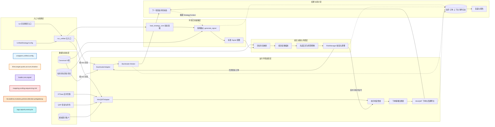
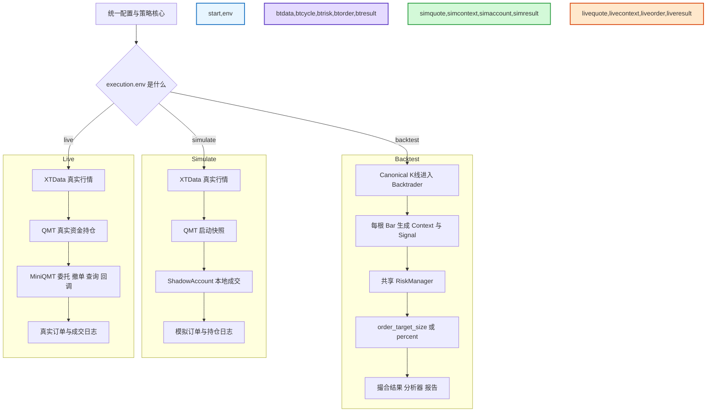
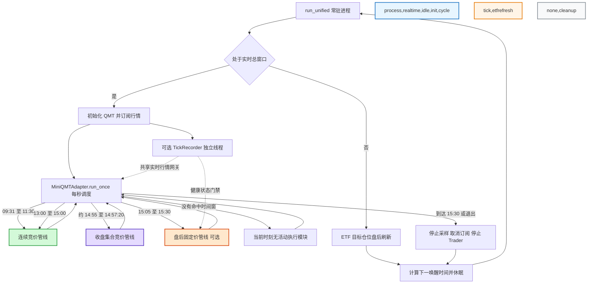
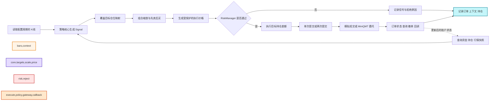
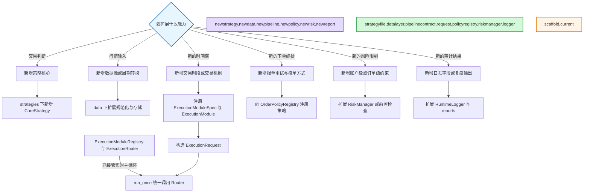

# Sartre 交易逻辑拓扑图

## 总体拓扑

读图要点：策略核心只产生交易意图，不直接调用 Backtrader 或 MiniQMT。`Signal` 之后还要经过目标仓位映射、组合缩放、交易顺序控制和风控，才进入环境相关的订单执行。

## 回测、模拟和实盘的真实分叉

三种环境共用的是配置模型、策略核心、`Signal`、`StrategyContext`、`MarketSnapshot`、风控规则和日志语义。撮合与账户状态并不共用：回测交给 Backtrader，模拟交给 `ShadowAccount`，实盘交给 MiniQMT。

## 实时主循环与日内时间窗

边界说明：

- 实时总窗口是上午 `09:30–11:30`、下午 `13:00–15:30`。
- 连续竞价策略仍受 `is_strategy_time` 限制，最晚到 `15:00`，不会因为外层进程运行到 `15:30` 而继续下单。
- 收盘集合竞价的具体观察、确认和报单时间来自策略参数；当前高股息债配置为 `14:55:00` 开始预确认、`14:57:05–14:57:20` 报单。
- 盘后固定价模块已有实现，但当前正式 JSON 配置没有启用 `execution_modules`，所以它不是默认活动链路。
- ETF 目标仓位刷新在当前 `run_unified.py` 中固定为交易日 `16:00` 之后每天一次。
- Tick 采集线程记录行情快照，不等于策略的多周期 K 线计算器。

## 单次连续竞价决策链

这里的“执行”是把目标持仓转换为当前持仓的差额，而不是简单把 `BUY` 或 `SELL` 原样发给券商。风控还会处理整手、仓位上限、现金上限、T+1、日内开平次数、涨跌停和价格笼子。

## 模块扩展边界

当前执行主链已经由 `ExecutionModuleRegistry` 和 `ExecutionRouter` 接管：`MiniQMTAdapter.run_once()` 只负责刷新运行状态并调用 Router，不再按模块名显式分派。新增第四种执行时段时，需要：

- 注册 `ExecutionModuleSpec`，声明默认窗口、允许窗口和可用 `OrderPolicy`。
- 实现并向 Adapter 注入 `ExecutionModule`；注册后会自动进入真实交易主循环。
- 新管线的状态机、`ExecutionRequest` 构造和审计日志。
- 必要时新增 `OrderPolicy`；如果只是复用单次或两次提交，可直接使用现有策略。
- 明确定义回测语义；Backtrader 会拒绝没有显式映射的自定义或盘后执行阶段。

内置三个管线继续保留各自的行情准备和状态机，但可执行订单统一构造成 `ExecutionRequest`，由 Router 完成幂等检查并交给 `OrderPolicyRegistry`。`Signal.execution_pipeline` 同时保留内置枚举兼容性和注册扩展所需的字符串名称。

## 对原手稿的修正

| 手稿中的表达 | 按当前工程应改为 | 原因 |
|---|---|---|
| `scheduler` 是一个独立业务模块 | `run_unified` 常驻循环加日历时间门禁 | 工程没有 APScheduler 或通用任务调度器；主循环按秒调用 `run_once()` |
| 数据层固定生成 `60m 15m 5m 1m` | 每次运行由配置选择一个 K 线周期，Tick 采集是独立旁路 | 当前没有统一的多周期聚合器，也不会自动把四个周期同时送入策略 |
| `data → signal` | `数据 + StrategyContext → CoreStrategy → Signal` | 信号依赖行情、资金、持仓和策略状态，不只依赖 DataFrame |
| `management engine` 是一个黑盒 | 拆成目标映射、组合缩放、交易顺序、风控、执行管线和订单策略 | 这些层的职责和扩展方式不同 |
| Backtrader、Live、Sim 是同一个执行器 | 三者共享策略与风控语义，但使用不同 Adapter 和账户撮合后端 | 回测由 Backtrader 撮合，Sim 用影子账户，Live 用 QMT 真实账户 |
| 执行系统之后直接进入分析 | 订单状态先通过查询、撤单、回调和账户状态闭环，再进入日志与报告 | 报单成功不等于成交完成 |
| 运行结果直接反馈给策略对象 | 下一轮重新查询或读取账户，重建 `StrategyContext` | 当前主要反馈载体是账户与持仓状态，不是统一的策略事件总线 |
| 逆回购属于统一主循环的一个普通节点 | 逆回购有独立入口和 `15:15–15:30` 轮询循环 | `run_miniqmt_reverse_repo.py` 不由 `run_unified.run_once()` 调度 |
| 日志只在末端产生 | 信号、上下文、订单、Tick、执行模块和错误各阶段都写审计日志 | RuntimeLogger 是横切能力 |

## 已修正的实现与文案不一致

`run_etf_rotation_live.py` 的提示文字已从“`22:00` 刷新”改为 `16:00`，与 `ETF_ROTATION_TARGET_REFRESH_TIME` 保持一致。

模块注册表、配置规格和 Router 现在共同构成实时执行主链；内置管线中的策略准备逻辑仍是 Adapter 侧回调，不应误读为所有业务状态机都已经移入 engine 包。

## 代码依据

| 关注点 | 主要代码 |
|---|---|
| 统一入口与环境分流 | [`run/run_unified.py`](../run/run_unified.py) |
| 实时时间边界 | [`sartre_core/data/calendar.py`](../sartre_core/data/calendar.py) |
| 配置模型 | [`sartre_core/config/runtime_config.py`](../sartre_core/config/runtime_config.py) |
| 策略动态加载 | [`sartre_core/strategies/__init__.py`](../sartre_core/strategies/__init__.py) |
| 标准信号与上下文 | [`sartre_core/engine/signal.py`](../sartre_core/engine/signal.py)、[`context.py`](../sartre_core/engine/context.py) |
| 风控 | [`sartre_risk/risk_manager.py`](../sartre_risk/risk_manager.py) |
| 回测执行 | [`sartre_core/adapters/backtrader_adapter.py`](../sartre_core/adapters/backtrader_adapter.py) |
| 模拟与实盘执行 | [`sartre_core/adapters/miniqmt_adapter.py`](../sartre_core/adapters/miniqmt_adapter.py) |
| 执行模块契约 | [`sartre_core/engine/execution_modules.py`](../sartre_core/engine/execution_modules.py) |
| 订单策略 | [`sartre_core/engine/order_policies.py`](../sartre_core/engine/order_policies.py) |
| Tick 采集与共享行情网关 | [`sartre_core/data/market_tick.py`](../sartre_core/data/market_tick.py) |
| 逆回购独立循环 | [`run/run_miniqmt_reverse_repo.py`](../run/run_miniqmt_reverse_repo.py) |
| 日志与报告 | [`sartre_core/engine/runtime_logger.py`](../sartre_core/engine/runtime_logger.py)、[`sartre_core/reports`](../sartre_core/reports) |
